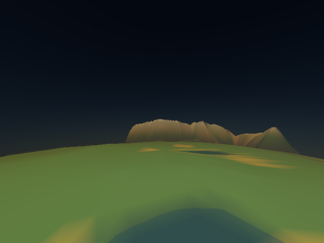
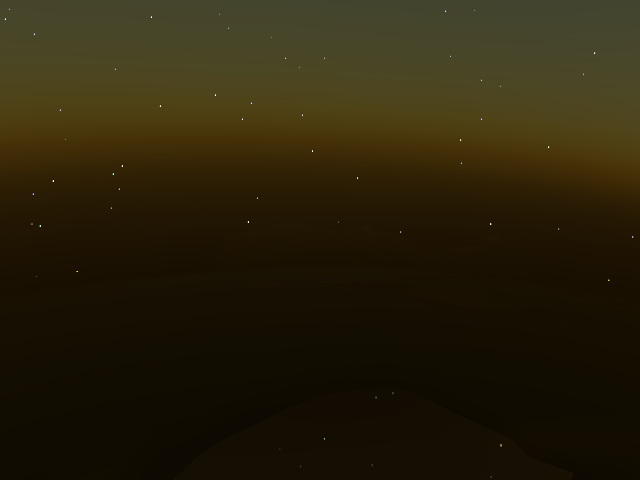
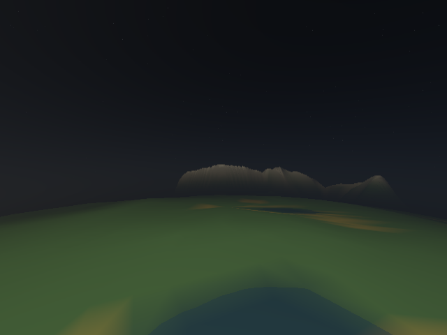
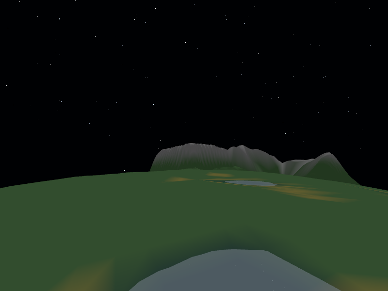
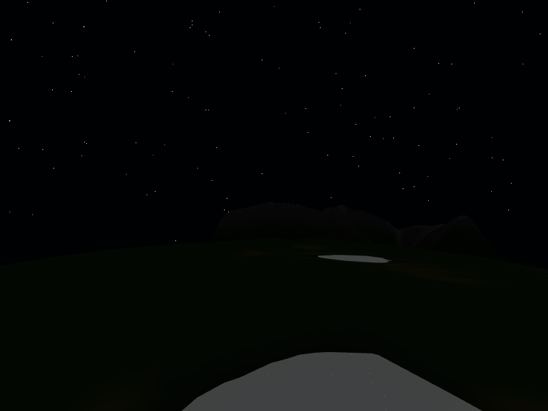
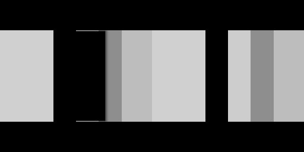
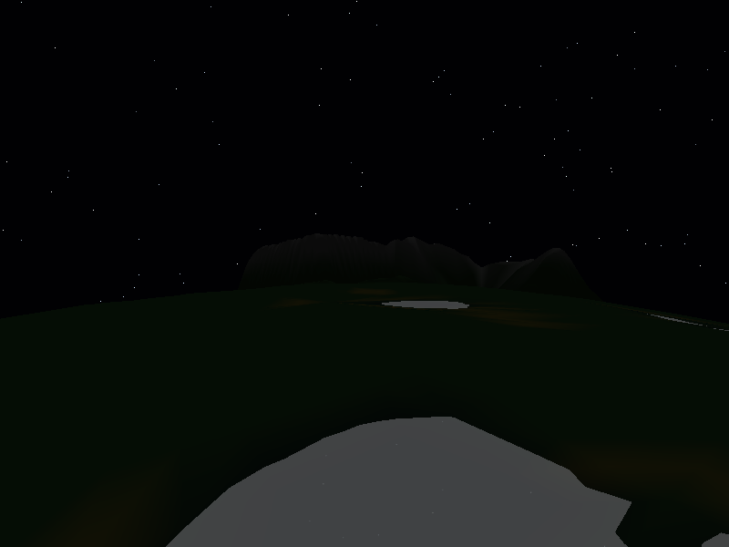

# PlanetSimulation

| Solar overview (compact test scene) | Planet surface (20 s) | Planet orbit (3000 s) |
|:--:|:--:|:--:|
|  |  |  |

These [renderer captures](docs/screenshots/) preserve the surface and planet
views from the lighting stabilisation, before atmospheric scattering was enabled. The solar overview uses the [frozen compact test scene](tests/fixtures/development/configs/scenarios/solar_system.json)
to fit the Sun and Earth in one frame. Click an image to view it at full size.

A C++20/OpenGL project that renders a moving Sun, Earth, and Moon from
`configs/scenarios/solar_system.json`.

The visual direction for later landscape and vegetation steps is the
[Quick Grass live demo](https://simondevyoutube.github.io/Quick_Grass/) and its
[GitHub source](https://github.com/simondevyoutube/Quick_Grass). The renderer
currently has broad terrain and water; grass remains future work.

The development scene uses kilometers for world coordinates: the Sun is 5 km
across, Earth is 2 km across, and the Moon is 540 m across. The Earth–Moon
center of mass travels between **74.6 and 104.4 km** from the Sun, with outer
orbital half axes of 89.5 and about 88.25 km.
The surface camera starts 30 m above sampled terrain or water, whichever is
higher, and walks at 80 m/s.
The development config stores planets in a `planets` array; the surface
camera's `planet_index` selects an entry in that array.

## Atmosphere, sunsets and mist

Earth now has an atmosphere with an outer radius of **1.1 × its reference
radius**: a 100 m shell on this 1 km-radius planet. It follows the planet's
translation and rotation and is visible from the surface and from orbit.
Terrain peaks above 100 m can protrude through the shell. The Moon remains airless.

| Atmosphere at 20 s | Red-dust sunset at 34 s | High water at 20 s | Heavy dust at 20 s |
|:--:|:--:|:--:|:--:|
|  |  |  |  |

The dust image is intentionally black; the depth and body-ID buffers still
confirm terrain geometry. The sunset camera faces the Sun. Other columns use
the same camera and time so their differences come from atmospheric composition.
All images are direct renderer captures. Their resolved configs and replay
sidecars are generated by the atmosphere test target below.

Each planet can opt in with an `atmosphere` object. All fields are optional:

~~~json
"atmosphere": {
    "enabled": true,
    "radius_multiplier": 1.1,
    "refraction_enabled": true,
    "surface_pressure_pa": 101325.0,
    "temperature_k": 293.15,
    "gas-contents": {
        "oxygen": 25.0,
        "water": 2.0,
        "nitrogen": 70.0,
        "red_dust": 0.0001
    }
}
~~~

Composition values are **percentages**: `25` means 25%, and `0.0001` means
0.0001%. A supplied `gas-contents` object replaces the default mixture; omitted
species are zero and the balance up to 100% uses inert argon-like optics.
Supported names are `nitrogen`, `oxygen`, `water`, `argon`, `carbon_dioxide`,
and `red_dust`. Unknown species, negative/nonfinite percentages, and totals
above 100% are rejected. Omitting `gas-contents` selects dry Earth-like air
(78.08% nitrogen, 20.95% oxygen, 0.93% argon, 0.04% carbon dioxide).
Omitting the entire `atmosphere` object preserves the airless render path.
The older `atmosphere_enabled` and `atmosphere_height` fields remain readable
legacy metadata; the new block controls rendering and takes precedence.

| Parameter | Default | Effect |
| --- | ---: | --- |
| `refraction_enabled` | true | Bend atmospheric view rays; false retains scattering with straight rays. |
| `radius_multiplier` | 1.1 | Outer shell radius divided by planet radius; allowed range 1.001–2.0. |
| `surface_pressure_pa` | 101325 | Reference surface pressure; 0 is vacuum, maximum 10,000,000 Pa. |
| `temperature_k` | 293.15 | Reference temperature, 180–373.15 K; affects density and saturation. |
| `suspended_water_fraction` | 0.001 | Fraction of excess condensable water retained as droplets, 0–1. |
| `droplet_radius_um` | 10 | Effective droplet radius, 0.1–100 µm; smaller droplets increase extinction for a given liquid-water mass. |

The CPU model derives an approximate visible-band refractive index and RGB
optical coefficients from composition and pressure/temperature. Molecular
Rayleigh scattering preferentially scatters blue light. Aerosol scattering
and absorption add haze and warm long light paths. The miniature atmosphere
compresses an Earth-like molecular optical column into the configured shell;
red dust uses a tunable mineral-aerosol approximation, not a gas equation of
state. `red_dust` is therefore an effective aerosol loading expressed as a
percentage. This is a rendering model, not a precision refractometry model.
The role of pressure, temperature and humidity is described in
[NIST's air-index documentation](https://emtoolbox.nist.gov/Wavelength/Documentation.asp).

Water vapour itself does not create white fog. The model estimates saturation
from temperature and pressure, then converts a small fraction of excess water
to suspended droplets. At 293.15 K and 101325 Pa, the configured 2% water remains
vapour; raising water to 20% (and reducing nitrogen to 50%) produces mist.
Cooling the same composition can also produce condensation. This follows the
[distinction between vapour and fog droplets](https://www.weather.gov/source/zhu/ZHU_Training_Page/fog_stuff/fog_definitions/Fog_definitions.html).
Raising red dust to 0.1% gives an opaque, absorbing atmosphere. Dense dust is
not automatically exposed back to daylight brightness.

Atmospheric scenes render terrain, sky and water reflections in linear HDR,
then integrate view-path scattering and extinction before a single display
exposure. Direct sunlight is attenuated along its atmospheric path too.
The finite solar disk softens the planet's twilight shadow. The first version
uses RGB single scattering, exponential density profiles, and a bounded
48-step curved view integration (24 steps with refraction disabled), with
8 straight light-path samples. It uses a single-sample HDR
buffer; airless scenes keep their existing multisampling. This follows the
scattering/transmittance formulation described by
[Bruneton](https://ebruneton.github.io/precomputed_atmospheric_scattering/),
with a smaller runtime approximation instead of precomputed multiple scattering.
Refraction uses the composition-derived index and its radial density gradient.
A midpoint integrator follows `d(direction)/ds = (grad(n) - direction *
dot(direction, grad(n))) / n`; the refractive index tapers continuously to
vacuum at the shell edge. This bends grazing rays toward denser air and raises
visible distant sky features. The CPU reference tracer checks the spherical
Snell invariant `n * r * sin(theta)` and reciprocal ray paths, following the
[spherical-atmosphere formulation](https://doi.org/10.1093/mnras/stv1078).
The effect uses this miniature world's density profile; it is not calibrated
to terrestrial astronomical refraction.

The current refraction pass reprojects the existing distant image. Near terrain
keeps its rasterized silhouette, depth, and body IDs; off-screen or terrain-hidden
sources cannot be recovered, and geometric terrain shadows/direct-light paths
remain straight. Strong gradients have a bounded integration budget; trapped
rays contribute no background light. Multiple scattering, wavelength-dependent
ray dispersion, weather evolution, and volumetric terrain-shadow shafts remain
future work.

`src/simulation/Atmosphere.h` keeps the model independent of OpenGL.
`LocalAirState` carries pressure, temperature, total water and dust, plus an
optional suspended-liquid-water density supplied by a future cloud solver.
`atmosphereOptics` converts that state into render coefficients; the initial
scene supplies one reference state per planet with altitude-dependent density.
`incidentSolarPowerWm2` provides exposure-independent incident solar power with
inverse-square distance and local incidence for future climate zones. A later
solver can sample these inputs by planet-local position and time, evolve heat
and moisture, and supply spatial air/cloud fields without changing the JSON
composition model. No climate, cloud transport or precipitation simulation is
run in this milestone.

Generate the tested atmosphere comparisons and exact replays:

~~~bash
xvfb-run -a cmake --build build --target render_atmosphere_scenarios
~~~

Use an existing display instead of `xvfb-run` when available. Outputs go to
`build/atmosphere-scenarios/`: each PNG has a resolved config, capture log and
replay sidecar. `results.json` records measured brightness, terrain contrast,
sky RGB, exposure, refractive index, humidity and suspended liquid-water mass.
`AtmosphereScenariosRenderIntegration` checks dust blackout, mist contrast,
blue daylight sky, warm sunset, dark night with and without stars, moonlight,
orbital viewing and replay. `AtmosphereRefractionRenderIntegration` measures
actual shader displacement against the CPU tracer for surface and orbital rays,
and checks vacuum, missed shells, foreground occlusion and trapped rays.
For example:

~~~bash
./build/PlanetSimulation --replay build/atmosphere-scenarios/mist.png.json --surface-capture build/mist-replay.png
~~~

## Lighting baseline without atmosphere

| Daylight (20 s) | Moonlit night (55 s) | Moonless control (55 s) |
|:--:|:--:|:--:|
|  |  |  |

The same surface camera shows the saved baseline lighting: moonlight
reveals dim terrain, while a moonless night stays almost black. Both night
captures use the same time and maximum exposure of 4096. The moonless control
changes only `lighting.reflections_enabled` to false, retaining the Moon's
geometry and the working ambient fill of `0.000001`. Daylight uses automatic
exposure of about 9.53. These PNGs are direct captures without brightness edits.

Replay sidecars beside the three surface images preserve their complete scene,
camera and timestamp, so the comparison survives later config edits. For example:

~~~bash
./build/PlanetSimulation --replay docs/screenshots/moonlit-night.png.json --surface-capture build/moonlit-night.png
./build/PlanetSimulation --replay docs/screenshots/moonless-night.png.json --surface-capture build/moonless-night.png
~~~

| Terrain shadow comparison | Twilight regression |
|:--:|:--:|
|  |  |

The ridge test shows shadows enabled on the **left** and disabled on the
**right**. The twilight capture preserves the reported camera at
2707.6216211392884 s; its regression checks both average and peak terrain
brightness to catch isolated bright triangles. The reproduction commands are
in the render-test section below.

## Orbits and rotation

Each body has a unique `name` and positive `mass_kg`. Every planet or moon has
an `orbit.parent` naming another body; all parent chains must reach the Sun.
Parents may appear after their children in the array. Unknown parents,
duplicate names, self-orbits, and cycles are rejected when loading or reloading.
The Sun is the sole root and has no `orbit`.

| Setting | Meaning |
| --- | --- |
| `orbit.semi_major_axis`, `orbit.semi_minor_axis` | Large and small half axes in `distance_unit`; require `0 < b <= a`. Omitting `b` gives a circle. |
| `orbit.mean_anomaly_deg` | Initial phase measured uniformly in time; 0 starts at periapsis, 180 at apoapsis. |
| `orbit.inclination_deg` | Orbital plane tilt relative to world XY. |
| `orbit.ascending_node_deg` | Rotation of the tilted orbital plane about world +Z. |
| `orbit.periapsis_deg` | Direction of periapsis within that plane. |
| `rotation.period_seconds` | Axial rotation period; 0 stops spin, a negative value reverses it. |
| `rotation.axial_tilt_deg` | Tilt of the body's north axis about world +X, independent of orbital phase. |
| `rotation.phase_deg` | Initial rotation about the body's own +Z axis. |

Orbital planes use world coordinates, independent of the parent's spin.
Earth's outer orbit lies in XY. Earth's axial tilt and the Moon's orbital
inclination are both **20°**, with a zero ascending node, so the Moon orbits
in Earth's equatorial plane. Both bodies spin once every **60 seconds**;
the Moon's orbital period is **120 seconds** and the Earth–Moon collective's
outer period is about **5747.66 seconds (95.79 minutes)**. The frozen compact
test scene retains the earlier 12.5 km outer half axis and 300-second period.
These are elapsed simulation seconds at normal speed, including frames that take longer to render. Reloading resets the epoch.
Press **T** to pause or resume all orbital motion and axial spin. Camera controls
remain active while paused, and resuming continues from the frozen time without
a jump. Press **Y** to halve or **U** to double the speed of orbits and spin
(from 1/1024× to 1024×; starts at 1×). Each press prints the current multiplier.
Speed changes preserve the current orbital phase and leave camera controls at
their usual speed. Changing speed while paused takes effect on resume.
Reloading preserves the paused/running state and speed multiplier.

Speeds follow [Newton's form of Kepler's laws](https://science.nasa.gov/learn/basics-of-space-flight/chapter3-3/).
Using axes in meters, `e = sqrt(1 - b²/a²)`, `μ = G × (parent mass + collective mass)`,
`T = 2π × sqrt(a³/μ)`, and `v² = μ × (2/r - 1/a)`, with
`G = 6.67430e-11 m³ kg⁻¹ s⁻²`. The minor axis determines eccentricity and the
variation in speed around the ellipse; the major axis and masses set the period.
Kepler's equation supplies the position and velocity at an absolute time,
keeping ellipses stable without accumulated integration error.

The collective mass includes the body and all descendants. For Earth's outer
orbit, the combined Earth–Moon mass is used. Within that collective, Earth
and Moon move on opposite sides of their shared center of mass in inverse
proportion to their masses. The Sun also recoils, conserving the whole system's
center of mass and momentum. The configured Sun `position` is its position at
time zero. An orbit's axes specify the **relative separation between the parent
body and the child collective's center of mass**. Multiple siblings contribute
to their parent's recoil. This is a hierarchy of prescribed two-body ellipses;
tidal effects and gravitational perturbations between branches are not modeled.

The example masses are deliberately scaled for this small, fast scene:

| Body | Mass (kg) |
| --- | ---: |
| Sun | 1.2194532287919512e19 |
| Earth | 6.338938161361669e17 |
| Moon | 7.923672701702087e15 |

They were originally calculated for the compact test scene using
`M_earth + M_moon = 4π² × (2500 m)³ / (G × 120²)`
and `M_sun = 4π² × (12500 m)³ / (G × 300²) - (M_earth + M_moon)`,
with an Earth:Moon mass ratio of 80:1. The working scene keeps those masses but
increases the outer orbital axes, lengthening its period and reducing sunlight
and moonlight through distance falloff. Spin is configured independently of mass.

Legacy unnamed planets receive names such as `planet_0` and default to orbiting
`sun`. A legacy `orbit_radius` becomes both axes. `orbit_speed` and planet
`position` remain readable metadata; dynamic positions and speeds come from
the orbital elements. Terrain, water, local coordinates, and surface cameras
share the same body rotation. Planet orbit cameras follow translation while
letting the surface turn beneath them.

## Sunlight, moonlight, and config descriptions

`sun.absolute_magnitude` sets **bolometric absolute magnitude**, with a lower
number giving more light. The working value of **3.1** and emission RGB
`[1.0, 0.99, 0.97]` give a brighter, nearly white Sun. The
[IAU magnitude scale](https://arxiv.org/abs/1510.06262) gives
`L = 3.0128e28 × 10^(-0.4 M_bol)` watts; a magnitude difference of −5 means
100 times the luminosity. The nominal Sun is about magnitude 4.74.

The `lighting` section groups ambient fill, display exposure, a reference
distance, and the reflection switch. `reference_distance` uses `distance_unit`
and normalizes illumination from one nominal solar luminosity to 1 at that
distance. This is a display scale for the miniature scene; the absolute
magnitude still determines the intrinsic luminosity. Direct light follows
inverse-square distance falloff. `exposure` affects the final image after
adding sunlight, reflected light, and ambient fill. An exponential tone curve
and sRGB encoding keep the brighter Sun and terrain highlights displayable.

The working scenario enables `lighting.auto_exposure` for surface and planet
orbit cameras. The meter uses sunlight above the local horizon, moonlight,
ambient fill, and an estimate of atmospheric skylight at the camera's planet-local
position. Twilight skylight prevents a sunlit atmosphere from being exposed
at maximum night sensitivity. It selects an exposure
for an 18% gray surface using `target_luminance`, limited by `min_exposure` and
`max_exposure`. `lighting.exposure` supplies exposure compensation. Sensitivity
rises at night to reveal moonlit terrain. Very low ambient fill and the upper
limit keep a moonless night dark. Setting `enabled` to false restores fixed
exposure; the whole-system camera always uses fixed exposure.

This meter is deterministic, with no adaptation history or warm-up frames.
It approximates local lighting using the spherical horizon; individual ridges
still cast shadows but do not change the meter. The same exposure is used for
terrain, water, the Sun, and water reflection passes. Stars and the background
fade below `auto_exposure.star_exposure` and reach full visibility at higher
sensitivity, so stars can disappear during daylight.

Each planet's `reflection.geometric_albedo` and `reflection.color` determine
the strength and RGB tint of sunlight it sends to other bodies. The Moon uses
albedo 0.12; setting it to 0 disables its reflection. Setting
`lighting.reflections_enabled` to false disables all bounced sunlight.
Reflection uses a
[Lambert sphere phase function](https://www.aanda.org/articles/aa/pdf/2018/02/aa31192-17.pdf):
`Φ(α) = [sin(α) + (π−α) cos(α)] / π`, where `α` is the Sun–Moon–receiver angle.
Full Moon sends the most light toward Earth, quarter phase sends `1/π` of that,
and new Moon sends none. The outgoing light is proportional to the Moon's
illuminating sunlight, albedo, color, `Φ`, and squared radius/separation ratio.
Sun–Moon and Moon–Earth distance falloff are both included.

Illumination is evaluated once per body per frame and shared by terrain,
water, and water reflection passes. Direct sunlight still shades surface
normals. Reflected light is averaged over the receiving sphere (intercepted
power divided over four times its cross-sectional area), as an inexpensive
uniform contribution to the whole planet. The same calculation allows
Earthshine on the Moon and multiple reflectors. This is one bounce only, with
no eclipses or recursive light exchange. The averaged reflected contribution
does not receive local terrain shadows.

Direct sunlight uses a Sun-facing depth map for each planet: a foreground
mountain blocks sunlight on terrain and water behind it, even when the hidden
surface faces the Sun. The maps contain the complete rendered terrain mesh,
including off-camera geometry, and follow the body's spin and orbital motion.
They are generated once per frame and reused in the main and water reflection
passes. Sun rays are parallel within each planet, consistent with its shared
lighting direction; shadows between separate celestial bodies are not modeled.

`lighting.shadows.enabled` toggles terrain shadows (default true).
`resolution` is the square depth map size, a power of two from 256 to 4096
(default 2048). `bias_texels` controls the slope-adjusted comparison offset
(0..4, default 0.5); excessive bias can erase small shadows. Filtered edges
reduce aliasing. Detail is limited by the map resolution and the current terrain
LOD. Shadow projection uses body-local coordinates, avoiding precision loss
from orbital translation. Ambient fill and averaged moonlight remain in shadow.
Receiver-plane filter corrections are bounded at grazing angles to prevent
large depth extrapolations that make shadowed triangles flash at sunrise or sunset.

Each config block now has a `description` and a `parameter_descriptions` map.
These explain units, limits, effects, and reserved settings while keeping the
actual parameter values directly editable. Metadata is ignored by the parser.
Ambient fill now belongs under `lighting.ambient_light`; older configs can
still use `skybox.ambient_light` as a fallback.

Use `--config PATH` to load another scenario, including render-test fixtures.
The selected file also becomes the interactive reload/watch target.

## Prerequisites

- CMake 3.16 or newer, Git, and a C++20 compiler
- Python 3 for lighting and replay integration tests when `BUILD_TESTING=ON`
- OpenGL 3.3 support, GLFW 3, and GLEW development libraries
- A graphical display for GLFW, including the hidden-window render test

CMake fetches nlohmann/json and GLM during the first configure, plus GoogleTest
when tests are enabled, so that step needs network access. On Ubuntu/Debian,
install the local build dependencies with:

~~~bash
sudo apt update
sudo apt install build-essential cmake git python3 libgl1-mesa-dev libglfw3-dev libglew-dev
~~~

## Configure, build, and test

Run these commands from the repository root. Repeating the configure and build
commands updates an existing build directory.

~~~bash
cmake -S . -B build -DBUILD_TESTING=ON -DCMAKE_BUILD_TYPE=Debug
cmake --build build --parallel 2
~~~

Run all registered tests:

~~~bash
cd build
ctest --output-on-failure
cd ..
~~~

The suite has 28 CTest entries covering unit tests, GPU shadows, scene captures,
lighting scenarios, and exact replay. It is verified on the native NVIDIA
display and Mesa llvmpipe under Xvfb. GPU shadow tests use their own offscreen
framebuffer, so hidden-window allocation does not determine their result.
The integration captures still need an OpenGL display. On a machine without
a display, run CTest under Xvfb from the build directory:

~~~bash
cd build
xvfb-run -a ctest --output-on-failure
cd ..
~~~

For a focused check, run the config test executable from the repository root:

~~~bash
./build/tests/config_tests
~~~

For a release build without tests, use a separate directory:

~~~bash
cmake -S . -B build-release -DBUILD_TESTING=OFF -DCMAKE_BUILD_TYPE=Release
cmake --build build-release --parallel 2
~~~

## Run the renderer

Run from the repository root because the executable loads `configs/` and
`shaders/` relative to its working directory. In interactive mode, left-drag
to orbit around the Sun: dragging right moves the camera left, and dragging up
moves it down. The scroll wheel requests 4% zoom steps and eases into each one.
Press `1` to orbit the Sun, `2` for the planet surface view, or `3` to orbit the
planet selected by `surface_camera.planet_index` (the first planet if no surface
camera is configured). The initial Sun camera retains its compact-scene pose;
zoom out to include Earth's larger working orbit, or press `3` to follow Earth.
Both orbit views use left-drag and the wheel. In surface mode, the mouse looks around without a
button and `W`, `A`, `S`, `D` walk along the planet while maintaining clearance
above ground or water at the configured `walk_speed_mps` (80 m/s in the
development scene). Returning to planet orbit from the surface keeps the
camera on the same side of the planet.
The cursor is captured in surface mode. Press `Esc` to release it while staying
in mode `2`, so the config can be edited; press `2` again to resume mouse look.
Press `1` or `3` to switch to an orbit view. Surface controls also activate
automatically when either orbit camera comes within `1.1 × planet diameter`
of the planet center.
Local Down then points radially toward the planet. Close the window to exit.
Saving `configs/scenarios/solar_system.json` reloads the Sun, planets, terrain,
water, and camera starting values automatically after the file settles for
about 0.1 s. Press `R` to request a manual reload at any time.
The active view stays selected when it is still configured, and its position
resets to the edited start value. A released surface cursor remains free after
reload until `2` is pressed again. An invalid or partly written JSON file is
reported on stderr and leaves the current scene running; press `R` again
after fixing it. Shader files still require an application restart.

~~~bash
./build/PlanetSimulation
~~~

When planet mode starts, and every five seconds while it stays active, stdout
prints the camera's world position and look direction, followed by a
planet-local position labeled latitude and longitude in degrees and altitude
above the spherical reference radius in meters, plus ground clearance, then a
`surface_camera start value` JSON object. Replace the existing `surface_camera`
object in `configs/scenarios/solar_system.json` with that printed object to
start at the saved position, view, and simulation time. The printed
`simulation_time_seconds` is the simulation clock, including pause and Y/U
speed changes, rather than elapsed wall time. It restores the Sun, Earth,
Moon, spin, shadows, and exposure together on startup or config reload.
Older snippets without a time still start at zero. `--simulation-time` takes
precedence over the saved timestamp. The `direction_ned` array is ordered
North, East, Down in the selected planet's local frame. The printed `up_ned`
array preserves image orientation when looking nearly straight up or down.
Both are optional; without `direction_ned`, the surface camera starts aimed at
the Sun. The JSON `altitude` is the requested clearance above sampled terrain or water
in the configured world distance unit (`0.002` km is 2 m in the development
scene). The printed LLA altitude varies with terrain or water height, while the reusable
config snippet keeps the requested clearance and walking speed.

Save the printed JSON object as `camera.json` to replay it directly:

~~~bash
./build/PlanetSimulation --config configs/scenarios/solar_system.json --replay camera.json
./build/PlanetSimulation --config configs/scenarios/solar_system.json --replay camera.json --surface-capture build/replayed.png
~~~

Interactive replay starts in surface mode with simulation paused; `T` resumes
it. Camera controls still work. Saving the replay file reloads it at the saved
time; `R` also reloads the replay and its base config. `--surface-capture` accepts a completely
dark surface, but requires terrain geometry to be present. Unlike the stricter
`--surface-render-test`, it does not require visible stars or brightly colored
terrain. It writes a PNG plus `replayed.png.json` containing the resolved scene,
camera, timestamp, resolution, exposure, renderer, and measured lighting.
Replaying that sidecar restores its full scene even if the working config has
changed; the original config file is no longer needed:

~~~bash
./build/PlanetSimulation --replay build/replayed.png.json --surface-capture build/replayed-again.png
~~~

An explicit `--render-size` overrides the sidecar's resolution. Identical
captures on the same build and graphics driver are checked byte for byte;
different drivers can rasterize edges differently.
Surface mouse look keeps heading and pitch independent: horizontal mouse
movement changes compass heading, while vertical movement changes only pitch.
Pitch stops at 89.9 degrees above or below the local horizon so the view cannot
cross the vertical pole and flip or begin to roll.

Each planet can configure `surface_noise` as a list of overlapping functions.
Each function has a `type` (`value_fbm` for smooth hills or `ridged_fbm` for
ridges), `seed`, `amplitude_m`, `frequency`, `octaves`, `persistence`, and
`lacunarity`. The function heights add together. The development planet combines
68 m smooth-hill and 40 m ridged-noise amplitudes, plus 10 m continental and
120 m cliff amplitudes. These are noise scales rather than exact peak heights;
the frozen legacy test scene retains its smaller terrain settings.
`noise_seed` is only the fallback for `surface_noise` functions that omit `seed`; the development scene specifies a
seed on each function. `terrain_landscape` adds a broad continental height
field, low-roughness plain regions, and ridge-weighted cliffs. Its own `seed`
controls those large-scale shapes, including the broad cliff regions. Change
`terrain_landscape.seed` for a noticeably different broad landscape; saving
the config rebuilds the mesh automatically. The
optional `enabled` switch, `elevation_offset_m`, `continent_amplitude_m`, `continent_frequency`,
`plain_threshold`, `cliff_threshold`, `cliff_amplitude_m`, `cliff_frequency`,
`ridge_smoothing`, and `seed` control that shape. `ridge_smoothing` rounds the
otherwise pointed absolute-noise crest; `0` preserves a sharp crest and the
development value `0.25` softens high-angle ridge peaks. Areas below the water
level form ocean basins.
Vertex colors interpolate green plains, pale cliffs, and dark seabed across
triangles, without visible triangle outlines. Sunlight and moonlight illuminate
the terrain; land textures remain future work.

`terrain_lod` divides terrain into near, middle, and far surface-distance
zones. Its `near_surface_distance_m` and `mid_surface_distance_m` are distances
along the planet from the camera's radial position. The development scene uses
16 edge segments near the camera, 8 in the middle, and 3 far away;
`max_edge_segments`, `medium_edge_segments`, and `base_edge_segments` configure
those densities. Nearby middle/near faces whose sampled rise-over-run exceeds
`steep_slope_threshold` can use `steep_edge_segments` instead. The development
scene raises those faces from 16 to 32 segments. If `max_triangle_budget` would
be exceeded, middle-zone refinements are removed before near-zone refinements;
the choice within each zone is stable while the camera moves. All
vertices sample the same planet-fixed height function;
nearby faces have more vertices and therefore resolve finer noise, while far
faces sample it sparsely. The ground no longer changes height when the camera
moves and the mesh is rebuilt. Adjacent faces share the same boundary samples
even when their densities differ, so the shell stays closed. The terrain mesh is rebuilt
after about 10 m of camera movement on the surface, keeping the faster walk
from rebuilding it too often. Walking rebuilds the CPU geometry in the
background and uploads it on the main thread when ready, so camera input and
rendering continue during noise evaluation. The configurable
`max_triangle_budget` caps the development terrain at 100,000 triangles per
planet. The older `lod_near_diameters` and `lod_far_diameters` remain in the
config for compatibility with earlier distance tests; the renderer uses the
surface-distance zones.
Faces retain their current detail level for another 20 m while the camera
moves away from a zone boundary, so walking back and forth does not repeatedly
switch their tessellation.

`water` sets `enabled`, `level_m`, `color`, `opacity`, and
`reflection_fraction` for a translucent spherical sea. The development scene
uses 50% opacity and a 50% mix of water color and reflected sky/Sun
light. Opaque terrain hides water above its level and remains visible through
water below it. The reflection pass includes the sky and opaque bodies, including
terrain, lit by the same sunlight and reflected body light. It does not refract
the scene. The water shell uses the same
triangle budget as the land, but its uniformly subdivided geometry stays fixed
while the camera moves because the sea has no height noise.

The terrain choice follows NVIDIA's guidance on [broad and fine procedural
noise](https://developer.nvidia.com/gpugems/gpugems3/part-i-geometry/chapter-1-generating-complex-procedural-terrains-using-gpu)
and [camera-centered terrain detail](https://developer.nvidia.com/gpugems/gpugems2/part-i-geometric-complexity/chapter-2-terrain-rendering-using-gpu-based-geometry).
The water blend is an early approximation of the techniques described in
[Effective Water Simulation from Physical Models](https://developer.nvidia.com/gpugems/gpugems/part-i-natural-effects/chapter-1-effective-water-simulation-physical-models).

Render the frozen compact test scene to a PNG and print background, Sun, planet,
and blue water-like pixel counts and bounding boxes, plus terrain triangle and
zone-face counts. This fixture keeps both bodies inside the initial solar view;
the working scene's wider Earth orbit lies outside that camera's starting view:

~~~bash
./build/PlanetSimulation --config tests/fixtures/development/configs/scenarios/solar_system.json --render-test build/render-test.png
~~~

Capture the same fixture's surface camera view and confirm a configured body is visible:

~~~bash
./build/PlanetSimulation --config tests/fixtures/development/configs/scenarios/solar_system.json --surface-render-test build/surface-render-test.png
~~~

Capture the initial planet-orbit view and confirm that the planet is visible:

~~~bash
./build/PlanetSimulation --config tests/fixtures/development/configs/scenarios/solar_system.json --planet-render-test build/planet-render-test.png
~~~

For resolution diagnostics, append `--render-size WIDTH HEIGHT` to any render
test command. The output reports mesh preparation and GPU-complete render time;
the actual framebuffer dimensions are printed because a window manager may
resize the hidden window.

Append `--simulation-time 37` to capture the moving scene at a deterministic
time in seconds. The test suite captures both the initial scene and the surface
and planet orbit views after 37 seconds. Orbital unit tests cover the requested
periods, mass scaling, descendant masses, barycenters, momentum, elliptical
energy and angular momentum, highly eccentric orbits, unit conversion, long
runs, the 20° equatorial alignment, and cameras attached to rotating terrain.

The tests use a frozen development config under `tests/fixtures/development`,
so editing the interactive scenario cannot change their orbital, terrain, or
camera assumptions. Lighting and twilight scenarios have their own frozen bases.
Their compact 12.5 km outer orbit receives stronger sunlight and moonlight than
the working scene; their brightness ranges describe those fixtures.

`tests/scenarios/lighting/manifest.json` defines independent daylight (20 s),
moonlit night (120 s), moonless night (120 s), new-Moon night (0 s), and fixed
exposure control cases. Each case shares a fixed base config and overrides
only its time, camera, or lighting settings. Generate and validate all cases:

~~~bash
xvfb-run -a cmake --build build --target render_lighting_scenarios
~~~

Or select a case or an alternative manifest:

~~~bash
xvfb-run -a python3 tests/render_lighting_scenarios.py --binary build/PlanetSimulation --case night_moon --output-dir build/night-check
xvfb-run -a python3 tests/render_lighting_scenarios.py --binary build/PlanetSimulation --manifest tests/scenarios/lighting/manifest.json --output-dir build/lighting-scenarios
~~~

Every case produces a resolved `.config.json`, PNG, replay `.png.json`, and
capture log. `results.json` records image hashes and measurements. The tests
check Sun and Moon illumination separately, exposure limits, terrain geometry,
day/night brightness, and exact replay of daylight and moonlit images. Dark
terrain is measured using depth and object identity, without counting the Sun,
Moon, or stars as terrain. Star visibility uses
`sky_interior_mean_display_luminance`, which excludes a one-pixel border around
geometry: multisample color can contain a bright terrain edge even when its
resolved depth/stencil sample says sky. `sky_interior_pixels` ensures enough
unobstructed sky remains to measure. The original whole-sky and terrain metrics
are also recorded. `LightingScenariosRenderIntegration` runs these same
checks in CTest. Use an existing display instead of `xvfb-run` when available.

`TwilightScenariosRenderIntegration` preserves the reported camera at
**2707.6216211392884 s** and captures times 0.1 s before and after it. It checks
peak terrain brightness as well as the mean, so isolated bright triangles
cannot hide in an otherwise dark image. The GPU shadow tests also sweep
sunrise/sunset directions and map resolutions for terrain and water behind
an opaque wall, at maximum night exposure, while preserving real grazing light.
Generate those replayable captures independently with:

~~~bash
xvfb-run -a python3 tests/render_lighting_scenarios.py --binary build/PlanetSimulation --manifest tests/scenarios/twilight/manifest.json --output-dir build/twilight-scenarios
~~~

Regenerate the shadow comparison with:

~~~bash
cd build
xvfb-run -a ctest --output-on-failure -R '^TerrainShadowRenderIntegration$'
cd ..
~~~

The output is `build/terrain-shadow-test.png`; the twilight image is
`build/twilight-scenarios/twilight_reported.png`.

The saved surface view looks across water toward flatter land and cliffs. The
surface render test checks for a visible configured body. The orbit
render test checks that both bodies are visible and separate.

The surface camera is configured in `configs/scenarios/solar_system.json`.
Its `planet_spherical_ned` reference frame follows the selected planet's center:
latitude is measured from its equator toward +Z, longitude from +X toward +Y,
and LLA altitude outward from its spherical reference radius. North, East,
and Down form the local orientation frame. The development start view is saved
with latitude, longitude, clearance, and `direction_ned` in that config file.
Latitude and longitude determine local vertical, but they do not
determine camera roll. `up_ned` remains optional and lets a saved view preserve
its roll, especially when looking almost straight up or down.

The render test hides its GLFW window but still needs a display. On a Linux
machine without one, install `xvfb` and run:

~~~bash
xvfb-run -a ./build/PlanetSimulation --config tests/fixtures/development/configs/scenarios/solar_system.json --render-test build/render-test.png
~~~

The release executable uses the same commands with `build-release` in place of
`build`.

Refresh the working-scene gallery at its documented times with:

~~~bash
./build/PlanetSimulation --config configs/scenarios/solar_system.json --surface-capture build/surface-view.png --simulation-time 20
./build/PlanetSimulation --config configs/scenarios/solar_system.json --planet-render-test build/planet-orbit.png --simulation-time 3000
./build/PlanetSimulation --config configs/scenarios/solar_system.json --surface-capture build/moonlit-night.png --simulation-time 55
~~~

For the matching moonless control, copy the working JSON to
`build/moonless.config.json`, set only `lighting.reflections_enabled` to false,
and use that file with `--surface-capture build/moonless-night.png --simulation-time 55`.
Copy reviewed captures into `docs/screenshots/`, including the `.png.json`
sidecars for surface captures. The solar overview comes from `build/render-test.png`
using the frozen fixture above.
