# PlanetSimulation

Version **0.0.1**. The CMake project version is the source of truth for the
startup banner and capture metadata. See the [image generation log](docs/captures/GENERATION.md)
for each README image’s last generation date, version and reproduction details.

The [illustrated engineering journal](docs/journal/paper.pdf) traces the project
from its first commit through the current renderer; its editable source is
[written in Typst](docs/journal/paper.typ).
The [two-page WebAssembly feasibility memo](docs/journal/portability/wasm.pdf)
assesses browser dependencies, graphics changes and deployment tradeoffs.

| Solar overview (compact test scene) | Planet surface (20 s) | Planet orbit (3000 s) |
|:--:|:--:|:--:|
| <a href="docs/screenshots/solar-view.png">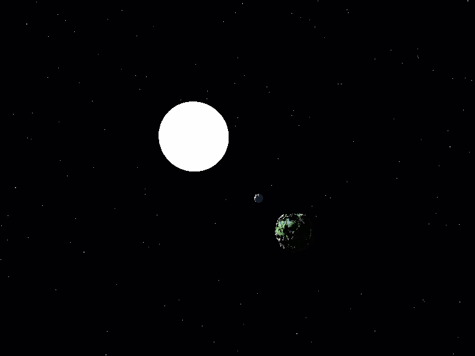</a> | <a href="docs/screenshots/surface-view.png">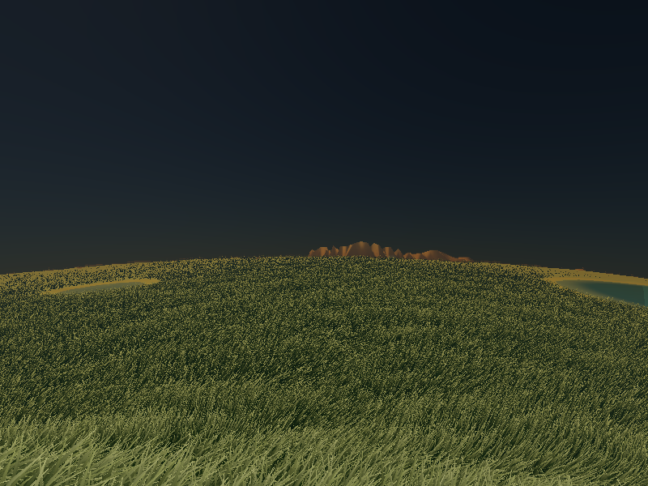</a> | <a href="docs/screenshots/planet-orbit.png">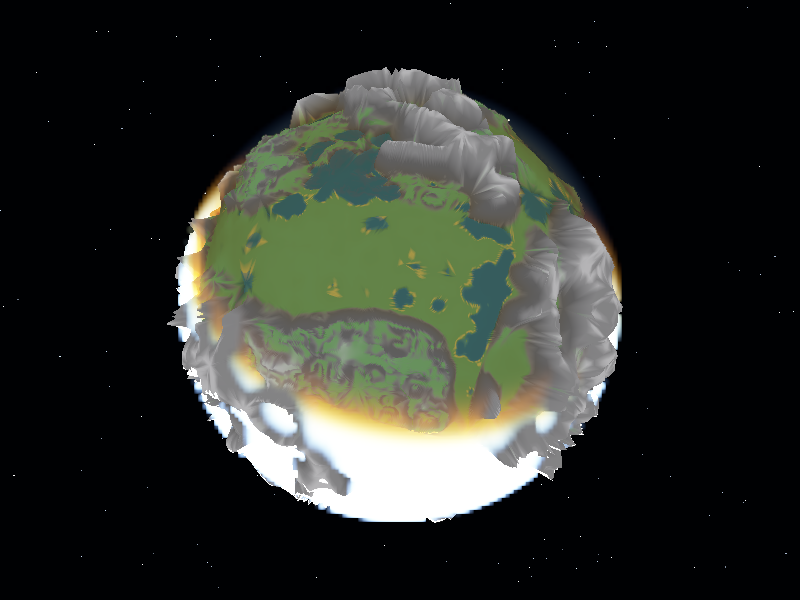</a> |

These [renderer captures](docs/screenshots/) were generated with version 0.0.1.
The surface and planet views use the current working scene, including its atmosphere.
The solar overview uses the [frozen compact test scene](tests/fixtures/development/configs/scenarios/solar_system.json)
to fit the Sun and Earth in one frame. Click an image to view it at full size.

A C++20/OpenGL project that renders a moving Sun, Earth, and Moon from
`configs/scenarios/solar_system.json`.

The visual reference for landscape and vegetation is the
[Quick Grass live demo](https://simondevyoutube.github.io/Quick_Grass/) and its
[GitHub source](https://github.com/simondevyoutube/Quick_Grass). The renderer
now includes wind-animated instanced grass adapted to spherical terrain.

The development scene uses kilometers for world coordinates: the Sun is 5 km
across, Earth is 2 km across, and the Moon is 540 m across. The Earth–Moon
center of mass travels between **74.6 and 104.4 km** from the Sun, with outer
orbital half axes of 89.5 and about 88.25 km.
The surface camera starts 2 m above sampled terrain or water, whichever is
higher, and walks at 80 m/s.
The development config stores planets in a `planets` array; the surface
camera's `planet_index` selects an entry in that array.

## Atmosphere, sunsets and mist

Earth now has an atmosphere with an outer radius of **1.1 × its reference
radius**: a 100 m shell on this 1 km-radius planet. It follows the planet's
translation and rotation and is visible from the surface and from orbit.
Terrain peaks above 100 m can protrude through the shell. The Moon remains airless.

| Atmosphere at 20 s | Red-dust sunset at 34 s | High water at 20 s | Heavy dust at 20 s |
|:--:|:--:|:--:|:--:|
| <a href="docs/screenshots/atmosphere-day.png">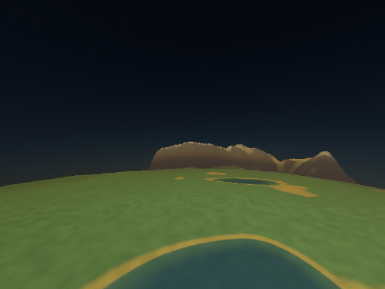</a> | <a href="docs/screenshots/atmosphere-sunset.png">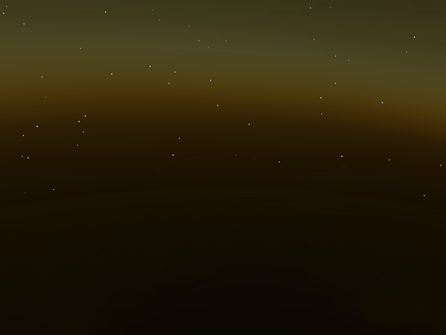</a> | <a href="docs/screenshots/atmosphere-mist.png">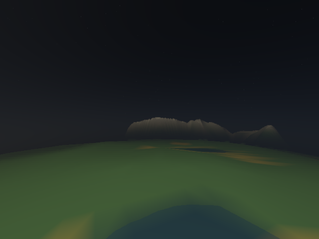</a> |  |

The dust image is intentionally black; the depth and body-ID buffers still
confirm terrain geometry. The sunset camera faces the Sun. Other columns use
the same camera and time so their differences come from atmospheric composition.
All images are direct renderer captures. Their resolved configs and replay
sidecars are generated by the atmosphere test target below.

Each planet can opt in with an `atmosphere` object. All fields are optional:

~~~json
"atmosphere": {
    "enabled": true,
    "radius_multiplier": 1.1,
    "refraction_enabled": true,
    "surface_pressure_pa": 101325.0,
    "temperature_k": 293.15,
    "gas-contents": {
        "oxygen": 25.0,
        "water": 2.0,
        "nitrogen": 70.0,
        "red_dust": 0.0001
    }
}
~~~

Composition values are **percentages**: `25` means 25%, and `0.0001` means
0.0001%. A supplied `gas-contents` object replaces the default mixture; omitted
species are zero and the balance up to 100% uses inert argon-like optics.
Supported names are `nitrogen`, `oxygen`, `water`, `argon`, `carbon_dioxide`,
and `red_dust`. Unknown species, negative/nonfinite percentages, and totals
above 100% are rejected. Omitting `gas-contents` selects dry Earth-like air
(78.08% nitrogen, 20.95% oxygen, 0.93% argon, 0.04% carbon dioxide).
Omitting the entire `atmosphere` object preserves the airless render path.
The older `atmosphere_enabled` and `atmosphere_height` fields remain readable
legacy metadata; the new block controls rendering and takes precedence.

| Parameter | Default | Effect |
| --- | ---: | --- |
| `refraction_enabled` | true | Bend atmospheric view rays; false retains scattering with straight rays. |
| `radius_multiplier` | 1.1 | Outer shell radius divided by planet radius; allowed range 1.001–2.0. |
| `surface_pressure_pa` | 101325 | Reference surface pressure; 0 is vacuum, maximum 10,000,000 Pa. |
| `temperature_k` | 293.15 | Reference temperature, 180–373.15 K; affects density and saturation. |
| `suspended_water_fraction` | 0.001 | Fraction of excess condensable water retained as droplets, 0–1. |
| `droplet_radius_um` | 10 | Effective droplet radius, 0.1–100 µm; smaller droplets increase extinction for a given liquid-water mass. |

The CPU model derives an approximate visible-band refractive index and RGB
optical coefficients from composition and pressure/temperature. Molecular
Rayleigh scattering preferentially scatters blue light. Aerosol scattering
and absorption add haze and warm long light paths. The miniature atmosphere
compresses an Earth-like molecular optical column into the configured shell;
red dust uses a tunable mineral-aerosol approximation, not a gas equation of
state. `red_dust` is therefore an effective aerosol loading expressed as a
percentage. This is a rendering model, not a precision refractometry model.
The role of pressure, temperature and humidity is described in
[NIST's air-index documentation](https://emtoolbox.nist.gov/Wavelength/Documentation.asp).

Water vapour itself does not create white fog. The model estimates saturation
from temperature and pressure, then converts a small fraction of excess water
to suspended droplets. At 293.15 K and 101325 Pa, the configured 2% water remains
vapour; raising water to 20% (and reducing nitrogen to 50%) produces mist.
Cooling the same composition can also produce condensation. This follows the
[distinction between vapour and fog droplets](https://www.weather.gov/source/zhu/ZHU_Training_Page/fog_stuff/fog_definitions/Fog_definitions.html).
Raising red dust to 0.1% gives an opaque, absorbing atmosphere. Dense dust is
not automatically exposed back to daylight brightness.

Atmospheric scenes render terrain, sky and water reflections in linear HDR,
then integrate view-path scattering and extinction before a single display
exposure. Direct sunlight is attenuated along its atmospheric path too. Terrain shadow maps also block direct
atmospheric scattering behind mountain ridges; indirect atmospheric fill remains.
The finite solar disk softens the planet's twilight shadow. The first version
uses RGB single scattering, exponential density profiles, and a bounded
48-step curved view integration (24 steps with refraction disabled), with
8 straight light-path samples precomputed in a reusable GPU density-column
table. Atmospheric fields use quarter resolution with depth-aware upsampling
and full-resolution integration at unresolved edges. Terrain, stars, and the
Sun stay at full resolution. It uses a single-sample HDR
buffer; airless scenes keep their existing multisampling. This follows the
scattering/transmittance formulation described by
[Bruneton](https://ebruneton.github.io/precomputed_atmospheric_scattering/),
with a smaller runtime approximation instead of precomputed multiple scattering.
Refraction uses the composition-derived index and its radial density gradient.
A midpoint integrator follows `d(direction)/ds = (grad(n) - direction *
dot(direction, grad(n))) / n`; the refractive index tapers continuously to
vacuum at the shell edge. This bends grazing rays toward denser air and raises
visible distant sky features. The CPU reference tracer checks the spherical
Snell invariant `n * r * sin(theta)` and reciprocal ray paths, following the
[spherical-atmosphere formulation](https://doi.org/10.1093/mnras/stv1078).
The effect uses this miniature world's density profile; it is not calibrated
to terrestrial astronomical refraction.
Set `planets[].atmosphere.temperature_k` in the scenario JSON to control the
reference air temperature (for example, `250` or `330`). At fixed pressure,
cooler air is denser and bends grazing sky rays more strongly; setting
`refraction_enabled` to `false` removes the displacement. Temperature is a
configured input for now and is not calculated from orbital sunlight.

Reference optical coefficients are cached once per planet and shared across sky
lighting, materials, main/reflection atmosphere passes and capture diagnostics.
Changing optical inputs refreshes the pack; scene reload owns a fresh cache.
Capture metadata reports evaluation/reuse counts. The
[shared optics checkpoint](docs/journal/architecture/atmosphere/optics/study.md)
documents keys, failure retention and software/hardware validation.

| Strong bending | Straight-ray control |
|:--:|:--:|
| <a href="docs/screenshots/refraction-extreme-on.png">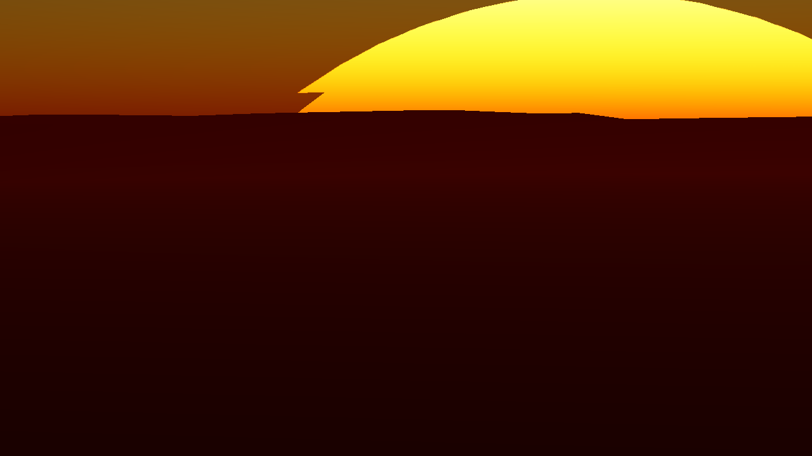</a> | <a href="docs/screenshots/refraction-extreme-off.png">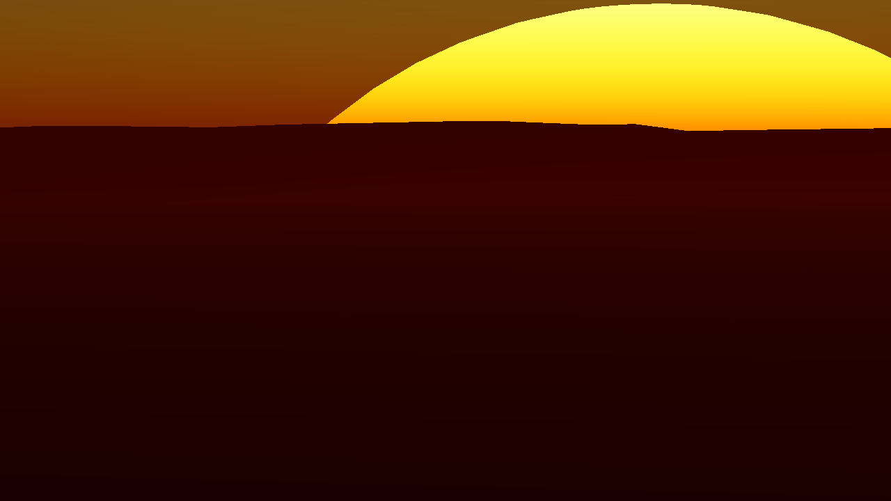</a> |

This controlled example uses a 15 m shell on the 1 km planet, 150,000 Pa,
180 K, a camera 2 m above the ground, and a 15° field of view. The compressed
shell deliberately exaggerates the radial index gradient. Both captures use
the same scene, time and full-resolution atmosphere integration; only
`planets[0].atmosphere.refraction_enabled` changes. The bent image extends the
Sun's apparent limb into the sky near the horizon. Its small pointed edge
shows the present image-reprojection limit where terrain hides the source.
These are renderer captures, not a physically calibrated Earth atmosphere.
The exact resolved scenes and camera are in
[`on`](docs/captures/replay/refraction/refraction-extreme-on.png.json) and
[`off`](docs/captures/replay/refraction/refraction-extreme-off.png.json) replay sidecars.
For a regular scenario JSON, set `refraction_enabled` to `true` or `false` in
that planet's `atmosphere` object; scattering remains enabled in either case.
Replay either example directly, for instance:

~~~bash
./build/PlanetSimulation --replay docs/captures/replay/refraction/refraction-extreme-on.png.json --surface-capture build/refraction-extreme-on-replay.png
~~~

The current refraction pass reprojects the existing distant sky image. Rasterized
terrain and luminous body pixels keep their silhouettes, depth, and body IDs;
off-screen or terrain-hidden
sources cannot be recovered, and geometric terrain shadows/direct-light paths
remain straight. Strong gradients have a bounded integration budget; trapped
rays contribute no background light. Multiple scattering, wavelength-dependent
ray dispersion, weather evolution, and volumetric terrain-shadow shafts remain
future work.

`src/simulation/Atmosphere.h` keeps the model independent of OpenGL.
`LocalAirState` carries pressure, temperature, total water and dust, plus an
optional suspended-liquid-water density supplied by a future cloud solver.
`atmosphereOptics` converts that state into render coefficients; the initial
scene supplies one reference state per planet with altitude-dependent density.
`incidentSolarPowerWm2` provides exposure-independent incident solar power with
inverse-square distance and local incidence for future climate zones. A later
solver can sample these inputs by planet-local position and time, evolve heat
and moisture, and supply spatial air/cloud fields without changing the JSON
composition model. No climate, cloud transport or precipitation simulation is
run in this milestone.

Generate the tested atmosphere comparisons and exact replays:

~~~bash
xvfb-run -a cmake --build build --target render_atmosphere_scenarios
~~~

Use an existing display instead of `xvfb-run` when available. Outputs go to
`build/atmosphere-scenarios/`: each PNG has a resolved config, capture log and
replay sidecar. `results.json` records measured brightness, terrain contrast,
sky RGB, exposure, refractive index, humidity and suspended liquid-water mass.
`AtmosphereScenariosRenderIntegration` checks dust blackout, mist contrast,
blue daylight sky, warm sunset, dark night with and without stars, moonlight,
orbital viewing and replay. `AtmosphereRefractionRenderIntegration` measures
actual shader displacement against the CPU tracer for surface and orbital rays,
and checks vacuum, missed shells, foreground occlusion and trapped rays.
For example:

~~~bash
./build/PlanetSimulation --replay build/atmosphere-scenarios/mist.png.json --surface-capture build/mist-replay.png
~~~

## Automatic interactive quality

The interactive renderer targets **at least 20 FPS** by reducing scene pixel
detail when the rolling frame time stays above 55 ms, then restoring detail
after sustained headroom below 32 ms. It uses six render scales from 100% down
to 25%; the window and statistics panel remain at native resolution. The startup
scale also respects available graphics memory reported by the driver when an
NVX or ATI memory extension is present. The memory estimate reserves space for
other GPU resources. `--video-memory-mb 256` can impose a lower explicit limit
for testing or a shared device. A resolution change is printed to stdout.

The 20 FPS threshold is a target, not a guarantee: scenes can still fall below
it at the minimum scale, especially on software rendering or while loading
terrain. Deterministic captures and benchmarks always use the requested fixed
resolution so their image hashes and timing comparisons remain meaningful.

## FPS and performance traces

Press **I** in any camera mode to toggle a black statistics panel with a white
border showing FPS, frame time, GPU pass time, and device utilization. Hold **Tab** to show it
temporarily when the toggle is off. `GPU USE` is the device-wide percentage
reported by NVIDIA NVML on Linux, sampled asynchronously at most twice per second.
It includes other applications using that GPU; GPU pass milliseconds remain a
separate measurement. See [NVIDIA's utilization definition](https://docs.nvidia.com/deploy/nvml-api/api/group__nvmlDeviceQueries.html).
NVML is loaded optionally from the installed driver, with no CUDA build dependency.
Software rendering, other platforms/vendors, missing telemetry permissions,
driver errors and ambiguous matching adapters display `GPU USE N/A`.
Identical-model multi-GPU setups deliberately remain unavailable because the
OpenGL renderer name cannot identify the active physical adapter uniquely.
FPS uses a rolling wall-clock average over
roughly 0.25 seconds; GPU timings arrive a few frames later. The interactive
loop uses vsync without adding a second 16 ms sleep.

<a href="docs/screenshots/performance-overlay.png">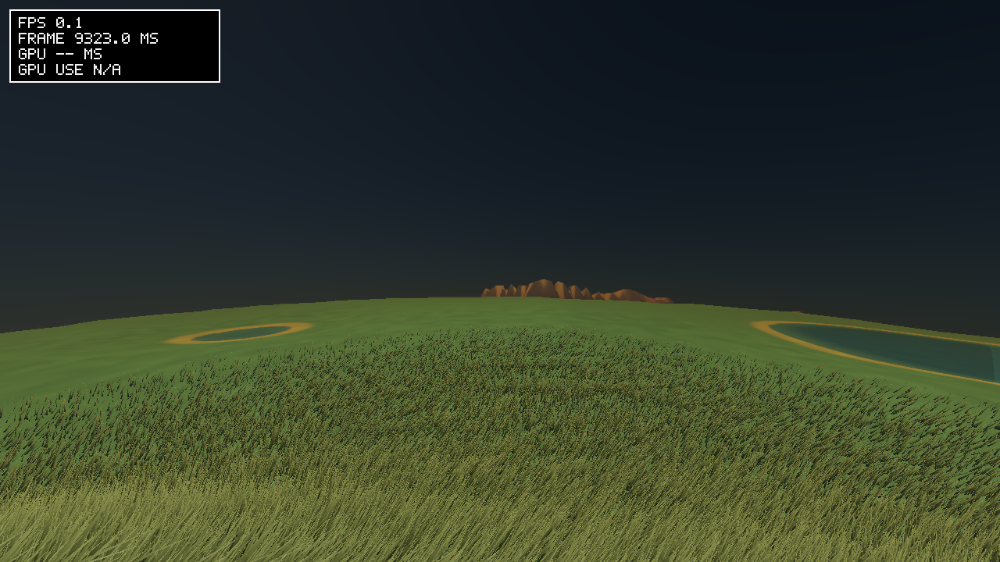</a>

Captured headlessly at 1280×720 with Xvfb and Mesa llvmpipe using
`--benchmark-overlay`, which draws the same panel toggled by **I**.
The displayed timings reflect software rendering in the capture environment.
Regenerate it from the repository root after building:

~~~bash
LIBGL_ALWAYS_SOFTWARE=1 xvfb-run -a -s "-screen 0 1280x720x24" ./build/PlanetSimulation --config configs/scenarios/solar_system.json --surface-capture build/performance-overlay.png --simulation-time 20 --render-size 1280 720 --benchmark-frames 20 --benchmark-overlay
~~~

The generated `.png.json` sidecar preserves the scene and camera for replay;
the overlay's live timing values vary between runs.

Record a CSV trace while exploring the scene:

~~~bash
./build/PlanetSimulation --performance-trace build/performance.csv
~~~

Each row identifies its frame and simulation time, CPU wall time and GPU time
per pass, terrain uploads, shadow updates/reuses, and completed-scene reuses.
`terrain_build_ms` records completed CPU terrain jobs on the frame that installs
them, including background jobs; their elapsed time can overlap earlier frames
and must not be added to the current frame time.
`foliage_rebuilds` counts rebuilt grass plans; `foliage_placement_ms`,
`foliage_sort_ms`, and `foliage_upload_ms` report triangle planning, the legacy
per-blade sort (now zero), and triangle-ID submission. `foliage_upload_bytes`
records that buffer payload, excluding uniforms and driver overhead.
The appended `gpu_frame_span_ms` measures frame start/end GPU timestamps,
separately from the sum of render stages in `gpu_ms`. `gpu_status`,
`gpu_query_polls` and `gpu_events_dropped` identify busy/missing samples and
stage overflow. Tracing also creates `path.csv.gpu-work.csv`, a bounded
nonblocking stream for terrain field/expansion, grass metadata/allocation and
main/reflection placement, with request and generation identities. Placement
is nested in geometry stages, so these timings must not be added to `gpu_ms`.
See the [GPU timing study](docs/journal/architecture/terrain-gpu/async/hardware/timing/study.md)
for scope, missing-sample statuses and remaining hardware acceptance work.
Interactive traces also create `path.csv.native-loop.csv`, with complete loop
wall time, event polling, presentation and minimized-window wait intervals.
It includes loading frames and the profiler's collection work; join it to the
other traces by frame number. Its contained intervals and GPU times must not
be added to the full wall time. See the [native loop study](docs/journal/architecture/terrain-gpu/async/hardware/loop/study.md).
Interactive tracing also writes `path.csv.publications.csv`: ordinary CPU/compute
terrain requests and resident grass-only attempts, ending at the first completed
draw with matching generation/contact receipts. Wall milliseconds and elapsed
frames include queueing and readiness delays. Failed, rejected, coalesced,
obsolete and never-drawn attempts have explicit outcomes and no successful
publication latency. GPU work adds an `attempt` column for joining these records.
Asynchronous resident reloads add a `reload` root and linked body attempts;
`parent_attempt`, `scene_exchange_ms` and `child_attempts` distinguish whole-scene
exchange from off-live preparation. Success requires the exchanged scene's
complete consumer draw. Root/child intervals overlap. Invalid, superseded and
failed transactions retain unsuccessful outcomes. Synchronous reload and capture
adapters use the same consumption gate; `capture_mode` identifies admission mode.
Off-live synchronous GPU work retains its child attempt with an empty frame field,
including reloads invoked between capture frames.
CPU grass-only rebuilds retain terrain serials and record actual anchors. Actual
character handoffs record `origin_body` and `contact_bound_ms`, with a `handoff`
kind whose latency covers binding through consumption. Preview handoffs and
unchanged grass are excluded. These intervals overlap. Matched hardware cost
acceptance remains pending. See the
[publication tracing study](docs/journal/architecture/terrain-gpu/async/hardware/publication/study.md),
the [reload tracing study](docs/journal/architecture/terrain-gpu/async/hardware/publication/transactions/study.md)
and [capture/contact/CPU grass study](docs/journal/architecture/terrain-gpu/async/hardware/publication/lifecycle/study.md).
Tracing also creates `path.csv.memory.csv`: one bounded worker samples optional
NVML memory only after the active context UUID and driver UUID match. Rows retain
query times, observation/sample age, stale/unsupported/error status, reload roots,
logical overlap reservations, partial CPU vectors and process RSS. NVX counters
are setup/shutdown checkpoints. These device-wide readings include other
processes and periodic samples can miss transient peaks; event rows reference
cached physical samples. Startup sampling is asynchronous. See the
[memory diagnostic study](docs/journal/architecture/terrain-gpu/async/hardware/memory/study.md).
`cpu_foliage_ms` includes complete CPU preparation. GPU placement, wind,
compaction and drawing belong to the opaque/reflection passes;
`gpu_foliage_ms` remains zero because that named stage prepares the CPU plan.
Passes cover simulation updates, mesh preparation, lighting, foliage preparation, lookup tables,
shadows, opaque geometry, reflected geometry, reflected atmosphere, water,
main atmosphere, cached presentation, HUD, and swap/presentation. GPU queries
are collected only when ready; an eight-frame ring skips GPU sampling if it
fills, marking `gpu_valid=0` and leaving GPU values empty. Rows can arrive out
of order: sort by `frame`. GPU queries run only while the statistics panel
is visible or tracing is requested. Tracing never calls `glFinish` or waits
for a query result.

CPU values are elapsed wall time, including driver stalls, not CPU utilization.
A large `cpu_present_ms` can be GPU backpressure or vsync; inspect the GPU pass
columns to identify rendering costs. `gpu_ms` sums the measured GPU passes;
it excludes presentation idle time. CPU and GPU times overlap and must not be
added together.

For nested CPU calls, worker lanes and thread CPU time, add `--cpu-trace`:

~~~bash
./build/PlanetSimulation --cpu-trace build/cpu.json --performance-trace build/performance.csv
python3 scripts/benchmarks/cpu_report.py build/cpu.json --output-dir build/cpu-report
~~~

Close the application normally to finish the JSON stream. The trace can also
be opened in a Chrome trace viewer or Perfetto. The standalone
`build/cpu-report/report.html` includes a chronological timeline, expandable
top-down call paths, self-time rankings and reversed callee-to-caller paths.
CSV and SVG versions are saved beside it. `--skip-frames N --frames M` selects
complete frames for reports; worker jobs crossing the selected interval are
excluded. Keep the unsliced trace to inspect complete background jobs.

Scopes cover simulation/camera updates, terrain/shoreline construction, mesh
installation, grass placement/batching/upload, render passes, presentation and
capture completion/readback/PNG writing. The trace starts in `Renderer::run`,
after constructor startup. Self time includes uninstrumented callees and tracing
overhead; inclusive times must not be summed. Per-thread CPU time excludes
other threads, including software-driver workers, and is omitted on platforms
without a thread CPU clock. Streaming uses bounded memory and serializes writes;
disabled tracing does not read clocks or write events. It adds no GPU waits.

The [CPU profiling study](docs/journal/benchmarks/cpu-profiling.md) pairs these
native timings with Callgrind function/caller instruction counts, reports
profiler-environment limitations, and includes top-down and bottom-up graphics.

For a repeatable, uncapped benchmark with a final capture:

~~~bash
./build/PlanetSimulation --config configs/scenarios/solar_system.json --surface-capture build/performance.png --simulation-time 20 --render-size 1280 720 --benchmark-frames 90 --performance-trace build/performance.csv
~~~

The simulation advances by 1/60 s per benchmark frame. Set `--benchmark-step 0`
to measure paused-frame reuse, or another step to measure slowly changing
shadows. Discard the first ten frames (shader/resource warmup) and the last
frame (captured without swapping) when comparing steady rendering costs.
`--benchmark-overlay` includes the HUD for diagnostics; its wall-time values
are not part of deterministic scene replay. `--atmosphere-full-resolution`
keeps the full-resolution integration path for quality comparisons. Capture
sidecars preserve that quality choice for replay.

To compare a paused stationary camera, walking with grass, and walking without
grass at the same frozen orbital time:

~~~bash
LIBGL_ALWAYS_SOFTWARE=1 LP_NUM_THREADS=2 xvfb-run -a python3 scripts/benchmarks/camera_movement.py --binary build/PlanetSimulation --output-dir build/camera-movement
~~~

Omit the software-renderer environment variables when profiling a physical GPU.
The script combines the saved grass camera with the current working scenario,
records the resolved inputs, driver, executable hash, per-frame CSV and summary,
and advances the camera by 2 m per frame using `--benchmark-walk-step`.
It discards five warmup frames and the final readback frame. This deliberately
accelerated walk exposes rebuilds in a short run; it does not emulate a fixed
real-time walking speed. Captures rebuild terrain synchronously for repeatable
geometry, whereas interactive walking builds terrain in the background.
A stationary paused scene reuses its complete rendered image. These capture
times therefore cannot establish the FPS of interactive walking. For that,
use `--performance-trace` during normal movement on the target GPU.
The [camera-movement journal](docs/journal/benchmarks/camera-movement.md)
records the measured costs, optimization comparison and remaining work.

On the Quadro M1000M at 1280×720, the same 90-frame surface benchmark measured:

| Rendering version | Mean frame time | Main atmosphere GPU | Reflected atmosphere GPU |
| --- | ---: | ---: | ---: |
| Before optimization | 208 ms | 117 ms | 79 ms |
| GPU density-column table | 138 ms | 75 ms | 54 ms |
| Reduced atmospheric fields and shared ray calculations | 26 ms | 10 ms | 9 ms |

These measurements used Debug CPU builds to isolate the rendering changes;
normal development builds now use `RelWithDebInfo`. This is about **8× faster**
on that scene and GPU, not a guaranteed frame rate for every view. A later
`RelWithDebInfo` verification run measured 28.5 ms (about 35 FPS). The final
capture's average per-channel difference from the original was below 0.04 of
one 8-bit colour level; differences concentrate around edges. GPU tests also
compare the reduced path with the full-resolution reference at a sharp depth
boundary, while the existing night, mist, dust, sunset and bending checks stay
in place.

An October 5, 2026 comparison uses the **same current production scene and
binary on both physical GPUs**, at 1280×720, with three alternating pairs per
case and 237 measured frames per GPU/case:

| Current workload | Quadro M1000M mean | RTX 3070 Ti mean | Frame-time ratio |
| --- | ---: | ---: | ---: |
| Fixed camera, orbital motion | 73.279 ms | 5.745 ms | 12.75× |
| Walking, orbital motion | 78.741 ms | 5.959 ms | 13.21× |

These are uncapped EGL offscreen timings. The short walking path triggers no
terrain/grass rebuilds, and this denser scene differs from the historical
optimization workload above. The [GPU comparison journal](docs/journal/benchmarks/gpu-comparison/study.md)
records the method, GPU stage costs, raw traces, image agreement, telemetry
and reproduction commands. Native interactive FPS and CPU-versus-compute
terrain acceptance remain separate measurements.

The historical optimization's remaining work was still mostly on the GPU. Moving more CPU algorithms to
shaders would not address the measured bottleneck: cached CPU mesh preparation
was about 0.005 ms per frame. The useful reuse rules are now:

- Atmospheric density columns are generated on the GPU once per shell shape;
  camera movement, gas composition, sunlight and exposure reuse them.
- Shadow maps update when accumulated local Sun-direction change reaches
  approximately one shadow-map texel, or when mesh revision, extent or
  resolution changes. Config reload invalidates them.
- A paused atmospheric scene with identical camera, simulation time, geometry
  and viewport reuses its completed HDR image. Pending terrain builds prevent
  this reuse. The HUD is drawn separately, so releasing Tab removes it immediately.
  The uncapped paused benchmark took about 1.6 ms per frame.
- Existing terrain LOD movement thresholds and background mesh generation remain
  active. Moving scenes still render every frame.

## Surface lighting and airless night controls

| Daylight (20 s) | Moonlit night (55 s) | Moonless control (55 s) |
|:--:|:--:|:--:|
|  | <a href="docs/screenshots/moonlit-night.png">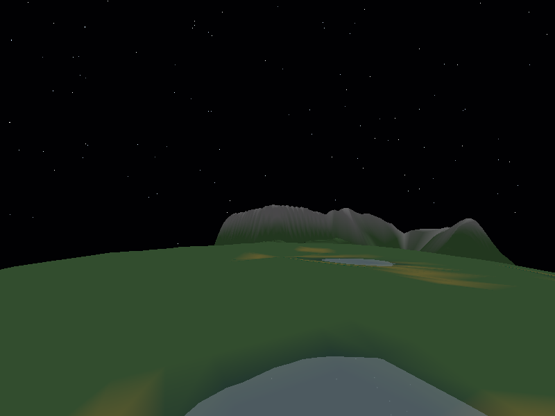</a> | <a href="docs/screenshots/moonless-night.png">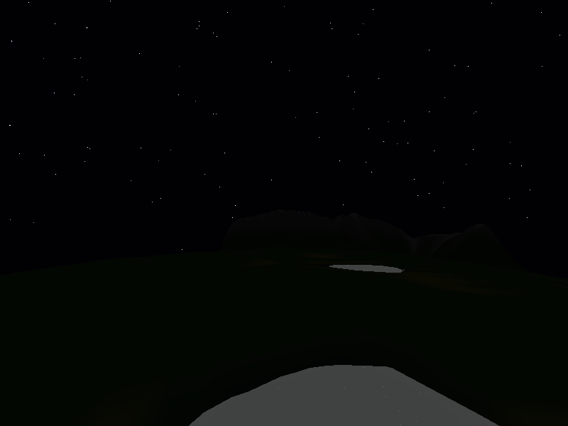</a> |

Daylight shows the current working scene with its atmosphere. The two night
images retain the saved airless lighting configurations, rendered with the
current version: moonlight reveals dim terrain, while the moonless control
stays almost black. Both night captures use the same time and maximum exposure
of 4096. The moonless control changes only `lighting.reflections_enabled` to
false, retaining the Moon's geometry and ambient fill of `0.000001`.
These PNGs are direct captures without brightness edits.

[Replay sidecars](docs/captures/replay/) for the three surface images preserve their complete scene,
camera and timestamp, so the comparison survives later config edits. For example:

~~~bash
./build/PlanetSimulation --replay docs/captures/replay/moonlit-night.png.json --surface-capture build/moonlit-night.png
./build/PlanetSimulation --replay docs/captures/replay/moonless-night.png.json --surface-capture build/moonless-night.png
~~~

| Terrain shadow comparison | Twilight regression |
|:--:|:--:|
| <a href="docs/screenshots/terrain-shadows.png">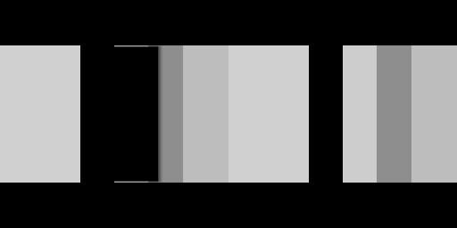</a> | <a href="docs/screenshots/twilight.png">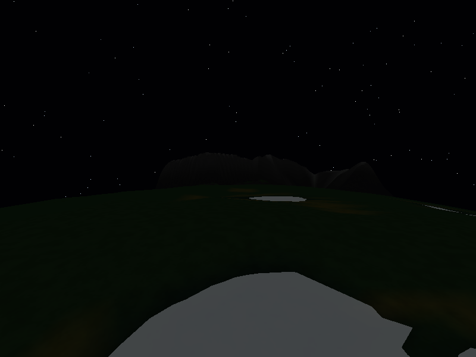</a> |

The ridge test shows shadows enabled on the **left** and disabled on the
**right**. The twilight capture preserves the reported camera at
2707.6216211392884 s; its regression checks both average and peak terrain
brightness to catch isolated bright triangles. The reproduction commands are
in the render-test section below.

## Orbits and rotation

Each body has a unique `name` and positive `mass_kg`. Every planet or moon has
an `orbit.parent` naming another body; all parent chains must reach the Sun.
Parents may appear after their children in the array. Unknown parents,
duplicate names, self-orbits, and cycles are rejected when loading or reloading.
The Sun is the sole root and has no `orbit`.

| Setting | Meaning |
| --- | --- |
| `orbit.semi_major_axis`, `orbit.semi_minor_axis` | Large and small half axes in `distance_unit`; require `0 < b <= a`. Omitting `b` gives a circle. |
| `orbit.mean_anomaly_deg` | Initial phase measured uniformly in time; 0 starts at periapsis, 180 at apoapsis. |
| `orbit.inclination_deg` | Orbital plane tilt relative to world XY. |
| `orbit.ascending_node_deg` | Rotation of the tilted orbital plane about world +Z. |
| `orbit.periapsis_deg` | Direction of periapsis within that plane. |
| `rotation.period_seconds` | Axial rotation period; 0 stops spin, a negative value reverses it. |
| `rotation.axial_tilt_deg` | Tilt of the body's north axis about world +X, independent of orbital phase. |
| `rotation.phase_deg` | Initial rotation about the body's own +Z axis. |

Orbital planes use world coordinates, independent of the parent's spin.
Earth's outer orbit lies in XY. Earth's axial tilt and the Moon's orbital
inclination are both **20°**, with a zero ascending node, so the Moon orbits
in Earth's equatorial plane. Both bodies spin once every **60 seconds**;
the Moon's orbital period is **120 seconds** and the Earth–Moon collective's
outer period is about **5747.66 seconds (95.79 minutes)**. The frozen compact
test scene retains the earlier 12.5 km outer half axis and 300-second period.
These are elapsed simulation seconds at normal speed, including frames that take longer to render. Reloading resets the epoch.
Press **T** to pause or resume all orbital motion and axial spin. Camera controls
remain active while paused, and resuming continues from the frozen time without
a jump. Press **Y** to halve or **U** to double the speed of orbits and spin
(from 1/1024× to 1024×; starts at 1×). Each press prints the current multiplier.
Speed changes preserve the current orbital phase and leave camera controls at
their usual speed. Changing speed while paused takes effect on resume.
Reloading preserves the paused/running state and speed multiplier.

Press **O** in the Sun orbit camera to show each planet's and moon's previous ten
revolutions. The oldest 20% of each path fades smoothly into view, avoiding a
hard cut at the distant end. The colored trails use simulated world positions, so a moon's
trail follows its moving parent. Their colors average the rendered terrain
vertex tints with each body's configured base color. A label beside each visible
body shows its name, parent, semi-major and semi-minor axes, eccentricity,
period, radius, and mass. Press **O** again to hide the display. The display
stays hidden in planet orbit and surface camera modes.

Speeds follow [Newton's form of Kepler's laws](https://science.nasa.gov/learn/basics-of-space-flight/chapter3-3/).
Using axes in meters, `e = sqrt(1 - b²/a²)`, `μ = G × (parent mass + collective mass)`,
`T = 2π × sqrt(a³/μ)`, and `v² = μ × (2/r - 1/a)`, with
`G = 6.67430e-11 m³ kg⁻¹ s⁻²`. The minor axis determines eccentricity and the
variation in speed around the ellipse; the major axis and masses set the period.
Kepler's equation supplies the position and velocity at an absolute time,
keeping ellipses stable without accumulated integration error.

The collective mass includes the body and all descendants. For Earth's outer
orbit, the combined Earth–Moon mass is used. Within that collective, Earth
and Moon move on opposite sides of their shared center of mass in inverse
proportion to their masses. The Sun also recoils, conserving the whole system's
center of mass and momentum. The configured Sun `position` is its position at
time zero. An orbit's axes specify the **relative separation between the parent
body and the child collective's center of mass**. Multiple siblings contribute
to their parent's recoil. This is a hierarchy of prescribed two-body ellipses;
tidal effects and gravitational perturbations between branches are not modeled.

The example masses are deliberately scaled for this small, fast scene:

| Body | Mass (kg) |
| --- | ---: |
| Sun | 1.2194532287919512e19 |
| Earth | 6.338938161361669e17 |
| Moon | 7.923672701702087e15 |

They were originally calculated for the compact test scene using
`M_earth + M_moon = 4π² × (2500 m)³ / (G × 120²)`
and `M_sun = 4π² × (12500 m)³ / (G × 300²) - (M_earth + M_moon)`,
with an Earth:Moon mass ratio of 80:1. The working scene keeps those masses but
increases the outer orbital axes, lengthening its period and reducing sunlight
and moonlight through distance falloff. Spin is configured independently of mass.

Legacy unnamed planets receive names such as `planet_0` and default to orbiting
`sun`. A legacy `orbit_radius` becomes both axes. `orbit_speed` and planet
`position` remain readable metadata; dynamic positions and speeds come from
the orbital elements. Terrain, water, local coordinates, and surface cameras
share the same body rotation. Planet orbit cameras follow translation while
letting the surface turn beneath them.

## Sunlight, moonlight, and config descriptions

`sun.absolute_magnitude` sets **bolometric absolute magnitude**, with a lower
number giving more light. The working value of **3.1** and emission RGB
`[1.0, 0.99, 0.97]` give a brighter, nearly white Sun. The
[IAU magnitude scale](https://arxiv.org/abs/1510.06262) gives
`L = 3.0128e28 × 10^(-0.4 M_bol)` watts; a magnitude difference of −5 means
100 times the luminosity. The nominal Sun is about magnitude 4.74.

The `lighting` section groups ambient fill, display exposure, a reference
distance, and the reflection switch. `reference_distance` uses `distance_unit`
and normalizes illumination from one nominal solar luminosity to 1 at that
distance. This is a display scale for the miniature scene; the absolute
magnitude still determines the intrinsic luminosity. Direct light follows
inverse-square distance falloff. `exposure` affects the final image after
adding sunlight, reflected light, and ambient fill. An exponential tone curve
and sRGB encoding keep the brighter Sun and terrain highlights displayable.

The working scenario enables `lighting.auto_exposure` for surface and planet
orbit cameras. The meter uses sunlight above the local horizon, moonlight,
ambient fill, and an estimate of atmospheric skylight at the camera's planet-local
position. Twilight skylight prevents a sunlit atmosphere from being exposed
at maximum night sensitivity. It selects an exposure
for an 18% gray surface using `target_luminance`, limited by `min_exposure` and
`max_exposure`. `lighting.exposure` supplies exposure compensation. Sensitivity
rises at night to reveal moonlit terrain. Very low ambient fill and the upper
limit keep a moonless night dark. Setting `enabled` to false restores fixed
exposure; the whole-system camera always uses fixed exposure.

Automatic exposure also checks the completed image, including atmosphere
and water reflections. It lowers brightness when needed
to keep white clipping to at most **5% of scene pixels**. Captures report
`white_clipped_fraction`, counting pixels whose RGB channels are all at least
250/255. The limiter conservatively protects every channel in at least 95% of
the image when reducing exposure, using maxima over 8×8 tiles weighted by
their actual pixel area.
Protected highlights have a small margin for display rounding. This can lower
exposure below `min_exposure`; it never raises the incident meter's exposure.
Manual exposure bypasses the limiter. The performance overlay is not metered.
Atmospheric scenes use a small GPU reduction and synchronous readback before
tone mapping. Airless scenes retain their display-space blending and MSAA;
only a frame exceeding the limit is rerendered in HDR for highlight recovery.

This meter is deterministic, with no adaptation history or warm-up frames.
It approximates local lighting using the spherical horizon; individual ridges
still cast shadows but do not change the meter. The same exposure is used for
terrain, water, the Sun, and water reflections in the final image. Stars and
the background fade below `auto_exposure.star_exposure` and reach full visibility at higher
sensitivity, so stars can disappear during daylight.

Each planet's `reflection.geometric_albedo` and `reflection.color` determine
the strength and RGB tint of sunlight it sends to other bodies. The Moon uses
albedo 0.12; setting it to 0 disables its reflection. Setting
`lighting.reflections_enabled` to false disables all bounced sunlight.
Reflection uses a
[Lambert sphere phase function](https://www.aanda.org/articles/aa/pdf/2018/02/aa31192-17.pdf):
`Φ(α) = [sin(α) + (π−α) cos(α)] / π`, where `α` is the Sun–Moon–receiver angle.
Full Moon sends the most light toward Earth, quarter phase sends `1/π` of that,
and new Moon sends none. The outgoing light is proportional to the Moon's
illuminating sunlight, albedo, color, `Φ`, and squared radius/separation ratio.
Sun–Moon and Moon–Earth distance falloff are both included.

Illumination is evaluated once per body per frame and shared by terrain,
water, and water reflection passes. Direct sunlight still shades surface
normals. Reflected light is averaged over the receiving sphere (intercepted
power divided over four times its cross-sectional area), as an inexpensive
uniform contribution to the whole planet. The same calculation allows
Earthshine on the Moon and multiple reflectors. This is one bounce only, with
no eclipses or recursive light exchange. The averaged reflected contribution
does not receive local terrain shadows.

Direct sunlight uses a Sun-facing depth map for each planet: a foreground
mountain blocks sunlight on terrain and water behind it, even when the hidden
surface faces the Sun. The maps contain the complete rendered terrain mesh,
including off-camera geometry, and follow the body's spin and orbital motion.
They are generated once per frame and reused in the main and water reflection
passes. Sun rays are parallel within each planet, consistent with its shared
lighting direction; shadows between separate celestial bodies are not modeled.

`lighting.shadows.enabled` toggles terrain shadows (default true).
`resolution` is the square depth map size, a power of two from 256 to 4096
(default 2048). `bias_texels` controls the slope-adjusted comparison offset
(0..4, default 0.5); excessive bias can erase small shadows. Filtered edges
reduce aliasing. Detail is limited by the map resolution and the current terrain
LOD. Shadow projection uses body-local coordinates, avoiding precision loss
from orbital translation. Ambient fill and averaged moonlight remain in shadow.
Receiver-plane filter corrections are bounded at grazing angles to prevent
large depth extrapolations that make shadowed triangles flash at sunrise or sunset.

Each config block now has a `description` and a `parameter_descriptions` map.
These explain units, limits, effects, and reserved settings while keeping the
actual parameter values directly editable. Metadata is ignored by the parser.
Ambient fill now belongs under `lighting.ambient_light`; older configs can
still use `skybox.ambient_light` as a fallback.

Use `--config PATH` to load another scenario, including render-test fixtures.
The selected file also becomes the interactive reload/watch target.

## Project layout

- `src/config`, `src/coordinates`, `src/simulation`: scene settings and physical models.
- `src/app` and `src/app/scene`: command-line options, window/input, config/replay loading and CPU scene preparation.
- `src/rendering/Renderer.h`: application renderer with constructor/destructor ownership.
- `src/rendering/runtime`: renderer state, terrain jobs, scene passes, captures and interactive loop.
- `src/rendering/{camera,geometry,foliage,lighting,atmosphere,diagnostics}`: rendering subsystems.
- `shaders/{terrain,foliage,water,skybox,atmosphere,diagnostics}`: matching GPU programs.
- `tests/{app,camera,geometry,foliage,lighting,atmosphere,simulation,config,diagnostics}`: subsystem tests.
- `tests/scenarios` and `tests/fixtures`: reproducible scene inputs.
- `docs/screenshots`: PNG images only; `docs/captures/replay`: replay JSON.
- `docs/captures`: image generation log and manifest; `scripts`: maintenance commands.

`python3 scripts/check_layout.py` checks folder sizes and README capture links.
Build products belong in a separate build directory.

`main.cpp` parses options, constructs `rendering::Renderer`, and calls `run()`.
The constructor loads and validates the scene and initializes the GLFW context
and rendering resources. Terrain meshes remain generated on demand for the
current camera. The destructor joins outstanding terrain jobs, releases GPU
resources, then destroys the window and context. Partially completed startup
and failed captures follow the same ownership rules. Use one Renderer at a time
on a single thread. Its public header hides GL and JSON implementation details.
`reload()` stages the complete scene, terrain and foliage before publication,
retains old resources through fenced retirement and preserves the current scene
on preparation failure. Window callbacks borrow the rebound camera and clock state.

## Prerequisites

- CMake 3.24 or newer, Git, and a C++20 compiler
- Python 3 for lighting and replay integration tests when `BUILD_TESTING=ON`
- OpenGL 3.3 support, GLFW 3, GLEW, and libpng development libraries
- A graphical display for GLFW, including the hidden-window render test

CMake fetches nlohmann/json and GLM during the first configure, plus GoogleTest
when tests are enabled, so that step needs network access. On Ubuntu/Debian,
install the local build dependencies with:

~~~bash
sudo apt update
sudo apt install build-essential cmake git python3 libgl1-mesa-dev libglfw3-dev libglew-dev libpng-dev
~~~

## Configure, build, and test

Run these commands from the repository root. Repeating the configure and build
commands updates an existing build directory. `RelWithDebInfo` keeps debug
symbols while optimizing CPU terrain generation; use `Debug` when needed for
step-by-step debugging, rather than for frame-rate comparisons.

~~~bash
cmake -S . -B build -DBUILD_TESTING=ON -DCMAKE_BUILD_TYPE=RelWithDebInfo
cmake --build build --parallel 2
~~~

Configuration parsing, terrain generation, and OpenGL rendering are compiled
once into `planet_config`, `planet_geometry`, and `planet_rendering` static
libraries, shared by the application and tests. Changes to their `.cpp` files
recompile that implementation and relink its consumers. Value-type config
headers forward-declare `Config`; code that reads JSON includes
`config/Config.h` explicitly. This keeps JSON parsing out of geometry and
camera compilation.

`planet_character` shares the astronaut's motion and terrain-contact code with
its tests. CMake fetches the pinned MIT-licensed ozz-animation 0.16.0 runtime
for two-bone leg IK; its tools, importers and examples are disabled.
The upstream license and integration notes are in
[external/ozz-animation](external/ozz-animation/README.md).

`planet_app` compiles the application and renderer implementation separately
from the small executable entry point and shares it with lifecycle tests.

In the stabilization check (GCC, Ninja, `RelWithDebInfo`, two build jobs),
touching `Terrain.cpp` rebuilt one object and relinked ten executables in
4.32 seconds. All twelve config/rendering headers checked independently;
the grass replay remained byte-identical to the pre-refactor executable.
Build times depend on the machine and build configuration.

Run the headless core checks without a display or historical benchmark data:

~~~bash
ctest --test-dir build -L core --output-on-failure
~~~

Run all registered tests:

~~~bash
cd build
ctest --output-on-failure
cd ..
~~~

The suite covers unit tests, GPU shadows, scene captures,
lighting scenarios, exact replay, and renderer lifecycle/failure recovery.
Renderer lifecycle checks cover repeated construction, partial startup failure,
capture write failure, and GPU deletion before context teardown.
Earlier rendering checks were verified on the native NVIDIA
display and Mesa llvmpipe under Xvfb. GPU shadow tests use their own offscreen
framebuffer, so hidden-window allocation does not determine their result.
The integration captures still need an OpenGL display. On a machine without
a display, run CTest under Xvfb from the build directory:

~~~bash
cd build
xvfb-run -a ctest --output-on-failure
cd ..
~~~

Raw benchmark traces and compressed maps stay local in ignored build directories.
Normal tests generate fresh output and do not require those historical archives.
See [local benchmark storage and optional archive checks](scripts/benchmarks/archives/README.md)
for storage paths, missing-data exit codes and regeneration commands.

For a focused check, run the config test executable from the repository root:

~~~bash
./build/tests/config_tests
~~~

For a release build without tests, use a separate directory:

~~~bash
cmake -S . -B build-release -DBUILD_TESTING=OFF -DCMAKE_BUILD_TYPE=Release
cmake --build build-release --parallel 2
~~~

## Run the renderer

Run from the repository root because the executable loads `configs/` and
`shaders/` relative to its working directory. In interactive mode, left-drag
to orbit around the Sun: dragging right moves the camera left, and dragging up
moves it down. The scroll wheel requests 4% zoom steps and eases into each one.
Press `1` to orbit the Sun, `2` for the planet surface view, or `3` to orbit the
planet selected by `surface_camera.planet_index` (the first planet if no surface
camera is configured). The initial Sun camera retains its compact-scene pose;
zoom out to include Earth's larger working orbit, or press `3` to follow Earth.
Both orbit views use left-drag and the wheel. In surface mode, the mouse looks around without a
button and `W`, `A`, `S`, `D` walk along the planet while maintaining clearance
above ground or water at the configured `walk_speed_mps` (80 m/s in the
development scene). Returning to planet orbit from the surface keeps the
camera on the same side of the planet.

Press **4** to follow a small astronaut at the surface camera's current
location. WASD walks at **6 m/s**; holding either **Shift** key sprints at
**12 m/s**. Tap **Space** to jump. While airborne, WASD fires and directs the
jetpack without Space; W follows your full look direction, so looking down
and pressing W descends. Hold Space for upward thrust. The suit tilts to direct
its single thrust axis. Blue exhaust bubbles emit gradually beneath the
backpack, drift with the grass wind, expand and fade over 1.4 s; a released
jetpack leaves a fading tail. Transparent shells retain reflective highlights,
with a 64-particle cap and one instanced draw per view. The same seeded wind
also enters the astronaut's atmospheric drag.
See [exhaust lifetime, wind and rendering bounds](docs/journal/character/exhaust.md).
Release the movement controls to coast under gravity and air resistance.
T pauses planetary motion while these controls remain active. Esc releases
the mouse in either walking camera.

Grounded movement follows elapsed time on slow frames; catch-up after a
suspension longer than one second is limited to one second. See the
[native speed validation](docs/journal/architecture/terrain-gpu/async/hardware/cost/movement/study.md).
Matched 400 m CPU/compute walking and sprint receipts are in the
[route cost study](docs/journal/architecture/terrain-gpu/async/hardware/cost/routes/study.md);
rendered near-root coverage and migration acceptance remain pending.
The [live grass inspection study](docs/journal/architecture/terrain-gpu/async/hardware/cost/coverage/study.md)
adds a separate private probe for actual main-view blade roots and opaque grass
masks. The [matched live-plan comparison](docs/journal/architecture/terrain-gpu/async/hardware/cost/coverage/matched/study.md)
adds 24 fixed-state Quadro routes and independently checked final-compositing
and ground/root receipts. Eight of twelve declared pairs pass; analytic area
sensitivity identifies an estimator issue requiring qualification and fresh
repeats. Two repeated stationary pairs exceed the 5% performance limit.
Coverage/cost acceptance remains pending and CPU stays default.
The [analytic area qualifier](docs/journal/architecture/terrain-gpu/async/hardware/cost/coverage/area/study.md)
passes four known plane/silhouette scenes on software GL and Quadro, with
32 independently checked snapshots and a bounded 2.25 MiB GPU target.
The [live analytic inspection qualification](docs/journal/architecture/terrain-gpu/async/hardware/cost/coverage/live/study.md)
adds 20 CPU/compute snapshots on software GL and verified Quadro, including
production walking/sprint crossings. All 60 grids meet the 1% area-convergence
gate with independently rasterized astronaut/other-body occlusion in 4.25 MiB
tiles. The native color mask retains explicit edge uncertainty; fresh three-pair
coverage repeats and stationary cost acceptance remain pending.
The [fresh analytic route comparison](docs/journal/architecture/terrain-gpu/async/hardware/cost/coverage/repeats/study.md) adds 24 verified Quadro
inspections: three alternating pairs each walking/sprint at 25/350 m. All twelve
pairs meet the unchanged 5% band gates; maximum area-convergence change is
0.61349%. Adjacent native frames bracket every crossing, with overshoot up to
4.665 m and actual root separation up to 4.448 m. The displayed color proxy
retains its 13.45% near-band edge-area uncertainty. Stationary wind/raster
investigation is documented in the
[stationary wind/raster study](docs/journal/architecture/terrain-gpu/async/hardware/cost/raster/study.md).
All 54 native Quadro runs and 27 pairs pass raw validation. Fixed-wind full
draws remain 9.44–15.03% slower on compute; discard and suppressed-draw controls
localize the repeatable difference to raster-enabled and downstream work.
The [blade-order probe qualification](docs/journal/architecture/terrain-gpu/async/hardware/cost/raster/order/study.md)
adds controlled native/near/far permutations of actual main/reflection queues.
Eighteen software snapshots retain exact blade contents, shader matrices,
depth and displayed color. With graphics access restored, the
[F2 runtime correction](docs/journal/architecture/terrain-gpu/async/hardware/cost/raster/order/correction.md)
distance-orders resident triangle references on the GPU using existing scratch
storage. Three alternating production normal-wind pairs pass the unchanged
1.05 full-frame p95 limit (ratios 1.009/1.021/1.013); fixed-wind pairs also pass.
Before/after production blade contents, depth and displayed RGB remain exact.
CPU stays default; earlier failures remain documented, and combined F5
movement/Moon/reload/transfer acceptance is still pending.

Within **1.2 body diameters from its centre (2.4 radii)**, orientation follows
the nearby planet or moon. Beyond that region, free-space mouse look lets you
fly toward another body; approaching the Moon selects its local frame smoothly.
World position and velocity remain continuous. Flight always sums gravity from
the **three closest celestial bodies**, including the Sun. Near a body the
commanded speed is 100 m/s; space thrust has no artificial speed ceiling.
See the [space-flight controls and validation](docs/journal/character/space-flight.md).

The procedural astronaut wears a grey suit with blue details and small German
flags on the upper arms. Planet-local planted feet and ozz two-bone IK provide
an initial gait. At rest, the body rises into straight knees while the boots
stay planted; uneven ground retains the bend needed for contact. Jump gravity derives from planet mass, radius and spin;
flight uses atmospheric drag and a shared thrust limit, with a 100 m/s
horizontal command target. See the
[implementation and validation notes](docs/journal/character/astronaut.md) and
[jetpack force and power calculation](docs/journal/character/flight.md).
The [Sketchfab model shortlist](docs/journal/character/sketchfab-models.md)
compares downloadable rigs against the requested Ava Turing reference.
Three [downloaded astronaut candidates and local previews](USER_IO/astronaut_vis/README.md)
now include editable rigs and GLBs with clear backs for a custom jetpack.
Their [asset inspection](docs/journal/character/assets.md) checks walking
deformation, skin weights and export, and records the separate asset licenses.
An external skinned model has not yet been integrated.

Grounded walking leaves persistent flattened grass along a 1.2 m wide path.
Wind is suppressed at its centre and blends back at the edges. Marks follow
planet rotation, remain when changing cameras, and appear in water reflections.
Jumping, jetpack flight and walking over water leave no marks. The latest
2,048 short path segments are retained until scene reload; old marks disappear
only when this bound is reached. Capture sidecars preserve the trail for replay.
[Trail validation and limits](docs/journal/character/trails.md) describe the
bounded history and GPU checks.

| Follow camera and planted feet | Grey/blue suit and arm flag | Directed jetpack thrust |
|:--:|:--:|:--:|
| <a href="docs/screenshots/astronaut.png">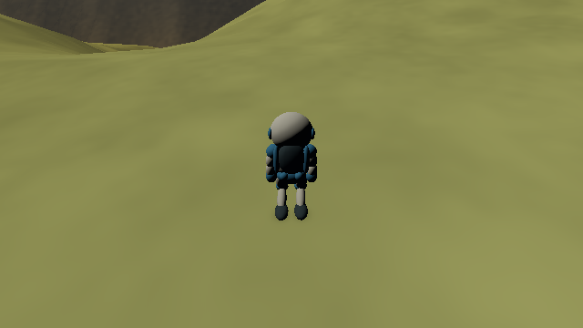</a> |  | <a href="docs/screenshots/astronaut-jetpack.png">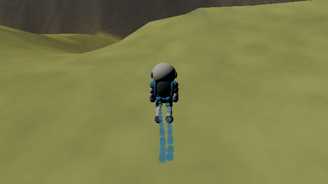</a> |

<a href="docs/screenshots/astronaut-trail.png">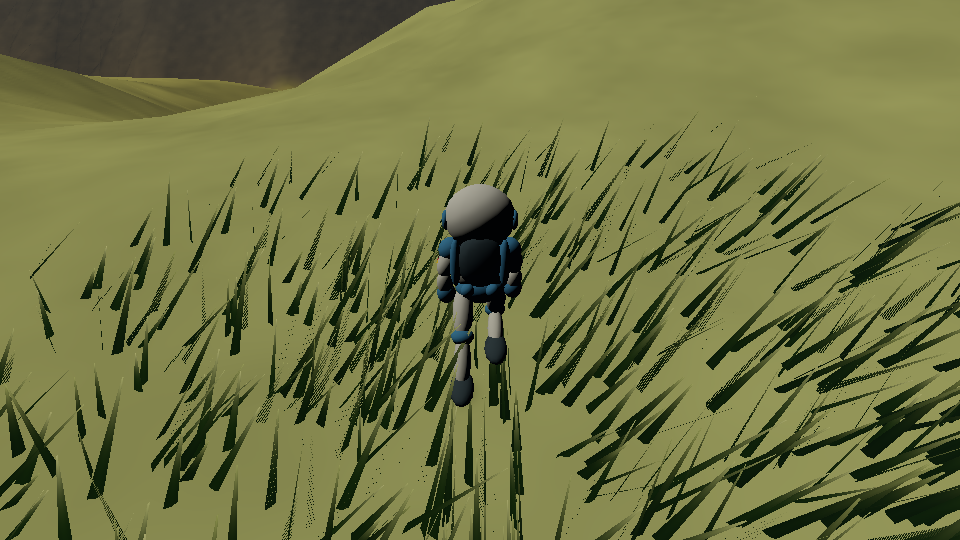</a>

Selecting `2` from either orbit view, or automatically reaching the surface
entry distance, starts a one-second camera descent. The eye moves around the
planet above sampled terrain and water while its view direction and field of
view ease toward the surface camera. The transition uses wall time, so it also
plays while orbital motion is paused. Mouse look and walking become active
when the descent ends; switching back to an orbit view cancels it.
The cursor is captured in surface mode. Press `Esc` to release it while staying
in mode `2`, so the config can be edited; press `2` again to resume mouse look.
Press `1` or `3` to switch to an orbit view. Surface controls also activate
automatically when either orbit camera comes within `1.1 × planet diameter`
of the planet center.
Local Down then points radially toward the planet. Close the window to exit.
Saving `configs/scenarios/solar_system.json` reloads the Sun, planets, terrain,
water, and camera starting values automatically after the file settles for
about 0.1 s. Press `R` to request a manual reload at any time.
The active view stays selected when it is still configured, and its position
resets to the edited start value. A released surface cursor remains free after
reload until `2` is pressed again. An invalid or partly written JSON file is
reported on stderr and leaves the current scene running; press `R` again
after fixing it. Shader files still require an application restart.

~~~bash
./build/PlanetSimulation
~~~

When planet mode starts, and every five seconds while it stays active, stdout
prints the camera's world position and look direction, followed by a
planet-local position labeled latitude and longitude in degrees and altitude
above the spherical reference radius in meters, plus ground clearance, then a
`surface_camera start value` JSON object. Replace the existing `surface_camera`
object in `configs/scenarios/solar_system.json` with that printed object to
start at the saved position, view, and simulation time. The printed
`simulation_time_seconds` is the simulation clock, including pause and Y/U
speed changes, rather than elapsed wall time. It restores the Sun, Earth,
Moon, spin, shadows, and exposure together on startup or config reload.
Older snippets without a time still start at zero. `--simulation-time` takes
precedence over the saved timestamp. The `direction_ned` array is ordered
North, East, Down in the selected planet's local frame. The printed `up_ned`
array preserves image orientation when looking nearly straight up or down.
Both are optional; without `direction_ned`, the surface camera starts aimed at
the Sun. The JSON `altitude` is the requested clearance above sampled terrain or water
in the configured world distance unit (`0.002` km is 2 m in the development
scene). The printed LLA altitude varies with terrain or water height, while the reusable
config snippet keeps the requested clearance and walking speed.

Live views and captures both size the near clipping plane from that ground
clearance. Mountain height above the reference sphere does not enlarge it;
with a 2 m eye clearance the near plane remains 0.2 m away, including during
the surface-camera descent. `CameraClippingInputIntegration` compares a live
window with a paused capture on an 80 m mountaintop, guarding against nearby
ground disappearing and exposing the planet interior.

Save the printed JSON object as `camera.json` to replay it directly:

~~~bash
./build/PlanetSimulation --config configs/scenarios/solar_system.json --replay camera.json
./build/PlanetSimulation --config configs/scenarios/solar_system.json --replay camera.json --surface-capture build/replayed.png
~~~

Interactive replay starts in surface mode with simulation paused; `T` resumes
it. Camera controls still work. Saving the replay file reloads it at the saved
time; `R` also reloads the replay and its base config. `--surface-capture` accepts a completely
dark surface, but requires terrain geometry to be present. Unlike the stricter
`--surface-render-test`, it does not require visible stars or brightly colored
terrain. It writes a PNG plus `replayed.png.json` containing the resolved scene,
camera, timestamp, resolution, exposure, renderer, and measured lighting.
Replaying that sidecar restores its full scene even if the working config has
changed; the original config file is no longer needed:

~~~bash
./build/PlanetSimulation --replay build/replayed.png.json --surface-capture build/replayed-again.png
~~~

An explicit `--render-size` overrides the sidecar's resolution. Identical
captures on the same build and graphics driver are checked byte for byte;
different drivers can rasterize edges differently.
Surface mouse look keeps heading and pitch independent: horizontal mouse
movement changes compass heading, while vertical movement changes only pitch.
Walking transports the camera's direction and up vector along the spherical
surface, so crossing either pole keeps the view and walking direction smooth
even though geographic longitude jumps by 180 degrees.
Pitch stops at 89.9 degrees above or below the local horizon so the view cannot
cross the vertical pole and flip or begin to roll.

Each planet can configure `surface_noise` as a list of overlapping functions.
Each function has a `type` (`value_fbm` for smooth hills or `ridged_fbm` for
ridges), `seed`, `amplitude_m`, `frequency`, `octaves`, `persistence`, and
`lacunarity`. The function heights add together. The development planet combines
68 m smooth-hill and 40 m ridged-noise amplitudes, plus 10 m continental and
120 m cliff amplitudes. These are noise scales rather than exact peak heights;
the frozen legacy test scene retains its smaller terrain settings.
`noise_seed` is only the fallback for `surface_noise` functions that omit `seed`; the development scene specifies a
seed on each function. `terrain_landscape` adds a broad continental height
field, low-roughness plain regions, and ridge-weighted cliffs. Its own `seed`
controls those large-scale shapes, including the broad cliff regions. Change
`terrain_landscape.seed` for a noticeably different broad landscape; saving
the config rebuilds the mesh automatically. The
optional `enabled` switch, `elevation_offset_m`, `continent_amplitude_m`, `continent_frequency`,
`plain_threshold`, `cliff_threshold`, `cliff_amplitude_m`, `cliff_frequency`,
`ridge_smoothing`, and `seed` control that shape. `ridge_smoothing` rounds the
otherwise pointed absolute-noise crest; `0` preserves a sharp crest and the
development value `0.25` softens high-angle ridge peaks. Areas below the water
level form ocean basins.
The landscape palette uses each fragment's height for green plains, pale
heights, narrow beaches, and dark seabed. Beach colors therefore follow the
waterline inside triangles; grass placement uses the same height boundaries.
Steeper slopes blend toward gray rock. Planet-fixed procedural
textures add mottled color and matte roughness; a two-scale height field
perturbs the smooth surface normals to reveal centimetre-scale relief under
Sun and Moon light. These details add no triangles and do not change collision
height or silhouettes. Both texture scales fade before becoming smaller than
a pixel, including in orbital views. The three-dimensional mapping follows
planet rotation and has no UV seam at either pole.

Sand uses a pale, slightly warm albedo with fine grains and wind ripples spaced
about 18 cm apart. Their bounded normal relief is about 1.4 cm from crest to
trough; millimetre-scale grit adds matte roughness. Triplanar mapping follows
the planet through rotation and filters out unresolved detail. As with the
other material relief, collision height and silhouettes use the terrain mesh.
The [sand study](docs/journal/materials/sand.md) records the reference, GPU
checks and shoreline comparison.

Each planet's optional `terrain_material` controls when grass gives way to
rock. The defaults keep grass on slopes up to 35° and smoothly blend to full
gray rock at 55°, measured from the local horizontal:

~~~json
"terrain_material": {
    "rock_start_degrees": 35.0,
    "rock_end_degrees": 55.0
}
~~~

Raise both angles to keep grass on steeper hills, or widen the range for a
longer blend. Values must be finite, between 0° and 90°, with the end at least
0.1° above the start. These settings also control broad slope darkening and
reload when the scenario is saved. They are independent of
`terrain_lod.steep_slope_threshold`, which controls tessellation, and
`terrain_landscape.cliff_threshold`, which controls the landscape shape.
The sea retains its smooth spherical normal and sharp scene reflections;
terrain roughness and normal relief apply only to land.

<a href="docs/screenshots/terrain-detail.png">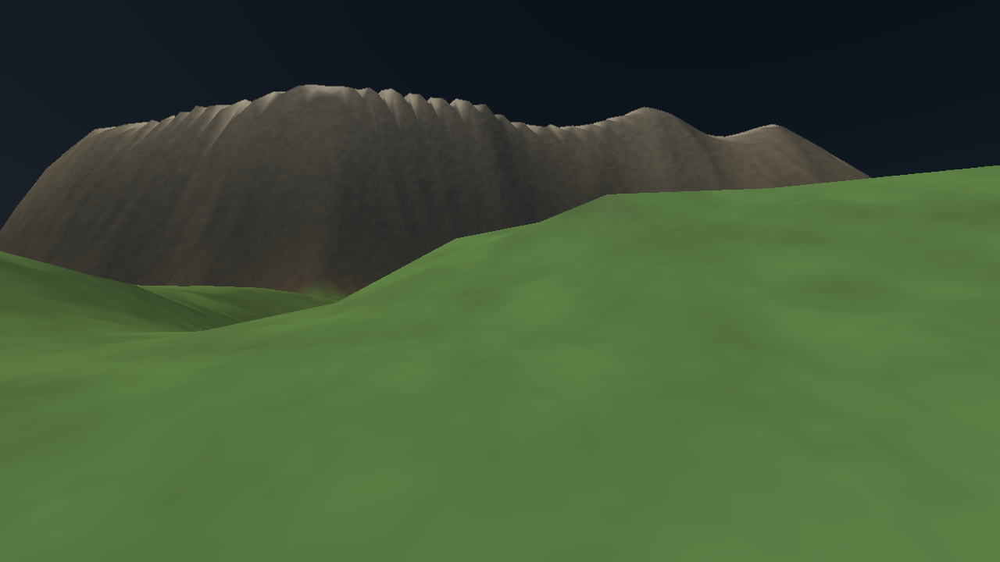</a>

This camera is five metres above sampled land. Its exact scene and camera are
saved in [the terrain replay](docs/captures/replay/terrain/terrain-detail.png.json):

~~~bash
./build/PlanetSimulation --replay docs/captures/replay/terrain/terrain-detail.png.json --surface-capture build/terrain-detail.png
~~~

`terrain_lod` selects **eight surface-distance levels**, numbered 0 (coarsest)
to 7 (finest). Distances follow the sphere from the camera's radial position
to the nearest extent of a base face. Level 7 extends to
`near_surface_distance_m`; six intermediate bands fill the interval to
`mid_surface_distance_m`, where level 0 begins. The working 300/1000 m settings
produce boundaries at 300, 416.7, 533.3, 650, 766.7, 883.3 and 1000 m.

The existing `base_edge_segments`, `medium_edge_segments`, and
`max_edge_segments` anchor levels 0, 3, and 7. Rounded interpolation gives
**3, 5, 6, 8, 10, 12, 14, 16** segments in the working scene. Small segment
ranges can share a density across levels. Steep nearby faces may still use
`steep_edge_segments` (32 here) when their rise-over-run exceeds
`steep_slope_threshold`. The hard `max_triangle_budget` (100,000 here) first
removes optional steep detail, then reduces coarser levels before finer ones.
Equal-priority choices use stable base-face order.

Coarser regions sink inward by up to `sink_depth_m` (default 1 m, range
0–100 m; `0` disables sinking). The offset scales with the square of the
fraction of lost edge segments; the finest and extra-steep samples stay at
their original height. For small planets the offset is capped at 0.1% of the
radius remaining after the maximum terrain relief. Shared corners use the
smallest offset of all incident faces, and shared edges use the finer neighbor.
Smooth interpolation joins those offsets to the face interior. Shoreline
subdivision interpolates the same offset field. The water shell uses eight
levels too, with sinking disabled to preserve sea level.

Each base face contributes only its selected tessellation to **one closed
terrain mesh**. No overlapping or buried LOD shells are submitted. Main,
reflection and shadow passes use that same mesh; grass roots sample its
triangles. A finished background rebuild replaces the previous mesh buffers.
Sampling and sinking remain fixed within unchanged levels. Faces retain
their level for another 20 m while moving away from a boundary; the mesh
rebuilds after about 10 m of surface movement. Level changes can still cause
small geometric steps: this is spatial sinking with hysteresis, not a temporal
morph or a strict bound on interpolation error between procedural samples.

The older `lod_near_diameters` and `lod_far_diameters` remain for compatibility
with uniform-distance tests; the renderer uses the eight surface bands.
Capture logs include all eight face counts and submitted terrain-buffer bytes.
The [terrain LOD journal](docs/journal/benchmarks/terrain-lod.md) records the
implementation, regression coverage and capture results.

The [CPU–GPU generation plan](docs/journal/architecture/terrain-gpu/plan.md) defines
the next migration: CPU subdivision/sinking and sparse contacts, GPU bulk shape
and normals, shared terrain/foliage buffers, and the remaining atmospheric work.
It evaluates hexagonal panels and sets memory, precision and validation gates.
Interactive rendering and captures default to CPU terrain generation.
The [completed field/topology extraction](docs/journal/architecture/terrain-gpu/contracts/study.md)
separates indexed radial/sink inputs from bulk evaluation, adds bounded query
caching and validates generation keys. Capture metadata reports planning and
evaluation counts and contract input bytes; the CPU backend uploads its legacy
expanded layout.

The [GPU field evaluation proof](docs/journal/architecture/terrain-gpu/compute/study.md)
is available for captures and interactive use with `--terrain-backend compute`; `--terrain-backend cpu`
selects the default. It generates height, normals, material factors, sinking and
draw buffers on GL 4.3, with queried limits and completed land/water publication.
A 100,000-triangle view uploads 2,800,880 input bytes including parameters and
control uniforms, compared with the CPU's 12,000,000 shaped-mesh bytes.
Current compute captures use GPU grass planning and sparse contacts; full CPU
render vectors are retained only for the legacy planner. No total-frame speedup
is claimed. A saved compute backend replays explicitly; unavailable GL 4.3 falls back
for a fresh request and rejects a locked compute replay. CPU remains the default.

The [sparse contact prerequisite](docs/journal/architecture/terrain-gpu/contacts/study.md)
now finds compute terrain triangles through a spatial index and evaluates only
needed float-rounded/sunk positions, with a 1,024-position cache. Contact queries
use no full render vectors or GPU readbacks. Current compute captures also use
resident GPU grass planning; interactive compute uses asynchronous publication.

The [resident GPU grass metadata checkpoint](docs/journal/architecture/terrain-gpu/grass-metadata/study.md)
computes original triangle IDs, bounds, biome eligibility and Gaussian area
weights from resident terrain buffers. A 100,000-triangle case uploads 176 bytes
and retains 6,400,160 metadata bytes, with no metadata readback.
The [GPU allocation checkpoint](docs/journal/architecture/terrain-gpu/grass-allocation/study.md)
now performs budgeted hash selection, rounded-slot density search and ordered
prefix allocation on GPU, then removes CPU land/water render vectors from new
compute captures. It reads only a 224-byte capture summary. Metadata and allocation
upload 2,840 bytes in the 100,000-triangle case, excluding terrain input buffers.

Fresh compute captures save planner `gpu-v1`; older compute replays retain CPU
planning and their compatibility vectors. Use `--terrain-grass-planner cpu` for
that route, or `--terrain-grass-planner gpu` to upgrade explicitly. The new mode
caps candidates conservatively by configured count and queried storage size;
capture diagnostics report the effective budget, density and all stage bytes.
GL 3.3 retains CPU fallback. Captures with disabled compute placement retain CPU
planning; interactive compute requires GPU placement. Dynamic VRAM/density policy
and hardware frame-cost validation remain queued. No
hardware FPS improvement is claimed.

The [bounded CPU worker checkpoint](docs/journal/architecture/terrain-gpu/async/worker/study.md)
moves compute topology/contact construction onto one persistent CPU executor,
with one coalesced queued request and scene/body/field identities. Reload invalidates
old CPU work without joining it; normal CPU walking polls for completed builds.
Resident interactive GPU and grass publication now poll across frames; captures
retain explicit wait adapters.

The [GPU preparation checkpoint](docs/journal/architecture/terrain-gpu/async/gpu/study.md)
adds owned land/water and grass submission, completion polling and patch commit.
Resident grass allocates draw resources before committing and reads one completed
224-byte allocation summary. An initial 512 MiB logical preparation ceiling
includes terrain and worst-case grass buffers. Captures use explicit wait adapters;
interactive publication and retirement poll without capture waits. Dynamic
free-memory policy remains a later stage.

The [complete generation transaction checkpoint](docs/journal/architecture/terrain-gpu/async/publication/study.md)
adds off-live land/water/grass/contact preparation, atomic ownership transfer and
fenced retirement. It reserves published, pending and retiring sets under a
logical aggregate limit, permits one GPU preparation globally and prevents a new
spare until that body's retirement completes. Renderer capture and scene reload integration are covered below.

The [renderer publication checkpoint](docs/journal/architecture/terrain-gpu/async/renderer/study.md)
connects complete resident consumers to capture frame boundaries. A restored
character preview preserves the exact chase/replay grass anchor, then the actual
character update uses committed contacts. Grass-only replanning retains terrain
and contacts, and main/shadow/reflection passes record matching generations.
CPU and legacy captures retain their paths; interactive compute uses the resident
GPU planner.

The [whole-scene replacement owner](docs/journal/architecture/terrain-gpu/async/scene/study.md)
stages all bodies under one overlap budget and exchanges scene/config plus
terrain/grass/contact receipts only after full readiness. It retains old resources
behind a last-use fence. The [renderer reload checkpoint](docs/journal/architecture/terrain-gpu/async/reload/study.md)
connects it to R/file-watch and `Renderer::reload()`: config/replay, all-body
preparation and chase anchors stay staged until complete readiness. Tracking,
cameras/contacts and caches change at the same boundary; preparation failures
retain the current scene and the same renderer can recover. CPU and legacy reloads
use the same boundary. The [movement and destination recovery checkpoint](docs/journal/architecture/terrain-gpu/async/recovery/study.md)
plans contacts for every prospective body and binds destination contacts during
handoff. Future-epoch reloads supersede old queued/ready work and discard running
old completions without changing the live epoch on failure. Moving/reordered-body
and Moon recovery underpin the interactive opt-in; CPU stays default.

The [asynchronous frame core](docs/journal/architecture/terrain-gpu/async/interactive/study.md)
uses the bounded worker result slot, zero-timeout preparation/retirement polls and
complete consumer publication during startup and movement. Initial loading defers
walking and scene draws; replacements retain usable terrain and failed work has
a bounded retry delay. [Asynchronous scene reload](docs/journal/architecture/terrain-gpu/async/interactive/reload/study.md)
prepares one replacement body at a time while the current scene remains usable,
then commits complete consumers and retains old resources until fenced retirement.
Newer requests supersede pending work; failed reloads keep the live scene.
[Native input acceptance](docs/journal/architecture/terrain-gpu/async/interactive/native/study.md)
covers loading, standing, walking/sprint, jump/thrust/trails, space/Moon contact
binding and manual/file-watch reload recovery. Enable the experimental resident
path explicitly:

~~~bash
./build/PlanetSimulation --config configs/scenarios/solar_system.json --terrain-backend compute
~~~

Window creation tries GL 4.3 core first and retries GL 3.3 core on older drivers.
The compute path requires GL 4.3 and GPU grass planning (the default compute planner), with
`foliage.compute_placement` enabled wherever foliage is enabled. Initial terrain
loading keeps events active while deferring walking and scene draws. Normal frames
and reload progress poll readiness and retirement without capture waits; failed
replacement keeps the current scene. Fresh requests fall back to CPU when GL 4.3
is unavailable; a replay locked to compute fails instead. Interactive legacy
CPU-planner compute replays require an explicit `--terrain-grass-planner gpu`
upgrade; captures retain legacy planner compatibility. CPU remains the default,
and hardware frame-time/physical-memory acceptance is still pending.

Near water, `terrain_lod.shoreline_edge_m` targets 1 m edges within
`shoreline_distance_m` (80 m by default). Set the edge target to `0` to disable
this extra refinement. Targets support 0.1–100 m and distances 1–1000 m.
The builder reserves a quarter of the existing triangle budget, then splits
nearby shoreline edges on both incident faces to keep the shell closed.
Closest edges take priority; the hard budget and eight-pass work limit can
stop subdivision before the target is reached. Distant shores retain coarse
geometry. Land and water rebuild together in the existing background job.

Optional per-planet `foliage` enables grass on the green biome. The working
Earth enables it; omitted blocks leave grass disabled in older scenes.
The port follows [SimonDev's Quick_Grass](https://github.com/simondevyoutube/Quick_Grass)
with six-segment curved blades nearby and tapered quads farther away,
random heights and lean, Perlin-noise wind, dark bases, yellow-green tips,
wrapped diffuse lighting and backscatter. The [source attribution and MIT
license](external/quick-grass/README.md) record the version and adaptations.

~~~json
"foliage": {
    "enabled": true,
    "frustum_culling": true,
    "compute_placement": true,
    "density_per_m2": 30.72,
    "height_m": 1.5,
    "width_m": 0.1,
    "draw_distance_m": 40.0,
    "quad_distance_m": 0.0,
    "wind_strength": 1.0,
    "wind_noise": {
        "gust_frequency": 0.08,
        "direction_frequency": 0.02,
        "flutter_frequency": 0.7,
        "speed_multiplier": 1.0,
        "seed": 0
    },
    "max_blades": 100000,
    "seed": 7321,
    "rebuild_distance_fraction": 0.15,
    "gaussian_sigma_fraction": 0.3333333333333333,
    "budget_fraction": 0.8,
    "max_candidates_per_triangle": 8192,
    "green_ratio": 1.15,
    "water_clearance_m": 0.15,
    "root_offset_m": 0.005,
    "height_multiplier_min": 0.75,
    "height_multiplier_max": 1.5,
    "lean_min": 0.1,
    "lean_max": 0.4
}
~~~

These are the defaults when a foliage block is present. Height and width are
in metres. The working scene's current overrides and descriptions of every
parameter are in `configs/scenarios/solar_system.json`. There is one grass layer,
with one draw distance and candidate budget.
The random height multiplier is 0.75–1.5. Budgets include candidates rejected on the GPU; reported candidate counts are not a readback of visible blades. Supported ranges are
0–2 wind strength, 0.05–3 m height, 0.005–0.3 m width, 5–400 m draw distance,
positive density up to 4096 blades/m², and 1–25,000,000 reserved candidates per planet.
Candidate density peaks at the camera and follows a Gaussian with standard deviation
`draw_distance_m * gaussian_sigma_fraction`: by default about 61% of peak at one third of the distance, 14%
at two thirds, and 1% at the edge. `density_per_m2` sets the requested peak;
the integrated distribution is scaled down when necessary to fit the instance
budget using `budget_fraction` as headroom. A cached patch follows walking, rebuilding after `rebuild_distance_fraction` of the draw
distance; overlapping candidates keep their seeded positions. Candidate slots
have stable density ranks, so growing a power-of-two batch retains existing
blades. A 20% band above each rank fades its pixel coverage smoothly as Gaussian
density changes. Each GPU candidate uses
one instance; the terrain triangle budget is unchanged. The default distance is shorter than the
demo's 100 m to bound work on weaker hardware.

Grass reuses the terrain vertex/index buffers through OpenGL 3.3 buffer
textures. Only a four-byte triangle ID per selected patch is uploaded, plus
small uniforms for density, seed, camera, shape and wind rules. GLSL generates
barycentric root positions, blade variation, Gaussian acceptance and biome
rejection; no individual grass positions, blade meshes, random arrays or
Perlin-noise fields cross from CPU to GPU. Astronaut trails upload a separate
bounded segment hierarchy when a new mark is recorded; unchanged trails upload
nothing. Cached grass plans upload no placement buffers.
The planner caps submitted candidate work, including GPU rejection, and groups
triangle IDs by candidate slots. A triangle supports up to 65536 candidate slots (powers of two, rounded down
from `max_candidates_per_triangle`). The separate distant tuft layer has been
removed. `enabled` controls grass; `draw_distance_m` sets its only outer cutoff.

With `compute_placement=true` (default) and OpenGL 4.3, a compute pass evaluates
placement and Perlin wind once per candidate, rejects invisible blades, and
compacts survivors into detailed/quad queues. Two indirect draws consume those
GPU buffers without CPU count readback. Each queue reserves 64 bytes per
candidate; two queues plus draw commands use `128 * capacity + 32` bytes of
GPU working memory at that capacity (buffers retain the largest plan until
cleanup). These records are created on the GPU and never uploaded.
OpenGL 3.3 or `compute_placement=false` uses procedural vertex generation.

The opt-in resident planner (`--terrain-backend compute`, `gpu-v1`) protects
configured density through `quad_distance_m` (including its automatic value).
Beyond that region it fits a Gaussian tail under candidate, render-time and
memory limits. The maximum tail width is `draw_distance_m *
gaussian_sigma_fraction`; increasing pressure narrows the tail before reducing
near density. If near work alone exceeds the physical slot/triangle limits,
`near_infeasible` reports the deficit and queues remain bounded. Retention fades
start outside the protected region; terrain biome rejection still applies.

Memory admission includes live, staged, retiring and replacement-scene
reservations. A cached reading from the existing NVML worker supplies half the
available physical memory, less reservations added after that sample. Without
fresh telemetry, admission uses a 64 MiB generation / 256 MiB aggregate ceiling;
terrain and planner storage count toward those limits. The existing logical
limits, GL storage limits and `--video-memory-cap-mb` can lower this further.
Frame timestamps and optional utilization adjust the soft candidate allowance
with three distinct samples and a two-second cooldown. Near density takes
precedence over that soft allowance when physical capacity permits it.

Capture sidecars save each body's effective capacity, budget, density, protected
radius and Gaussian width in `render.foliage_policy` version 1. Replay locks
those settings and rejects insufficient memory instead of silently thinning the
recorded result. Camera-only/older replays without this field use live policy;
an explicit CPU override uses the supported legacy planner. CPU remains the
default, with its existing foliage behavior; combined acceptance is tracked in
F5 of `todo.md`.

Interactive wind follows elapsed wall time: `T` pauses planetary orbits and spin,
while grass keeps moving. `Y`/`U` change orbital speed only. Setting
`wind_noise.speed_multiplier` or `wind_strength` to zero freezes wind.
Deterministic captures retain their explicit simulation-time wind phase. The native
`GrassWindInputIntegration` check covers pause, orbital speed keys, zero-speed
freeze and reload; [live-wind evidence](docs/journal/benchmarks/live-wind.md)
includes its images and orbital-time trace.

`wind_noise` is optional; omitted fields retain the defaults above. Its
`gust_frequency`, `direction_frequency` and `flutter_frequency` accept
0.001–100 cycles per metre in the rotating planet's local coordinates.
`speed_multiplier` accepts 0–16 and `seed` is an integer independent of the
placement seed. Both compute placement and the OpenGL 3.3 fallback consume
these rules on the GPU. Invalid values are rejected before a scene reload.

Grass geometry now hot-swaps between a **six-segment strip** (14 vertices,
12 triangles) and a **single tapered quad** (4 vertices, 2 triangles), following
Quick_Grass's high/low geometry selection: six quads close to the camera and
one quad farther away, each quad made from two triangles. A narrow top edge keeps both low
triangles nondegenerate. The camera-to-triangle bound selects geometry every
rendered frame, without regenerating or uploading roots. Blades straighten
between half of `quad_distance_m` and that threshold. The default `0` selects
`min(15 m, draw_distance_m / 4)` automatically; positive values (up to 400 m)
are capped at the draw distance. For example, `"quad_distance_m": 30.0` morphs
from 15 to 30 m. Geometry morphing keeps roots fixed. Thus any
triangle switched to quads already has straight blades. Reflections share the
main camera's geometry choice. Fragment shading evaluates the same palette
across both geometries. Interpolated lateral offset is normalized by the blade
width in the fragment shader, so the quad and segmented strip have matching
interior shading as well as matching edges.
The terrain grass biome uses the same shared tip palette at midpoint variation:
linear RGB `(0.634375, 0.74375, 0.284375)`. Lighting, slope shading and surface
grain still apply, so ground and blades share albedo rather than identical
screen pixels. Beach, snow, seabed and rock transitions retain their materials.

Eight stable retention tiers and the outer distance fade reduce pixel
coverage using deterministic screen-space dithering. All grass retains its height and ground roots during distance fading: **grass never sinks**. Astronaut trails bend blades while keeping those roots fixed.
Terrain retains its independent eight LODs and configured sinking. A cached
plan includes the walking margin and only uploads triangle IDs when the camera
moves past its rebuild threshold or the terrain mesh changes. Adjacent patches
with equal candidate counts and geometry merge into instanced draw calls.

With `frustum_culling=true` (default), GPU patch bounds are tested against the
active pass's six clip planes before random sampling, normals/colors, biome
checks or wind. Bounds include maximum blade reach. Reflection views use their
own frustum; no individual blade shadow casting is added. Candidate work counts
include rejected geometry. Compute compaction reduces the actual draw count;
the vertex fallback keeps the reserved instance count.

Capture logs report candidate vertices/triangles, draw batches and actual grass
payload bytes. The new transfer and performance study is recorded in the
[procedural grass journal](docs/journal/benchmarks/procedural-grass.md). The
[older LOD study](docs/journal/benchmarks/grass-lod.md) records the superseded
single-triangle/sinking experiment; its measurements describe that version.

Roots sit on the rendered terrain triangles and follow body rotation, including
at the poles. Water, beaches, snow and gray bodies do not grow grass. Coverage
thins through the configured grass-to-rock slope range. Blades receive terrain
shadows and atmospheric lighting and appear in water reflections. They do not
cast individual shadows; base occlusion is an approximation, as in the demo.
Wind samples three periodic 3D Perlin gradient fields in body-local metres:
12.5 m cells for broad gusts, 50 m cells for slowly changing direction, and
roughly 1.4 m cells for fine flutter. The fields drift smoothly over time;
neighboring blades share coherent gusts without a latitude/longitude texture
seam. Quintic interpolation keeps lattice crossings smooth. Noise is evaluated
on the GPU without noise textures or field uploads. `wind_noise`
frequencies are cycles per metre (0.001–100); `seed` chooses the gradient field,
and `speed_multiplier` (0–16) scales the wrapped wind clock; zero freezes wind.
Only these scalar settings are sent to the GPU.
`wind_strength: 0` removes all wind deformation, retaining each blade's seeded
static lean. The same phase drives the main and reflected views.
Wind follows simulation time, so pause freezes it and capture replays are exact.
The clock uses an 8192-second wrap period, shared by the drifting fields,
to retain float precision without an animation jump. The implementation follows
the gradient-and-fade construction of [Perlin's improved noise](https://cs.nyu.edu/~perlin/noise/)
with integer hashing in place of a permutation table.
Patches update after movement or terrain LOD changes; a new tessellation can
reseed the patch. Player collision and the demo's screen-space blade thickening
are not implemented.

<a href="docs/screenshots/grass-detail.png">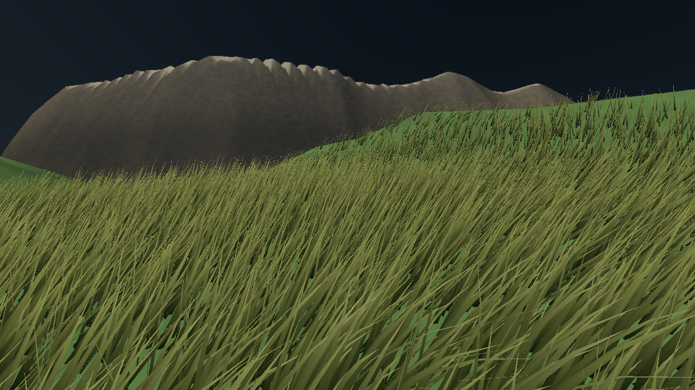</a>

This view is three metres above the ground. Replay it with:

~~~bash
./build/PlanetSimulation --replay docs/captures/replay/foliage/grass-detail.png.json --surface-capture build/grass-detail.png
~~~

`water` sets `enabled`, `level_m`, `color`, `opacity`, and
`reflection_fraction` for a translucent spherical sea. The development scene
uses 50% opacity and a 50% mix of water color and reflected sky/Sun
light. Opaque terrain hides water above its level and remains visible through
water below it. The reflection pass includes the sky and opaque bodies, including
terrain, lit by the same sunlight and reflected body light. The reflection
mix fades to zero as local direct sunlight approaches the horizon or terrain
blocks the Sun, so a bright reflected day scene cannot light the night ocean.
Indirect water light remains. Reflections outside the reflected camera's view
are ignored. The pass does not refract the scene. The water shell uses a coarse
distant mesh with the same local edge target near the camera, reducing flat
triangle intersections at the shore. Its separate budget is the smaller of
60,000 triangles and the land budget. Refined vertices stay on the sea sphere;
the residual approximation can still change slightly when mesh detail updates.

This [shoreline replay](docs/captures/replay/terrain/shoreline-detail.png.json)
uses a 2 m camera beside the water. The narrow sand band is shaded inside
the triangles; grass stops at the beach instead of following coarse corner
colors. `TerrainTests` checks local resolution, shared edges and budgets;
the GPU material test checks the beach band within two large triangles.

The terrain choice follows NVIDIA's guidance on [broad and fine procedural
noise](https://developer.nvidia.com/gpugems/gpugems3/part-i-geometry/chapter-1-generating-complex-procedural-terrains-using-gpu)
and [camera-centered terrain detail](https://developer.nvidia.com/gpugems/gpugems2/part-i-geometric-complexity/chapter-2-terrain-rendering-using-gpu-based-geometry).
The water blend is an early approximation of the techniques described in
[Effective Water Simulation from Physical Models](https://developer.nvidia.com/gpugems/gpugems/part-i-natural-effects/chapter-1-effective-water-simulation-physical-models).

Render the frozen compact test scene to a PNG and print background, Sun, planet,
and blue water-like pixel counts and bounding boxes, plus terrain triangle and
zone-face counts. This fixture keeps both bodies inside the initial solar view;
the working scene's wider Earth orbit lies outside that camera's starting view:

~~~bash
./build/PlanetSimulation --config tests/fixtures/development/configs/scenarios/solar_system.json --render-test build/render-test.png
~~~

Capture the same fixture's surface camera view and confirm a configured body is visible:

~~~bash
./build/PlanetSimulation --config tests/fixtures/development/configs/scenarios/solar_system.json --surface-render-test build/surface-render-test.png
~~~

Capture the initial planet-orbit view and confirm that the planet is visible:

~~~bash
./build/PlanetSimulation --config tests/fixtures/development/configs/scenarios/solar_system.json --planet-render-test build/planet-render-test.png
~~~

For resolution diagnostics, append `--render-size WIDTH HEIGHT` to any render
test command. The output reports mesh preparation and GPU-complete render time;
the actual framebuffer dimensions are printed because a window manager may
resize the hidden window.

Replay the dense offline example at the production starting location:

~~~bash
./build/PlanetSimulation --replay docs/captures/replay/offline/offline-render.png.json \
  --offline-render build/offline.png
~~~

The saved view is **1920×1080**, at the production latitude/longitude,
2 m eye clearance, initial NED direction and **time 0**. It retains production
terrain, atmosphere, water and lighting. Only the showcase foliage settings
change: a **12 million** candidate budget, Gaussian sigma fraction **0.05**
and **65,536** candidate slots per triangle. The 20× profile gives a 3 km
cutoff and 150 m Gaussian sigma. It submits **213,454 main-view blades**,
versus **102,918** with the production foliage settings at the same camera.
Compute queues reserve approximately **1.54 GB**; density still obeys the
hard budget and biome rules. The dusk foreground is naturally backlit.

To use your current scene directly, replace `--replay ...` with
`--config configs/scenarios/solar_system.json`. To reproduce the comparison,
flare-off/replay checks and narrow-view allocation study, run
`python3 scripts/benchmarks/offline_showcase.py --binary build/PlanetSimulation
--output-dir build/offline-showcase` under an OpenGL display.

`--offline-render` waits for synchronous terrain construction and complete GPU
rendering, with no frame-rate target or adaptive resolution reduction. It uses
full-resolution atmosphere, a 256-segment Sun (131,072 submitted triangles),
up to 32 terrain edge segments, and a 100,000-triangle budget per body. Bodies
other than the surface-camera planet, including the Moon, use at least ten
base segments (86,400 triangles before optional local refinement).

The single grass layer extends to **20× its configured radius** by default.
`--foliage-distance-multiplier 1..20` selects a smaller factor. Candidate budget
grows with area, with automatic growth capped at two million candidates
(about 256 MB for compute queues); larger explicit JSON budgets are retained.
Density, biomes, the Gaussian distribution and frustum rejection still apply,
so expanded radius does not promise uniform density across the entire horizon.
The validated normal scene and its saved JSON remain the replay source.

Lens flare adds a solar halo, streak and colored aperture ghosts in display
space. Visible Sun stencil pixels and their brightness attenuate the effect;
a fully terrain-occluded Sun produces none. This is an artistic optical
approximation. `--no-lens-flare` disables it; `--offline-quality` applies the
profile to another capture command, including `--astronaut-capture`.
Replay sidecars retain the profile and normal scene separately, applying the
multiplier once. Explicit distance/flare overrides also work with an offline
replay. Performance traces include a separate `lens_flare` stage.

Production starting view with dense grass, full atmosphere and visible sunset
halo, streak and aperture ghosts. The exported PNG is a direct renderer capture.

Narrow columns were evaluated: a central 192×1080 view submits fewer blades
but retains the same 12 million candidate allocation and 100,000/86,400
terrain triangles. Column rendering therefore cannot load more geometry with
the current planner. Assembly also needs shared exposure, off-axis projection,
reflection bounds and full-image flare coordinates; the
[showcase study](docs/journal/benchmarks/offline-showcase.md) records the measured
limits and the prerequisites for implementing it.

The [offline quality study](docs/journal/benchmarks/offline-rendering.md) contains
controlled normal/offline and visible/occluded comparisons, exact replay checks
and submitted mesh counts.

Append `--simulation-time 37` to capture the moving scene at a deterministic
time in seconds. The test suite captures both the initial scene and the surface
and planet orbit views after 37 seconds. Orbital unit tests cover the requested
periods, mass scaling, descendant masses, barycenters, momentum, elliptical
energy and angular momentum, highly eccentric orbits, unit conversion, long
runs, the 20° equatorial alignment, and cameras attached to rotating terrain.

The tests use a frozen development config under `tests/fixtures/development`,
so editing the interactive scenario cannot change their orbital, terrain, or
camera assumptions. Lighting and twilight scenarios have their own frozen bases.
Their compact 12.5 km outer orbit receives stronger sunlight and moonlight than
the working scene; their brightness ranges describe those fixtures.

`tests/scenarios/lighting/manifest.json` defines independent daylight (20 s),
moonlit night (120 s), moonless night (120 s), new-Moon night (0 s), and fixed
exposure control cases. Each case shares a fixed base config and overrides
only its time, camera, or lighting settings. Generate and validate all cases:

~~~bash
xvfb-run -a cmake --build build --target render_lighting_scenarios
~~~

Or select a case or an alternative manifest:

~~~bash
xvfb-run -a python3 tests/lighting/render_lighting_scenarios.py --binary build/PlanetSimulation --case night_moon --output-dir build/night-check
xvfb-run -a python3 tests/lighting/render_lighting_scenarios.py --binary build/PlanetSimulation --manifest tests/scenarios/lighting/manifest.json --output-dir build/lighting-scenarios
~~~

Every case produces a resolved `.config.json`, PNG, replay `.png.json`, and
capture log. `results.json` records image hashes and measurements. The tests
check Sun and Moon illumination separately, exposure limits, terrain geometry,
day/night brightness, and exact replay of daylight and moonlit images. Dark
terrain is measured using depth and object identity, without counting the Sun,
Moon, or stars as terrain. Star visibility uses
`sky_interior_mean_display_luminance`, which excludes a one-pixel border around
geometry: multisample color can contain a bright terrain edge even when its
resolved depth/stencil sample says sky. `sky_interior_pixels` ensures enough
unobstructed sky remains to measure. The original whole-sky and terrain metrics
are also recorded. `LightingScenariosRenderIntegration` runs these same
checks in CTest. Use an existing display instead of `xvfb-run` when available.

`TwilightScenariosRenderIntegration` preserves the reported camera at
**2707.6216211392884 s** and captures times 0.1 s before and after it. It checks
peak terrain brightness as well as the mean, so isolated bright triangles
cannot hide in an otherwise dark image. The GPU shadow tests also sweep
sunrise/sunset directions and map resolutions for terrain and water behind
an opaque wall, at maximum night exposure, while preserving real grazing light.
Generate those replayable captures independently with:

~~~bash
xvfb-run -a python3 tests/lighting/render_lighting_scenarios.py --binary build/PlanetSimulation --manifest tests/scenarios/twilight/manifest.json --output-dir build/twilight-scenarios
~~~

Regenerate the shadow comparison with:

~~~bash
cd build
xvfb-run -a ctest --output-on-failure -R '^TerrainShadowRenderIntegration$'
cd ..
~~~

The output is `build/terrain-shadow-test.png`; the twilight image is
`build/twilight-scenarios/twilight_reported.png`.

The saved surface view looks across water toward flatter land and cliffs. The
surface render test checks for a visible configured body. The orbit
render test checks that both bodies are visible and separate.

The surface camera is configured in `configs/scenarios/solar_system.json`.
Its `planet_spherical_ned` reference frame follows the selected planet's center:
latitude is measured from its equator toward +Z, longitude from +X toward +Y,
and LLA altitude outward from its spherical reference radius. North, East,
and Down form the local orientation frame. The development start view is saved
with latitude, longitude, clearance, and `direction_ned` in that config file.
Latitude and longitude determine local vertical, but they do not
determine camera roll. `up_ned` remains optional and lets a saved view preserve
its roll, especially when looking almost straight up or down.

The render test hides its GLFW window but still needs a display. On a Linux
machine without one, install `xvfb` and run:

~~~bash
xvfb-run -a ./build/PlanetSimulation --config tests/fixtures/development/configs/scenarios/solar_system.json --render-test build/render-test.png
~~~

The release executable uses the same commands with `build-release` in place of
`build`.

Regenerate every README image and update its version, UTC timestamp, command and
SHA-256 hash in the [generation log](docs/captures/GENERATION.md):

~~~bash
cmake --build build --target PlanetSimulation terrain_shadow_render_tests
LIBGL_ALWAYS_SOFTWARE=1 xvfb-run -a -s "-screen 0 1280x720x24" python3 scripts/generate_readme_images.py --build-dir build
~~~

Configure with `BUILD_TESTING=ON` first. The script validates the atmosphere,
twilight and shadow fixtures and publishes images only after all captures pass.
Night controls retain their saved airless scenes; the main surface and planet
views use the current working config. Commit the PNGs, replay sidecars and
generation records together after reviewing the captures.
