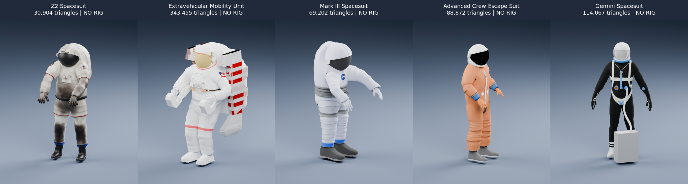
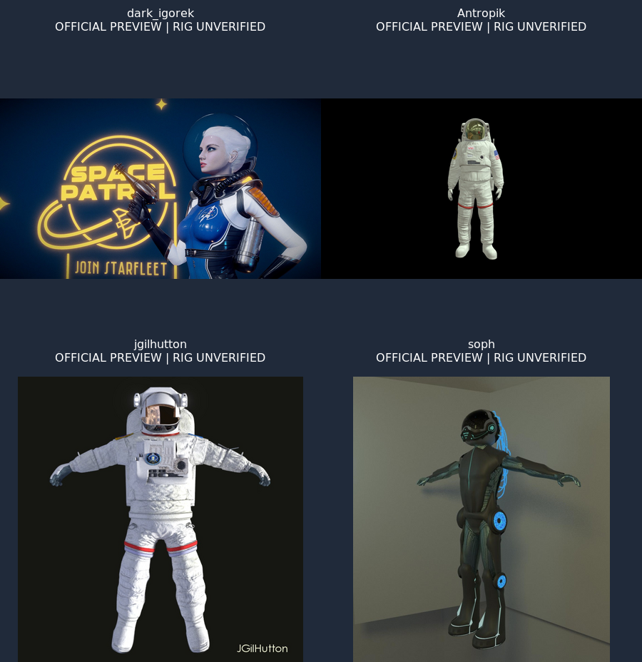

# Detailed astronaut comparison — 2026-10-09

Five new NASA meshes are rendered locally below, replacing the three rejected
low-poly candidates. Each has a full-body, rear and close-up image. These are
**visual studies, not animation-ready replacements**: inspection of the actual
files found zero skins, bones and animation clips. Gemini is a historical
comparison, not a proposed modern design. The existing TODO remains in progress.



| Actual downloaded model | Triangles | Full body | Rear / backpack | Close-up |
|:--|--:|:--|:--|:--|
| [Z2](https://science.nasa.gov/3d-resources/z2-spacesuit/) | 30,904 | [Render](nasa-z2.png) | [Render](views/nasa-z2-back.png) | [Render](views/nasa-z2-detail.png) |
| [Extravehicular Mobility Unit](https://science.nasa.gov/3d-resources/extravehicular-mobility-unit/) | 343,455 | [Render](nasa-emu.png) | [Render](views/nasa-emu-back.png) | [Render](views/nasa-emu-detail.png) |
| [Mark III](https://science.nasa.gov/3d-resources/mark-iii-spacesuit/) | 69,202 | [Render](nasa-mark-iii.png) | [Render](views/nasa-mark-iii-back.png) | [Render](views/nasa-mark-iii-detail.png) |
| [Advanced Crew Escape Suit](https://science.nasa.gov/3d-resources/advanced-crew-escape-suit/) | 88,872 | [Render](nasa-aces.png) | [Render](views/nasa-aces-back.png) | [Render](views/nasa-aces-detail.png) |
| [Gemini, historical](https://science.nasa.gov/3d-resources/gemini-spacesuit/) | 114,067 | [Render](nasa-gemini.png) | [Render](views/nasa-gemini-back.png) | [Render](views/nasa-gemini-detail.png) |

[Rear contact sheet](views/back-comparison.png) ·
[Close-up contact sheet](views/detail-comparison.png).
Counts are measured on the imported geometry, with no artificial subdivision.
Gemini's source has 114,463 indexed triangles, including 396 repeated-index
degenerates discarded by Blender; these are independently counted in the GLB.
The EMU's pack/hand attachments remain visibly rough despite its high count.
Original base colours, textures, packs and poses are retained. Display transforms
normalize each suit to 2 m; cameras and studio lighting are shared. Close-ups
intentionally crop the lower body. Packs are shown so attachment/removal work
can be assessed rather than hidden.

## Rigged alternatives to inspect next

The pictures here are **official listing previews**, not our local renders.
The actual downloads require sign-in; their rigs and deformation have not been
tested locally. Source URLs, credits and advertised licenses are recorded in
[references/sources.json](references/sources.json). No purchase was made.



| Model | Detail and movement evidence | Access / fit |
|:--|:--|:--|
| [To the Stars — dark_igorek](https://sketchfab.com/3d-models/to-the-stars-astronaut-9c55bc97e009454cb768e3c9c84dbac4) | Official API: 124,946 triangles, 68,629 vertices, zero clips; listing tagged rigged. [Official preview](references/9c55bc97e009454cb768e3c9c84dbac4.jpg). | CC BY 4.0; sign-in download. Closest futuristic female design to the requested Ava direction; skinning, retargeting, fingers and pack separation still need file inspection. |
| [EMU — Juan Ignacio Gil-Hutton / jgilhutton](https://blendswap.com/blend/12622) | Author describes a complete rig and unapplied multires sculpt detail at level 3. [Author render](references/12622.jpg). | CC-BY; sign-in download. Strong detailed animation candidate, but author notes finger/shoulder issues; compatibility and multires artifacts need testing. License version and any embedded third-party credits must be read from the download before integration. |
| [Astronaut — Antropik](https://sketchfab.com/3d-models/astronaut-482bf87662fd4b378bcb3a2931d59ca3) | Official API: 19,584 triangles and five animation clips. [Official preview](references/482bf87662fd4b378bcb3a2931d59ca3.jpg). | CC BY 4.0; sign-in download. Practical realistic textured fallback, with less geometry than the high-poly request. Clips do not establish good walking deformation without inspection. |
| [Futuristic astronaut — soph](https://blendswap.com/blend/22902) | Author describes a rig and basic walking animation. [Author render](references/22902.jpg). | CC0; sign-in download. Slim futuristic silhouette, but its appearance is less realistic; retain as a style comparison rather than a preferred high-detail choice. |

For a paid comparison, [BlenderKit's Astronaut Rigged](https://www.blendkit.com/asset-gallery-detail/aac348f9-efc9-49b9-9951-b713b1ca8990/)
advertises a detailed realistic rig and PBR materials; its download requires the
Full Plan. No file, rig, polygon count or redistribution rights were verified.
The supplied [Ava Turing reference](https://sketchfab.com/3d-models/ava-turing-the-turing-test-3dea4809201645a69e97214c048bd856)
remains a visual reference, not an acquired asset.

The five NASA studies do **not** close the request for five modern, detailed,
well-animating models. The next useful step is to inspect acquired rigged files
for joint chains, weights, knee/shoulder/finger deformation, animation export,
pack removal and the grey/blue suit with German arm flag. Runtime integration
follows a suitable choice; the procedural astronaut remains in use.

## Sources and reproduction

NASA Z2 credit: NASA / LaRC / Advanced Concepts Lab. The other four: NASA /
Michael D. Carbajal. The [NASA repository](https://github.com/nasa/NASA-3D-Resources)
describes these assets as free and without copyright; its linked
[NASA usage guidelines](https://www.nasa.gov/nasa-brand-center/images-and-media/)
still apply, including NASA identifiers and endorsement restrictions. This
study does not assert that the files carry a Creative Commons license.

[sources.json](sources.json) pins repository revision
`11ebb4ee043715aefbba6aeec8a61746fad67fa7`, file sizes and original SHA256 hashes.
The original GLBs, Blender installation, rejected candidate backup and verbose
logs stay local under ignored `build-f5/astronaut-next`; no downloaded model
executables or Python scripts are run. Committed artifacts are previews,
provenance, compact render receipts and reproducible scripts.

Use Blender **4.5.4 LTS** with NumPy and its bundled Draco importer. Blender 3.4
produced broken specular materials and failed embedded-image checks and is not
supported by this preview recipe. Cycles uses the RTX 3070 Ti when available,
otherwise CPU, with 64 samples and denoising. The original GLBs are imported
directly with their embedded images. In the preview scene only, full transmission
with IOR=1 is reset to opaque: some NASA exports assign that combination even to
cloth and hardware, making the suit transparent in Cycles. Each receipt lists
the affected materials; partially transmitting visors remain untouched.
Downloaded files and geometry are not altered.

```sh
python3 scripts/character/fetch_realistic.py
for model in nasa-z2 nasa-emu nasa-mark-iii nasa-aces nasa-gemini; do
  build-f5/astronaut-next/blender-4.5.4-linux-x64/blender -b --disable-autoexec --python-exit-code 1 -t 8 -P scripts/character/render_realistic.py -- --model "$model"
done
MAGICK_THREAD_LIMIT=1 python3 scripts/character/compare_realistic.py
python3 scripts/character/check_realistic.py --record --with-models
python3 scripts/character/check_realistic.py --with-models
python3 scripts/check_layout.py
```

The validator checks five imported meshes' recorded geometry counts, source
hashes, zero rig/clip claims, 15 complete 900×1080 PNGs, three labelled contact
sheets and published artifact hashes. It cannot establish animation suitability
for the unavailable rigged files. The earlier rejected asset study can be
recovered from commit `a316d1a` and the local backup.
