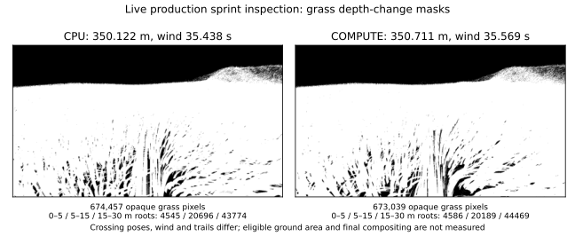

# T3c5c2b2a — inspect live native grass generations

2026-10-07. This private inspection foundation records generated main-view
blade roots and an opaque grass pixel mask while retaining actual native
asynchronous terrain/grass generations. It does not establish matched near-root
rendered density or migration cost acceptance. T3c5c2b2b remains; CPU stays default.

## Implementation and scope

`terrain_coverage_probe` links unchanged product libraries. Its separate
translation unit includes the existing `NativeProbe.cpp`, renaming that probe's
presentation interposer locally and adding an inspection-only indirect grass
draw interposer. The shipping app, renderer sources/shaders and ordinary timed
native probe are unchanged. CMake registers one new scoped inspection test.

A request arms inspection at a native walked-distance crossing on Earth in
third-person mode. Model/program/clip uniforms distinguish the main Earth draw
from reflection and other bodies. Each queue is read before its actual draw:
14 vertices per detailed blade, four per quad, zero first/base instance, and
one 64-byte std430 record containing root/fade, up/LOD, variation and wind.
The VAO attribute offset identifies the queue half; the buffer's queried size
bounds the populated prefix. Empty prefixes are allowed; unused capacity is
not decoded as roots. Commands and populated records are copied before later
reflection dispatches reuse them. Later reflection command counts are retained
separately, never substituted for main counts.

Depth is read immediately before the first main grass queue and after both
queues, from the actual opaque draw framebuffer. A strict depth decrease marks
pixels whose nearest opaque fragment changed to grass. It includes both queues
and the shader's dithered fade. Read-framebuffer, copy-buffer and pixel-pack
buffer bindings are restored. Snapshot files retain the raw float32 depth and
Blade records with explicit encoding, camera/model/projection matrices, native
frame, actual root/walked distance, wind clock, full astronaut pose/trail history,
terrain field/topology/revision, publication state before grass and after the
frame, and effective/configured foliage workload/anchor. Generation revision
must stay unchanged throughout the draw.

These reads and barriers intentionally synchronize. The private inspection
receipt records read calls and bytes and declares `timing_acceptance: false`.
Inspection buffer reads use the unwrapped GL function, separately counted from
the ordinary native audit; zero ordinary-audit reads does not mean zero
inspection readbacks. All inspection route frames are excluded from cost
acceptance. No synchronous capture replanning or worker completion wait replaces
the installed native generation.

`analyze.py` independently checks finite records, queue capacity/offsets, fade,
unit up vectors, and finite monotonic [0,1] depth. It exports a portable PGM
mask and generated root counts/fade sums in Euclidean body-local distance bands
0–5, 5–15 and 15–30 m from the saved actual astronaut root. Generated roots can
be occluded; their counts are not counts of visibly rendered blades. Depth
masks describe this opaque grass stage, before later astronaut/water/atmosphere
compositing. Ground depth is not an eligible visible-ground-area denominator.
No roots/m² or final visible-density parity is inferred from these two receipts.

## Validation

The corrected scoped test passes **22.93 s** on software, then **28.56 s**
when repeated over the same output directory. Both final batches are retained,
with eight snapshots each. All eight small native Quadro snapshots also pass
CPU/compute airless/HDR standing and real W movement, with water reflection
active. Fixtures require valid nonempty roots and grass masks, join each
snapshot to its actual completed native frame/root/distance, and check compute
contact/draw generation coherence. These are scoped inspection checks, not a
new full-suite claim.

An initial software pass (53.70 s) was followed by an 8.00 s failed rerun:
existing snapshot files could satisfy readiness before a new draw. The failure
log and mixed old/new preflight artifacts are retained separately and are not
included as final qualification snapshots. Snapshot JSON now publishes by
atomic rename, each request removes stale metadata and readiness/validation
joins the new native frame. The repeated final test explicitly covers reused
output. The original successful log remains historical only.

Two excluded production Quadro sprint inspections keep unchanged 1280×720,
100k Earth triangles and the 2M foliage budget. Context/NVML UUID is verified
as `GPU-2cefee61-6b3b-a670-c390-c7449dad3f79`. Their actual native snapshots
are observations at different crossings, not matched coverage acceptance:

| Receipt | CPU | Compute |
|---|---:|---:|
| Actual walked distance (m) | 350.122 | 350.711 |
| Wind clock (s) | 35.438 | 35.569 |
| Retained trail segments | 536 | 563 |
| Effective density scalar (blades/m²) | 58.234 | 58.796 |
| Root-to-grass-planning-eye distance (m) | 11.611 | 9.953 |
| Main detailed / quad instances | 25,947 / 159,532 | 25,656 / 158,001 |
| Later reflection instances | 26,169 / 161,607 | 26,139 / 160,155 |
| Generated roots 0–5 m | 4,545 | 4,586 |
| Generated roots 5–15 m | 20,696 | 20,189 |
| Generated roots 15–30 m | 43,774 | 44,469 |
| Opaque grass pixels | 674,457 | 673,039 |
| Explicit read volume (MiB) | 18.352 | 18.241 |



The distinct later reflection counts demonstrate why end-of-frame queue reads
cannot represent main-view roots. Snapshot roots/depth are copied before that
reuse. These two crossings also have much smaller anchor distances than the
largest earlier sprint lags, so one endpoint observation cannot dismiss the
route discrepancy. Their pose, wind and trails differ; no density parity or
performance gain is inferred from similar raw counts or masks.

The independent archive validator recomputes all **26 final** root/depth
snapshots, native-frame joins, distance-band counts, queue bounds, masks,
complete generation fields and hardware UUIDs. Raw streams and all failed
qualification evidence remain. The shipping renderer source/shaders, app,
timed native probe, all 42 previous executables and driver fixtures retain
the previous route fingerprints; only the new inspection executable/test inputs
are added. No product runtime behavior or default is changed.

## Remaining matched coverage work — T3c5c2b2b

Use repeated common distance landmarks and fixed camera/projection, wind,
character pose and trail state, retaining the actual live generation and
anchors. The foundation currently records those states; the native crossing
may overshoot and wind/trail phases are not locked across runs. An arbitrary
paired crossing is not an exact common-view coverage test.

Measure eligible visible ground area with the same terrain/material/water/
biome rules. Separate generated root acceptance/frustum effects from opaque
pixel coverage and later character, water and atmospheric occlusion. Declare
coverage/density tolerances before repeated comparisons and retain all failures.
Investigate the larger compute sprint anchor distance from the route preflight;
repeat affected route and stationary controls before accepting lower overall
native p95 as equivalent work. The stationary pair with compute/CPU ratio 1.0853
and Moon/reload/final migration gates remain open. Protected configured near
foliage density and VRAM adaptation (B1) remain separate.

## Reproduction

```sh
cmake --build build-resume --target terrain_coverage_probe -j 2
env LIBGL_ALWAYS_SOFTWARE=1 LP_NUM_THREADS=2 xvfb-run -a \
  ctest --test-dir build-resume -R '^TerrainCoverageInspectionIntegration$' \
  --output-on-failure

env __NV_PRIME_RENDER_OFFLOAD=1 __GLX_VENDOR_LIBRARY_NAME=nvidia xvfb-run -a \
  python3 tests/app/terrain/native/coverage/test_inspection.py \
  --probe build-resume/tests/terrain_coverage_probe \
  --output-dir build-resume/coverage-hardware

env __NV_PRIME_RENDER_OFFLOAD=1 __GLX_VENDOR_LIBRARY_NAME=nvidia \
  xvfb-run -a -s '-screen 0 1600x900x24' \
  python3 scripts/benchmarks/terrain_cost/inspect.py \
  --probe build-resume/tests/terrain_coverage_probe \
  --output-dir build-resume/coverage-production \
  --expected-uuid GPU-2cefee61-6b3b-a670-c390-c7449dad3f79 \
  --case sprint --distance 350
```

The small flat 10k-triangle/10k-blade fixtures verify inspection correctness;
they do not replace production coverage or costs. `validation/` retains raw
compressed snapshots/streams, inputs, frozen fingerprints and independent
checks. The previous timed 12-route evidence remains unchanged in `../routes/`.
