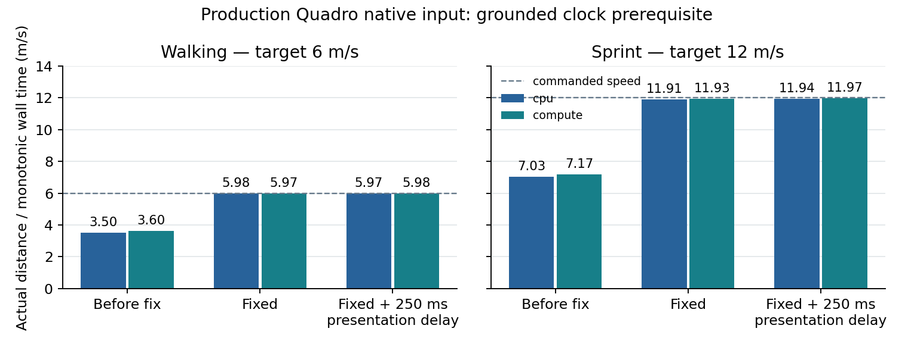

# T3c5c2a — actual grounded speed before route cost acceptance

2026-10-06. Production native measurements exposed a movement clock defect:
the astronaut walked and sprinted at roughly 60% of the commanded speed on
Quadro M1000M. The animation clock alone concealed the reduction. This checkpoint
restores real-time grounded motion and splits the remaining matched route costs
and rendered near-root coverage into T3c5c2b. CPU terrain remains default.

## Diagnosis and implementation

The interactive loop limited camera and grounded character time to 50 ms per
rendered frame. Actual production frames exceeded that limit, so a correct
6/12 m/s animation-clock rate did not imply a correct distance per real second.
Four baseline runs use actual X11 W/Shift input with the complete production
scenario at 1280×720. All fail the ±5% real-time speed gate.

`Interactive.cpp` now consumes grounded elapsed time in advances of at most
50 ms, with at most one second of catch-up after a long suspension. At 12 m/s
each camera advance is at most 0.6 m; the motion engine retains its finer
contact/gait integration and existing relocation reset. Each extra advance
updates camera, character, trail, chase view and effects against the installed
contact generation. Wind timestamps advance across the same interval, avoiding
duplicate exhaust-gap integration. Terrain/GPU preparation and publication
still run once per frame, with no extra waits, polls or readbacks in catch-up.
The terrain planner considers the remaining displacement on the next frame;
longer-route image coverage still needs separate verification.

The existing world-space flight integration and jump activation frame retain
their previous elapsed-time behavior. A new native regression injects 180 ms
presentation delays and measures monotonic wall speed on resident compute,
default CPU and GL 3.3 fallback, using a warmed flat/coarse clock fixture without
foliage so software contact/rebuild work stays below the suspension limit. The original noisy
input/reload and space/Moon fixtures retain their fields and valid 10k budget.
Delays above one second verify bounded progress and continuous walked-distance
history rather than a relocation reset. Jump, directional/Space
thrust, exhaust, Moon/outer-space contacts and reload recovery remain covered.

## Hardware method

The short speed prerequisite uses `scripts/benchmarks/terrain_cost/speed.py`:
one walking and one sprint process per backend, before and after the fix, then
another four with 250 ms presentation delay. These are single runs, not three
alternating route cost pairs. Baseline routes cover at least 18 m; final natural
and delayed routes cover at least 100 m and 21 observed frames after the first
W receipt. The initial short fixed sprint result narrowly failed the wall-speed
gate because the final rendering spike extended the observation boundary;
those four complete short preflight runs are retained separately. Longer
intervals reduce boundary sensitivity without discarding any measured spikes. All
startup, warmup, release and close receipts remain archived. No movement
outliers are removed. Distance comes from accumulated grounded `walked_m`;
elapsed time comes independently from native monotonic observation timestamps.
Animation-clock rates are reported separately.

The time-zero public camera replay embeds the untouched production scenario,
pauses orbit/spin, and preserves production quality and all optical consumers.
Standing readiness is followed by at least three seconds and 30 frames of
warmup. The private probe requests swap interval zero and inspects owned CPU
state; primary observation overhead remains included in native wall. Device
identity comes from the actual context/NVML UUID, not an adapter name alone:
Quadro M1000M, `GPU-2cefee61-6b3b-a670-c390-c7449dad3f79`, driver 580.178.04.
No native RTX comparison is inferred from its earlier EGL capture results.

The runtime change also gets three fresh alternating stationary CPU/compute
pairs using the original preflight tool, each with 240 retained frames. They
retain the production 100k Earth cap, 2M foliage budget, exact field/topology,
camera/root and planning-anchor parity, and all excluded frames. Device-wide
periodic memory samples can miss peaks and do not establish replacement limits.

## Results

The natural 100 m production checks pass at 5.978/5.974 m/s walking and
11.906/11.926 m/s sprinting on CPU/compute. All animation rates remain near
6/12 m/s. The short fixed sprint preflight measured 11.364 m/s on CPU: its
animation interval was 1.694 s but its wall observation interval was 1.785 s,
a 91 ms boundary difference. Extending the route retains complete frames and
spikes rather than filtering that result. Baseline and final route lengths
therefore differ; this is speed validation, not a matched cost comparison.

With 250 ms added to each presentation, 100 m routes still pass: CPU/compute
walking is 5.971/5.975 m/s and sprint 11.938/11.971 m/s. Every final speed run
passes ±5% of commanded speed, preserves production quality and records zero
blocking GL polls, server waits, bulk reads, finishes or frame memory queries.
All observations remain included; these deliberate delays test speed behavior
and do not estimate ordinary hardware frame cost.



Six relevant CTest groups pass in the initial 217.51 s batch. The augmented
native group passes in 92.11 s after fixture correction; the runtime and all
42 executables remain unchanged through those Python-only revisions. Early
preflights retained an insufficient input window, noisy software frames beyond
the suspension limit, an invalid attempt to lower the public 10k minimum, and
cold fallback/foliage rebuild spikes. The final separate clock fixture warms
for three seconds and ten frames and uses a coarse flat field without foliage;
the original noisy input/reload/space/Moon scenarios remain intact. Measured
software wall speeds are 5.965–6.003 and 11.886–12.011 m/s, with three >1 s
frames validating the bounded walked-history contract. These are passing
scoped results, not a new full-suite run.

Fresh stationary controls retain 1,440 measured and 1,942 excluded frames,
3,486 ready GPU work rows and twelve complete initial publication receipts.
All three pairs match exact field/topology, camera/root and planning anchors;
scalar foliage density remains 47.149 versus configured 120.72 under the
existing budget policy. Primary observer means are 0.965–1.388 ms, included
without correction. Sampled device-wide used peaks remain CPU 496.4 MiB and
compute 521.9 MiB; no replacement occurs.

| Pair | CPU native p95 (ms) | Compute native p95 (ms) | Compute / CPU |
|---|---:|---:|---:|
| 1 | 76.005 | 78.799 | 1.0368 |
| 2 | 80.133 | 81.956 | 1.0227 |
| 3 | 78.424 | 85.115 | 1.0853 |

The third pair exceeds the 5% migration limit at 8.53% slower compute p95.
Its independent full GPU span p95 is also higher (83.568 versus 76.400 ms),
but those spans do not isolate a cause. Investigate the complete stage and
workload receipts and repeat affected controls before final cost acceptance.
These fresh controls supersede the earlier stationary numbers for this runtime;
CPU remains default.

Independent archived validation joins all sixteen speed/preflight runs
(933 movement and 4,231 excluded frames) plus the six fresh stationary runs.
Every raw observation and qualification failure remains retained. Twelve
before/final/delayed speed-gate runs are distinct from the four short fixed
preflight runs; the baseline gates fail and all eight final gates pass.


## Reproduction and evidence

Run from the repository root after building `build-resume`:

```sh
env __NV_PRIME_RENDER_OFFLOAD=1 __GLX_VENDOR_LIBRARY_NAME=nvidia \
  xvfb-run -a -s '-screen 0 1600x900x24' \
  python3 scripts/benchmarks/terrain_cost/speed.py \
  --probe build-resume/tests/terrain_native_probe \
  --output-dir build-resume/movement-speed-after \
  --distance 100 \
  --expected-uuid GPU-2cefee61-6b3b-a670-c390-c7449dad3f79
```

Repeat with `--distance 100 --presentation-delay-ms 250` and a separate output
directory for the slow-frame check. Use `terrain_cost/run.py` with a third
directory for fresh three-pair stationary controls. The scoped CTest batch is
CameraInputTests, AstronautMotionTests, TerrainRecoveryIntegration,
TerrainFrameIntegration, TerrainReloadFrameIntegration, NativeLoopTimingIntegration
and TerrainNativeInputIntegration under Mesa software/Xvfb.

`validation/` preserves full compressed native/performance/GPU work/publication/
memory/observer streams, process logs, frozen before/after source/build-input/
42-executable and driver hashes, production replays, software native results,
and artifact hashes. `python3 .../movement/validate.py` independently recomputes
all twelve movement speeds, frame joins, production quality, contact keys,
device identity and fresh stationary controls. `make_figure.py` regenerates the
standalone SVG/PNG with optional Matplotlib.

T3c5c2b still requires three alternating pairs for each longer route, common
distance landmarks, rebuild/spike receipts and rendered near-root density.
T3c5c3 Moon/reload overlap and T3c5c4 canonical field-time/transfer and cross-case
acceptance remain pending. The existing foliage budget scales effective density
below the configuration; this fix does not implement the protected near-density
controller. Short speed receipts do not prove a terrain-migration speedup.
