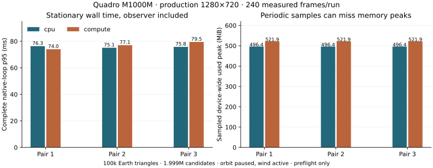

# T3c5c1 — production native workload and stationary preflight

2026-10-06. Three alternating CPU/resident-compute pairs run on the actual
Quadro M1000M GLX context, using the shipping interactive loop at 1280×720.
The production scalar workloads, field/topology fingerprints, camera/root and
planning anchors match. CPU remains default. This checkpoint prepares the
movement, Moon/reload and final cost gates; it does not complete T3c5.

## Method and scope

The frozen input embeds `configs/scenarios/solar_system.json` without reducing
terrain, foliage, shadow, reflection, atmosphere or sky settings. Public
camera-only replay startup freezes simulation at zero and pauses orbit/spin;
wind and character animation remain driven by native wall time. X11 key `4`
selects the astronaut camera. A minimum three seconds and 30 frames of warmup
follow complete standing readiness. Each measured run retains 240 contiguous
rendered frames, lasting 17.00–18.34 seconds. No measured outliers are removed.

The native probe's optional benchmark mode preserves the shipping 1280×720
window and requests swap interval zero for both backends. Presentation still
uses real GLFW/GLX with Xvfb; these are not EGL capture timings or desktop-display
latency guarantees. The complete native timer includes event polling,
preparation/rendering, presentation and profiler closure. Full GPU frame spans
remain independent; nested GPU work intervals must not be added to wall time.

The private observer reads only owned CPU scalars and records its primary
inspection/JSON-write time inside presentation. Its mean is 1.087–1.567 ms per
frame, about 1.4–2.2% of native wall time, and is **included without correction**.
Its own timing CSV write, control-file polling and GL-hook bookkeeping are not
included in that observer receipt. Thus this is an instrumented preflight, not
a measurement of disabled-trace shipping overhead. Close-to-threshold timing
requires further validation rather than subtracting an estimated observer cost.

The device is Quadro M1000M, context/NVML UUID
`GPU-2cefee61-6b3b-a670-c390-c7449dad3f79`, NVIDIA driver 580.178.04 and
OpenGL 4.3.0. Physical samples are periodic device-wide readings, include other
processes and can miss transient peaks. Renderer-ready startup is asynchronous
and is not a guaranteed isolated pre-admission physical baseline. Logical
reservation numbers cover the managed terrain/grass owners, not every resource.

Run order is CPU→compute, compute→CPU, CPU→compute. Source/shaders, build/test
inputs, production/replay and executable hashes are frozen. The runtime source,
shipping application and other 41 executable hashes remain unchanged from
T3c5b2c; only the private native probe changes. Two relevant software CTest
groups pass on the final probe: native loop timing and native input (63.63 s).
This is scoped validation, not a new full-suite run.

## Matched production workload

| Receipt | CPU terrain/CPU planner | Resident compute/gpu-v1 |
| --- | ---: | ---: |
| Earth triangles / unique radial samples | 100,000 / 50,002 | 100,000 / 50,002 |
| Moon triangles | 960 | 960 |
| Configured candidate budget | 2,000,000 | 2,000,000 |
| Submitted candidates / patches | 1,999,246 / 27,496 | 1,999,246 / 27,496 |
| Effective placement density, blades/m² | 47.14922891273592 | 47.14922891273598 |
| Configured density / draw distance | 120.72 / 150 m | 120.72 / 150 m |
| Earth full CPU render vectors | 12,000,000 bytes | 0 bytes |
| Earth reported GPU terrain input | — | 2,800,880 bytes |
| Bulk CPU height evaluations | 150,006 | 0 |
| CPU planning height evaluations | 70,881 | 70,881 |

All six measured workloads are stable across their 240 frames. Pairwise land
and water field/topology keys, camera/root and terrain/active-grass planning
eyes match exactly. Disabled Moon water has revision zero on CPU and revision
one on compute; both carry zero field/topology and do not enable a water draw.
Enabled compute consumers retain matching draw/contact/shadow/water keys.
No blocking/flush polls, server waits, bulk readbacks, `glFinish` or diagnostic
frame memory queries occur. Worker ownership stays bounded.

The CPU density is already reduced by existing budget scaling; preserving it
does **not** mean the configured 120.72 near density is achieved. The protected
near-density/falloff controller remains B1. Scalar matching also does not prove
rendered near-root/image coverage, which remains part of the movement/final
acceptance work. The reported Earth transfer arithmetic is a 76.659% reduction
relative to the CPU payload, consistent with T2. Removing bulk evaluation counts
does not establish the required 50% reduction in measured CPU field time.

## Stationary results

All times below are milliseconds. Each row has 240 complete native receipts and
240 ready full GPU spans.

| Pair / backend | Native p50 | Native p95 | Native p99 | GPU span p95 | Primary observer mean |
| --- | ---: | ---: | ---: | ---: | ---: |
| 1 CPU | 71.803 | 76.325 | 78.997 | 74.039 | 1.567 |
| 1 compute | 71.152 | 74.006 | 76.498 | 71.871 | 1.279 |
| 2 CPU | 71.258 | 75.108 | 77.507 | 72.413 | 1.440 |
| 2 compute | 73.844 | 77.062 | 79.263 | 75.074 | 1.356 |
| 3 CPU | 71.802 | 75.772 | 78.924 | 73.603 | 1.463 |
| 3 compute | 76.953 | 79.501 | 80.872 | 77.512 | 1.087 |

Compute/CPU native p95 ratios are **0.9696, 1.0260 and 1.0492**: from 3.0%
faster to 4.9% slower. CPU p95 ranges 75.108–76.325 ms; compute ranges
74.006–79.501 ms. The largest ratio sits close to the 5% gate. These short-tail
estimates and run spread do not establish a robust improvement or overall
migration acceptance. Do not pool away the least favorable pair.



Measured device-wide used-memory maxima are 496.4 MiB for CPU and 521.9 MiB
for compute in all three pairs, with 68–73 samples per measured run. Resident
logical startup/steady admission peaks at about 277.1 MiB. CPU has no managed
resident ledger. Compute uses more sampled device memory in this workload;
the preflight does not claim a VRAM saving. No scene replacement occurs, so
these values do not establish replacement overlap or its physical peak.

## Evidence and reproduction

[validation/results.json](validation/results.json) retains every run's actual
command, method, hashes, density/budgets, percentiles, missing-sample counts and
memory maxima. There are 1,440 measured and **1,955 excluded** native frames;
startup/loading, camera transition, warmup and close are retained in full
compressed streams. The observer's `controls.phase` labels identify the measured
interval. All 3,494 GPU work rows resolve ready; twelve initial terrain
publication receipts resolve published. None measures replacement or Moon
handoff. [checks.json](validation/checks.json) retains outlier labels without
filtering and independently joins every frame, fingerprint and device receipt.

An initial camera-only replay run was rejected because interactive compute
requires an explicit resident planner override. The corrected runner passes
`--terrain-grass-planner gpu` for compute and `cpu` for CPU. Its rejected log
is preserved under `validation/logs/`; the first draft CPU timing is excluded
from the six-run result. An earlier interrupted development attempt overlapped
software tests and supplies no accepted timing samples. Final paired runs execute
after regression, without concurrent builds or test workloads.

```sh
env __NV_PRIME_RENDER_OFFLOAD=1 __GLX_VENDOR_LIBRARY_NAME=nvidia \
  xvfb-run -a -s '-screen 0 1600x900x24' \
  python3 scripts/benchmarks/terrain_cost/run.py \
  --probe build-resume/tests/terrain_native_probe \
  --output-dir build-resume/terrain-cost-final \
  --expected-uuid GPU-2cefee61-6b3b-a670-c390-c7449dad3f79
python3 docs/journal/architecture/terrain-gpu/async/hardware/cost/preflight/validate.py
python3 docs/journal/architecture/terrain-gpu/async/hardware/cost/preflight/make_figure.py
```

The figure generator requires Matplotlib. It uses archived receipts and does
not run a new benchmark. Artifact hashes and 42 executable/driver-fixture
fingerprints are retained in [evidence.json](validation/evidence.json) and
[provenance.json](validation/provenance.json).

Resume **T3c5c2** for actual native 6/12 m/s routes, rebuild spikes and rendered
coverage, then T3c5c3 Moon/reload memory and T3c5c4 optimized CPU field-time and
cross-case gates. Repeat affected stationary pairs if those changes alter
workload or runtime. CPU stays default throughout the incomplete acceptance.
