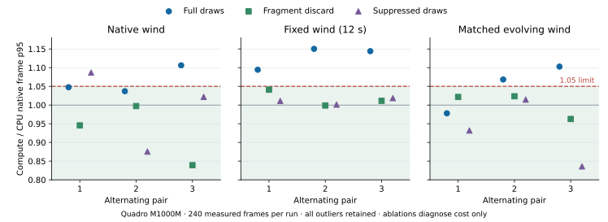

# T3c5c2b3 — stationary wind and grass raster investigation

Declared before production measurements, 2026-10-07, after `d2e9e2c`.

The previous three ordinary timed stationary pairs retain native compute/CPU
p95 ratios 1.05789/1.11058/1.04965 (and the earlier 1.0853 failure). GPU opaque
p95 increases about 4–6 ms, while placement means differ by only 0.18–0.35 ms
per view. Wind phase was missing from those receipts. These failures remain
recorded; stage percentiles are separate distributions, not an additive or
subtractive decomposition of whole-frame p95. CPU remains default.

## Declared controls and gates

Use the same production replay, 1280×720, quality scale 1, 100,000 Earth
triangles, configured/effective two-million foliage budget and verified Quadro
UUID GPU-2cefee61-6b3b-a670-c390-c7449dad3f79. Orbit/spin stay paused at time
zero; native grounded root, optical view, terrain/grass planning anchors,
field/topology identities, revisions and scalar workload must remain steady
and match between CPU and resident backends. Preserve the configured/effective
density distinction: this is not a protected-near-density budget test.

For each of three wind modes and three grass draw modes, collect three fresh
alternating CPU/compute pairs (CPU/compute, compute/CPU, CPU/compute): 54 native
runs /27 pairs. After at least 30 grounded warmup frames and three wall seconds,
retain the first 240 synchronized measured wind indices, numbered 0–239, lasting
at least five wall seconds. Keep every startup, transition, tail and close
frame in raw storage; no outlier filtering. Control changes observed after a
draw boundary cannot turn that older wind index into a measured sample.

Wind modes:

- `native`: actual advancing production wind, recorded separately for main and
  reflection. This diagnoses ordinary costs; phases are not matched across runs.
- `fixed`: effective shader wind time 12 s for both blade raster and compute
  placement, in main and reflection. Original native times remain recorded.
- `indexed`: effective shader wind time 12 + 0.125 × index s, matched by cohort
  index across CPU/compute and all raster controls. This preserves a declared
  evolving wind sequence without backend frame-rate drift.

Draw modes:

- `full`: all production grass draws execute. These provide complete native
  total-cost comparisons; the unchanged per-pair p95 ratio limit is 1.05.
- `discard`: grass draw calls and vertex work execute with rasterizer discard;
  compute placement remains. Discard state is restored before unrelated work.
- `suppress`: grass draw calls are omitted after unchanged placement/uniform/
  queue preparation. Other terrain, character, water, atmosphere and fullscreen
  draws are forwarded. This is a diagnostic ablation, never workload acceptance.

The new private executable links wrappers around grass draws and shader float
setters, leaving shipping code/shaders and all 44 previous executables unchanged.
Receipts attach actual original/effective per-body main/reflection wind values,
blade/placement program writes, submitted/omitted draw identities and unrelated
draw counts to the existing native frame observation. All hook/receipt/primary
observer overhead remains inside native wall timing. No queue/depth/framebuffer
readback or driver-memory query is added to measured frames.

## Qualification prerequisite

Small 320×180 software and native fixtures exercise legacy CPU planning with compute
placement, resident GPU planning, and legacy vertex placement. For every path,
all nine wind/draw controls retain four declared cohort frames. Explicitly
excluded pipeline queries check generated primitives and passed samples;
independent uniform reads verify actual blade/placement shader wind. Full and
discard primitive counts must match at fixed/indexed wind; discard/suppress
samples must be zero, suppression primitives zero, and full main grass samples
positive. Unrelated draws and clean native publication/wait/readback audits
must remain. Blocking qualification query reads are explicit and absent from
production measurements. These checks do not qualify rendered near-density or
migration acceptance.

Compare complete native/frame-span distributions and main/reflection placement,
opaque, reflection and atmosphere distributions separately. Report all pair
ratios, draw modes and wind phases, retaining earlier failures. A raster/vertex/
placement localization is a controlled observation; attribution to atomic queue
ordering, overdraw or dispatch chunking needs its own controlled experiment.
Moon/reload, transfer, optimized bulk-field, near-density and final memory gates
remain independent. Never change defaults based on these diagnostic ablations.

## Results and interpretation — 2026-10-07

All 54 native Quadro runs completed on the frozen inputs. Independent raw
reconstruction verifies 27 pairs and 12,960 measured frames, with 18,320
excluded startup/warmup/transition/tail/close frames retained. All 426 upper
Tukey-fence outliers remain in the measured distributions; the fence is a
reporting diagnostic, never a filter. Every measured GPU frame and retained
GPU-work receipt is ready, with no dropped measured GPU events. Exact scalar
workloads, geometry/pose/anchors, device identity, bounded publication and
zero blocking-poll/server-wait/bulk-read/glFinish/memory-query audits pass.
The new probe's explicit qualification queries remain outside these runs.

The table reports compute/CPU **complete native frame p95** ratios. The 1.05
limit is unchanged. Discard and suppressed draws are diagnostic ablations;
even values below that limit cannot qualify full-workload migration.

| Wind | Grass draw control | Pair 1 | Pair 2 | Pair 3 |
| --- | --- | ---: | ---: | ---: |
| native | full | 1.047608 | 1.036985 | 1.106210 |
| native | discard | 0.945534 | 0.997245 | 0.839104 |
| native | suppress | 1.086817 | 0.875511 | 1.021815 |
| fixed | full | 1.094387 | 1.150303 | 1.144083 |
| fixed | discard | 1.041136 | 0.998776 | 1.011265 |
| fixed | suppress | 1.011026 | 1.001188 | 1.018595 |
| indexed | full | 0.977918 | 1.068332 | 1.102773 |
| indexed | discard | 1.021654 | 1.023504 | 0.962707 |
| indexed | suppress | 0.931938 | 1.014612 | 0.835970 |



Fixed wind does not remove the regression: all three full-draw pairs are
9.44–15.03% slower on compute. Their CPU/compute native p95 values are
88.923/97.316, 86.197/99.153 and 86.932/99.457 ms. All six fixed-wind
discard/suppressed pairs remain below 1.05. With a matched evolving wind
sequence, two full-draw pairs still fail (1.068332 and 1.102773), while all
six corresponding ablations remain below 1.05. Native wind retains one
full-draw failure and one suppressed-draw failure, so background variability
is present and the controls do not explain every isolated spike.

The repeatable fixed-wind difference is localized to work enabled by grass
rasterization and its downstream scene effects. It is not explained solely
by a different advancing wind phase. The ablations retain placement; discard
also retains the primitive/vertex path. They do not establish the cause as
atomic ordering, overdraw or placement dispatch chunking. Changed grass color
and depth also change inputs to later reflection/atmosphere work, so a
full-minus-discard percentile is not a standalone fragment-time measurement.

For fixed full draws, GPU opaque p95 CPU/compute is 21.117/27.073,
21.842/27.118 and 21.783/27.082 ms. Main and reflection placement **means**
increase only 0.210–0.311 ms per view. Reflection p95 is 15.861/16.773,
16.367/16.746 and 16.379/16.747 ms; atmosphere p95 is 35.853/38.380,
35.468/40.691 and 36.406/39.782 ms. Each is a separate distribution with
nested and overlapping work. None may be added/subtracted to explain native
p95. Discard pair 1 still has elevated stage tails despite its passing
complete-frame ratio. Complete reconstructed stage distributions are in
[validation-result.json](validation-result.json).

## Qualification, storage and reproduction

The final scoped software control test passes in 69.00 s. The same private
fixture passes on verified Quadro. Each renderer checks 27 controls /108
frames across legacy compute placement, resident planning and legacy vertex
placement. Main and reflection original/effective times agree with actual
shader uniforms. Excluded pipeline queries confirm full/discard primitive
parity and zero discard samples /suppressed primitives and samples. These
small fixtures qualify control semantics, not production rendered density.
`GL_SAMPLES_PASSED` counts passing depth/stencil samples, not fragment shader
invocations or an overdraw denominator.

Two successful software preflights (224.37 s and 69.54 s, 216 frames total)
remain separate with their exact earlier sources and executable hashes.
The first uses 1280×720 and earlier receipt labels; the second refines the
labels and smaller fixture but still uses zero placeholders for unobserved
indirect draw counts. Final receipts use null for those unknown counts.
The first archive-validator invocation exposed a string/Path codec adapter
error. Its traceback is retained separately; accepting string paths fixes
archive reading without changing any measured helper or cohort. No timing
batch or failed historical benchmark is replaced by this correction.

Shipping sources/shaders, driver fixtures and all 44 previous executable
hashes match the before checkpoint. Only the new private executable and its
build/test inputs are added; all 45 final executable/input hashes stay frozen
through measurements. This is scoped qualification and archive verification,
not a new full CTest run. Gallery and historical captures remain unchanged.

The lossless archive verifies 703 source data files byte for byte after
decoding: 152,526,975 raw bytes become 7,740,877 stored bytes, saving 94.9%.
JSONL and CSV use deterministic gzip; JSON and logs retain original bytes.
`validation/codec-receipts.json` records lengths and decoded SHA-256 digests.
[Artifact hashes](evidence.json) cover the full evidence tree. Raw arrays,
all excluded frames, publication/GPU/memory traces, qualification and
preflight receipts, frozen helper sources and reproduction inputs remain
available under `validation/`. CSV companions are grouped under `trace/`.
The frozen summary helper omits singular reflection/mesh CSV columns because
it looks for plural names; the archive validator independently reconstructs
all CPU/GPU stage columns without editing that measured helper.

Reconstruct the archived cohorts and qualification checks from the repository
root with standard-library Python:

```sh
python3 -B docs/journal/architecture/terrain-gpu/async/hardware/cost/raster/validate.py
```

`plot.py` regenerates the standalone SVG with Matplotlib from those verified
results. Reproduction runner/archive sources are retained under
`validation/inputs/reproduction/`; use fresh output folders for a new hardware
study and requalify changed inputs. Do not overwrite these original receipts.

## Next work and acceptance

T3c5c2b3's control investigation is tested and documented; full-draw cost
acceptance fails. T3c5c2b4 must distinguish root/queue population and draw-order
or overdraw effects with separate excluded production inspection, define a
bounded correction, verify coverage/numerical/replay parity and repeat affected
full-draw CPU/compute pairs at the unchanged 1.05 limit. Diagnostic query time
must stay outside those measurements. Earlier stationary failures remain
recorded. CPU stays default; Moon/reload, canonical transfer, bulk field,
protected configured near-density and final memory/migration gates remain.
