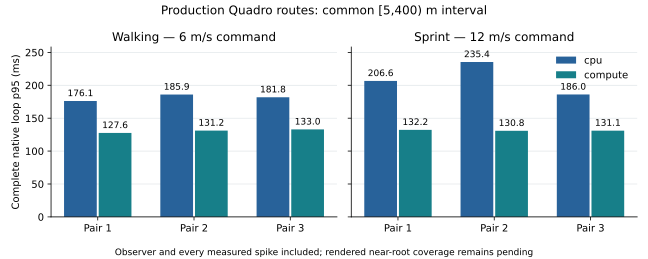

# T3c5c2b1 — distance-aligned production native route cost receipts

2026-10-06. Three alternating CPU/resident-compute pairs per walking and sprint
route retain full production native timing, publication and memory receipts.
This checkpoint collects the longer route cost preflight. Rendered near-root
coverage remains T3c5c2b2; candidate counts and effective density scalars do not
establish equal rendered work or complete migration acceptance. CPU stays default.

## Method

`scripts/benchmarks/terrain_cost/routes.py` uses the unchanged runtime/private
probe and all 42 unchanged executables from the grounded speed checkpoint.
Only new benchmark/postprocessing scripts change the frozen build/test inputs.
The time-zero public replay embeds the untouched production scenario: 1280×720,
100k Earth triangle cap, 2M foliage budget, atmosphere, sky, shadows and water
reflection consumers. Explicit CLI planner overrides select CPU legacy versus
resident `gpu-v1`. Requested swap interval is zero under actual Quadro M1000M
GLX/Xvfb, context/NVML UUID `GPU-2cefee61-6b3b-a670-c390-c7449dad3f79`,
NVIDIA driver 580.178.04. These are instrumented native timings, not desktop
presentation guarantees or the earlier RTX EGL comparison.

Real X11 key `4` selects the astronaut. Standing readiness is followed by at
least three seconds and 30 frames of warmup. Real W, with Shift for sprint,
covers 400 m along the same initial planet-local path at commanded 6/12 m/s.
Walking and sprint each use CPU→compute, compute→CPU, CPU→compute order. Each
run measures the common **[5,400) m** interval with at least 240 complete native
frames. First-key confirmation/first 5 m, endpoint crossing/keyup, startup,
warmup, ten settled frames and close remain as explicit exclusions. Every raw
frame is retained. The endpoint crossing frame brackets the 400 m landmark;
it is not silently counted as an equal-length extra interval.

Each full frame is assigned to a 25 m bin using its end-of-update walked
distance; no frame time is clipped or rescaled at bin boundaries. Positions
alone are linearly interpolated between observed frames at fixed 25 m landmarks.
Workload and generation metadata come from the nearest real receipt, with the
bracketing frame numbers/fraction retained. CPU/compute publication schedules
may differ. Paired roots/camera positions and effective density ratios report
those differences rather than forcing dispatch or publication to coincide.

The native timer includes polling, preparation, rendering, presentation and
profiler closure. Primary observer time remains included without correction.
GPU frame spans, nested render stages, asynchronous worker build times, GPU
work intervals and request-to-publication outcomes are separate receipts;
their sums are not substituted for complete native wall. Upper Tukey-fence
outliers are descriptive labels only. All rebuild and spike frames remain.
Three pairs and roughly hundreds of frames per run give limited tail precision.

Periodic device-wide NVML used bytes include other processes and can miss peaks.
Managed logical overlap belongs to compute owners, not every renderer resource;
the unmanaged CPU path has no such ledger and reports **null/unavailable**.
The first complete CPU preflight exposed a missing-ledger postprocessing bug;
the corrected analyzer retains its full run separately and checks real CPU
joins, identical comparison, altered-budget rejection and missing-landmark
failure. Final alternating pairs are fresh runs with frozen corrected inputs.

## Results

All twelve fresh runs pass speed, frame joins, fixed production quality/budgets,
verified device and zero blocking GL diagnostics. The common distance cohorts
retain **5,276 measured and 3,797 excluded frames**, including all **461** upper
Tukey-fence outliers. No frame is trimmed. Each of 192 landmark receipts retains
the actual nearest generation/workload; paired root and camera differences are
at most **6.42 cm** and **6.44 cm**. These establish route/quality preflight,
while different live topology/publication schedules still require rendered
coverage inspection.

| Route | Pair | CPU / compute frames | CPU / compute wall speed (m/s) | CPU / compute native p95 (ms) | Compute / CPU p95 |
|---|---:|---:|---:|---:|---:|
| walking | 1 | 596 / 624 | 5.920 / 5.990 | 176.134 / 127.569 | 0.7243 |
| walking | 2 | 550 / 622 | 5.825 / 5.989 | 185.928 / 131.186 | 0.7056 |
| walking | 3 | 557 / 607 | 5.873 / 5.980 | 181.846 / 132.974 | 0.7312 |
| sprint | 1 | 267 / 305 | 11.988 / 11.948 | 206.599 / 132.248 | 0.6401 |
| sprint | 2 | 266 / 307 | 11.985 / 11.996 | 235.371 / 130.798 | 0.5557 |
| sprint | 3 | 270 / 305 | 11.972 / 11.993 | 186.029 / 131.062 | 0.7045 |



Whole-route compute/CPU p95 ratios are 0.7056–0.7312 walking and
0.5557–0.7045 sprinting. Small 25 m bins have just 11–58 frames and ratios
0.1280–1.9447; some compute bins are slower. All bins remain in `results.json`.
This spread is descriptive, not a confidence interval or proof of equal
rendered density. Primary observer overhead remains inside every native value.

Per-run CPU mesh scope p95 is 56.71–71.55 ms walking and 82.18–112.80 ms
sprinting, versus 7.76–8.82 ms on compute across routes. Complete GPU span p95
is 103.85–120.46 ms on CPU versus 126.17–129.98 ms on compute. These scopes
can overlap or include driver waits; their sums do not establish total cost
or isolate the cause of the previous stationary regression.

Configured Earth density remains 120.72 blades/m². Existing budget scaling
gives effective scalars of 44.66–66.60 across all runs; paired landmark
compute/CPU density ratios span **0.9710–1.0438**. The pending protected
near-density controller (B1) is not implemented by these experiments.
Walking measured mesh upload/rebuild counts are CPU 23–25 / 24–26 and
compute 26–28 / 26–28. Sprint is CPU 12 / 24, compute 13–14 / 13–14.
Different asynchronous schedules must remain explicit.

Root-to-grass-planning-eye p95 is 18.75–19.96 m CPU and 19.28–19.83 m
compute when walking. Sprint is **25.15–25.28 m CPU versus 33.44–34.64 m
compute**, with compute maximum **43.82 m**. This includes the chase-camera
offset and does not itself prove thinning, but makes inspection of actual
near-root coverage essential before attributing lower overall native p95 to
equivalent rendered work.

All 5,276 measured GPU frame records and 12,798 full-run GPU work rows are
ready. The 511 retained publication rows comprise 296 published, 196 coalesced
and 19 shutdown outcomes. Full unsuccessful outcomes and startup/settle work
remain in the raw archives; publication admissions inside the distance cohort
are listed separately. There are no memory event drops or blocking render-loop
polls, waits, bulk reads, finishes or memory queries.

Periodic device-wide peak used memory in the distance cohort is **740.5 MiB
CPU** and **769.5–797.125 MiB compute**. Compute owner logical overlap peaks
at **554.08 MiB across the complete run**, including excluded startup/settle;
the CPU ledger is unavailable, represented as null. These scopes differ and
must not be subtracted as like-for-like memory savings. No whole-scene reload
occurs here; sparse sampling can miss replacement/transient peaks. All raw
memory samples retain query age and status.

**T3c5c2b1 is tested. T3c5c2b2 coverage and final cost acceptance remain
pending; CPU stays default.** The first optional-ledger CPU preflight remains
separate with its original script fingerprint and postprocessing failure log.
It is not silently substituted into the six fresh comparisons.

## Coverage inspection plan — T3c5c2b2

Do not interpret a paired budget, global density scalar or total submitted
candidate count as near-root rendered density. Asynchronous mesh publication,
different rounded-slot planners and stale grass anchors can change local
coverage while these scalars match. The root-to-planning-eye distance here
includes the camera/chase offset; it is a geometric lag diagnostic, not a
count of blades or an independent foliage coverage measurement.

The next inspection needs fixed body-local landmarks and explicit camera,
character/wind clock, trail state, optical quality and generation/grass anchor
identity. Inspect actual live generations in **separate, excluded inspection
runs**; an independently replanned synchronous capture cannot silently stand
in for the native asynchronous generation. Preserve field/topology, revisions,
anchor and endpoint pose alongside every view. Use repeated views/landmarks to
distinguish phase variation from coverage loss.

Combine grass-only image masks against controlled no-grass renders with
generated-root distance bands (0–5, 5–15 and 15–30 m). Current
`ProceduralGrass::computedCounts` reads only two draw counts and cannot provide
root positions. Inspection-only decoding of the generated 64-byte Blade buffers
must retain main/reflection view identity and detailed/quad queue offsets;
later passes may overwrite these buffers. Any synchronization/full buffer/depth
readback belongs outside the timed cost runs and must be reported explicitly.
Ground eligibility uses the same terrain/material, water clearance and biome
rules. Frustum rejection, root acceptance and depth occlusion are separate
effects: generated root counts are not automatically visible-pixel counts.
Measure eligible visible ground consistently before calling roots/m² a rendered
density. Report configured and budget-scaled effective density separately.

Compare coverage with a declared tolerance and retain all discrepant landmarks.
If a speed/cost difference accompanies thinning or lag, investigate and repeat
affected route/control pairs before migration acceptance. Fresh stationary
pair 3 already has compute/CPU native p95 ratio 1.0853, beyond the 5% limit;
complete stage/workload investigation and repeat controls remain required.

## Reproduction and evidence

```sh
env __NV_PRIME_RENDER_OFFLOAD=1 __GLX_VENDOR_LIBRARY_NAME=nvidia \
  xvfb-run -a -s '-screen 0 1600x900x24' \
  python3 scripts/benchmarks/terrain_cost/routes.py \
  --probe build-resume/tests/terrain_native_probe \
  --output-dir build-resume/routes-cost \
  --expected-uuid GPU-2cefee61-6b3b-a670-c390-c7449dad3f79
```

`validation/` retains complete compressed frame/native/GPU work/publication/
memory/observer streams, per-run summaries/logs, production replay, device
inventory, frozen source/script-input/42-binary/driver hashes and independent
artifact checks. The failed optional-ledger preflight is separate. Standalone
`validate.py` recomputes distance cohorts, real-time speed, frame joins,
landmark brackets, rebuilds, device identity and paired comparisons from the
archive. `make_figure.py` uses optional Matplotlib for the standalone plot.
T3c5c2b2 rendered coverage, T3c5c3 Moon/reload and T3c5c4 final gates remain.
