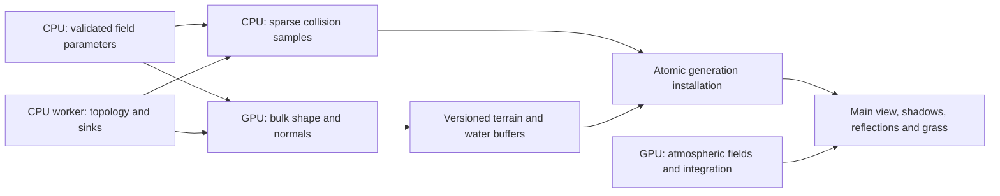

# CPU–GPU planet generation plan — 2026-10-03

This completes the planning prerequisite in `todo.md`. The first migration will
retain the existing icosahedral triangular panels. CPU workers select topology,
subdivision and inward LOD offsets; a GPU generation pass evaluates the planet's
shape, height gradients and material inputs into reusable terrain buffers.
Sparse CPU evaluation supports simulation and topology decisions. GPU resources
are installed as one versioned generation across terrain, water, foliage,
shadows and reflections. GPU terrain implementation remains the next task.

## Audited starting point

Paths below refer to the source at commit `5993b23`. These are code observations;
measurements explicitly refer to existing dated studies.

| Work | Current owner and dependency | Consequence for migration |
| --- | --- | --- |
| Height field | [Terrain.cpp](../../../../src/rendering/geometry/Terrain.cpp): `heightMeters`, 32-bit hash/value noise, continent/plain/cliff fields, fBm/ridged fBm | Port the exact configured field, including seeds, octave normalization, ridge smoothing and SI scale. Grass wind is Perlin; terrain is value noise. |
| Topology and sinking | [TerrainLod.cpp](../../../../src/rendering/geometry/TerrainLod.cpp): 320 base triangles, eight bands, shared finer edges/corners, ring interiors, hard cap, hysteresis; sink applied after refinement | Separate radial topology from sampled positions. Keep CPU subdivision/sink ownership and a single closed surface. |
| Shoreline | [TerrainShoreline.cpp](../../../../src/rendering/geometry/TerrainShoreline.cpp): up to eight edge-split passes, height and distance classification, shared incident edges, spare triangle budget | CPU subdivision may remain, but classifications must use local queries or small GPU summaries, without reading every shaped vertex back. |
| Scheduling | [TerrainMeshes.cpp](../../../../src/rendering/runtime/TerrainMeshes.cpp): rebuild after 10 m radial travel or local/far transition; 20 m zone hysteresis; walking worker builds land and water together | Preserve useful caching and asynchronous jobs. Install land/water atomically; reject stale scene generations. Capture remains synchronous. |
| Uploads | [Mesh.cpp](../../../../src/rendering/geometry/Mesh.cpp): three distinct vertices per land triangle, nine floats each, three uint32 indices; `glBufferData` uploads both | Current payload is 120 bytes/triangle. No shaped-vertex upload on the compute path. |
| Camera/astronaut | [PlanetSurfaceCamera.h](../../../../src/rendering/camera/PlanetSurfaceCamera.h) queries `heightAt`; [SurfaceContact.cpp](../../../../src/rendering/character/SurfaceContact.cpp) intersects CPU triangles; [Character.cpp](../../../../src/rendering/runtime/Character.cpp) binds mesh vectors and clamps to sea level | Retain a CPU height oracle and a small matching collision mesh. Analytic height alone cannot replace rendered triangle-plane contacts. |
| Grass planning | [GrassPlan.cpp](../../../../src/rendering/foliage/procedural/GrassPlan.cpp) scans CPU positions/normals, area/biomes and distance, rounds to power-of-two slots and lowers global density to fit | This dependency prevents deleting the CPU render mesh without also changing grass planning. |
| Grass generation | [GrassCompute.cpp](../../../../src/rendering/foliage/procedural/GrassCompute.cpp) reads existing terrain buffers, places/culls roots and fills indirect queues on GL 4.3; GL 3.3 generates roots in vertices | Reuse the new resident terrain buffers. Current roots depend on triangle order and are not guaranteed stable across retriangulation. |
| Atmospheric fields | [AtmosphereTransmittance.h](../../../../src/rendering/atmosphere/AtmosphereTransmittance.h) builds a 256×128 RG32F density-column texture on the GPU; [atmosphere.glsl](../../../../shaders/atmosphere/atmosphere.glsl) and [atmosphere.frag](../../../../shaders/atmosphere/atmosphere.frag) integrate extinction, scattering and refraction per sample | These fields are already GPU calculated. Preserve the geometry-only LUT key (shell radius ratio), shared main/reflection use and optical model. |
| Atmospheric coefficients/meter | [Atmosphere.h](../../../../src/simulation/Atmosphere.h) computes small uniform optics and a 16-sample sky-illuminance estimate on CPU; [AtmosphereRenderer.h](../../../../src/rendering/atmosphere/AtmosphereRenderer.h) reads an 8×8-tile highlight map and sorts it on CPU | Move suitable field/meter reductions when measured; do not replace a tiny coefficient calculation with a synchronous GPU readback. |
| Residency telemetry | [VideoMemory.h](../../../../src/rendering/diagnostics/VideoMemory.h) has optional NVX/ATI free-memory queries; [Renderer.cpp](../../../../src/rendering/runtime/Renderer.cpp) samples at startup for adaptive resolution | Foliage currently has no automatic VRAM policy. Availability is optional and an allocation ledger is needed. |
| Utilization | [GpuUtilization.h](../../../../src/rendering/diagnostics/GpuUtilization.h) optionally polls matched NVIDIA NVML devices, only while the HUD is visible | It is not a portable budget signal. Use existing GPU pass timers independently of HUD visibility. |

The historical [CPU study](../../benchmarks/cpu-profiling.md) attributed 85.4% of
terrain-build wall time to shoreline refinement in its software-renderer workload.
That predates later changes; it motivates measuring classification/topology
separately, not claiming that a noise port alone fixes generation cost.
The [latest offline study](../../benchmarks/offline-showcase.md) measured 100,000
Earth and 86,400 Moon triangles, 11,999,989 candidates and 1,535,998,624 queue
bytes. A central narrow viewport retained those allocations. These are baseline
facts, not a GPU implementation benchmark.

## Panel choice, seams and poles

| Option | Useful properties | Cost and decision |
| --- | --- | --- |
| Existing subdivided icosahedron | No latitude seam or pole fan; current shared-edge rules and replay face order; four triangular children fit their parent's boundary | **Use first.** Make the current 320 faces explicit panels; preserve ordering. Later child patches can provide finer streaming boundaries without changing the field. |
| Icosahedral hexagon/pentagon dual | Mostly six neighbors, attractive adjacency for spatial storage | A uniform closed spherical tiling with three panels at each vertex cannot be all hexagons. Pentagonal exceptions and mixed-resolution boundary handling are required. Keep as an optional later indexing layer. |
| H3-style hierarchy | Established spherical neighborhood indexing | Twelve pentagons; child-cell geometric containment is approximate. Introducing it would not preserve existing LOD boundaries/replay IDs. Do not add the dependency for the initial port. |
| Cube sphere with quadtrees | Regular grids, four-child patches, straightforward texture layers | Six face charts require edge rotations and eight corner joins, plus new topology/IDs. A valid later alternative if grid texture sampling becomes central. |
| Latitude/longitude panels | Simple parameterization | Longitude seam and polar degeneracy need exceptional topology; poor match for local uniform sampling. Reject for this migration. |

For a genus-zero hexagon/pentagon network with degree-three junctions,
`3V=2E`, `5P+6H=2E`, and `V−E+(P+H)=2` imply `P=12`.
The finite icosahedral dual shares this exception count. H3 documents both the
[twelve pentagons](https://h3geo.org/docs/core-library/overview/) and
[approximate parent/child geometric containment](https://h3geo.org/docs/highlights/indexing/).
This motivates the triangle choice; it does not mean every conceivable polygonal
sphere partition must have exactly twelve pentagons.

Use canonical integer sample IDs: original vertex IDs; sorted edge endpoints
plus a reduced rational edge parameter; panel ID plus deterministic ring/interior
coordinates. A shared sample is generated once and referenced by both panels.
Shared sinks use the finest incident level, as today. Generate seam endpoints in
one canonical arithmetic order, with no separate face-specific normalization.
Global noise samples use normalized body XYZ, never latitude/longitude UVs.
Normals use the same tangent-reference choice as `gradientAt`, including its
branch near `abs(z)=0.8`. Test that branch and both poles, not just the equator.
New hierarchy IDs must be schema-versioned; retain legacy face-zone replay for
old captures or select the CPU backend when loading that schema.

## Ownership and data contract

| Responsibility | CPU | GPU |
| --- | --- | --- |
| Configuration, units, bodies | Validate JSON; retain double world positions/orientations, SI radius, noise seeds and generation keys | Consume packed parameters and body-local transforms |
| Subdivision/LOD | Select panels, reconcile edges, ring topology, shoreline edge splits, hard triangle cap, movement hysteresis and sink scalar | Optional batched classification summaries for future planning; no independent topology change |
| Surface field | Sparse oracle for steep/shoreline decisions, startup camera and simulation; bounded near-character triangle mirror | Bulk radial shape, full configured noise, gradients, biome/material factors and final inward displacement |
| Water | Choose a closed sea topology and fixed level; zero sink | Generate sea shell into its own buffer; same declared physical level in all passes |
| Foliage | Residency/work budget and deterministic planning state; bounded panel list | Triangle bounds/area/biome tests, rounded-slot allocation, roots, culling, wind and trails; same terrain buffer |
| Atmosphere | Configuration, simulation air/drag and uniform optics reference; initial incident-light meter | Existing density columns, ray integration/refraction; later suitable metering/field reductions |
| Resource lifecycle | Memory ledger, async job keys, allocation/failure policy, GL scheduling on render thread | Persistent generation outputs, bounded scratch and per-view draw queues |

Proposed interfaces (design names, not existing APIs):

- `PlanetFieldParameters`: radius in metres, world scale, landscape parameters,
  ordered noise functions/types/seeds, water level, material thresholds, gradient
  sample sine/cosine and field version. Upload on scene/field change, not per
  vertex or frame. Use explicit aligned packing and count/size validation.
- `TerrainTopology`: canonical sample IDs, unit radial doubles, sink scalars,
  triangle indices, face levels and conservative bounds. Start with a **32-byte
  input sample** (`double x,y,z,sink_m`); sample index is its local canonical ID.
  Stable panel/sample IDs and adjacency are separate CPU metadata. Unchanged
  topology stays resident; later templates can replace repetitive descriptors.
- `TerrainGenerationKey`: scene revision + field version/hash + topology/sink
  revision + backend. `TerrainBuffers` holds generated VBO/EBO, water buffers,
  compatible foliage descriptors, bounds, collision mirror and completion fence.
  Draw/collision publication happens together. Shadow-cache keys and frame reuse
  must include the generation, not merely CPU mesh upload revision.
- Generated terrain initially keeps the **nine-float position/normal/color layout**
  so buffer-texture grass and all draw passes can read it. Use an SSBO scalar
  float array or explicit packing; a std430 struct with three vec3 fields is not
  automatically a 36-byte record. Layout tests must check actual offsets/stride.

CPU workers must not issue GL calls. They return topology and collision-query
snapshots tagged with the generation key. The render thread uploads changed
inputs and dispatches generation into a bounded spare buffer set; fence polling
is nonblocking. Keep the previous complete generation until replacement is
ready. Stale jobs after reload, body switches or quality changes are discarded.
Buffer deletion/reuse waits for outstanding uses; a memory ledger includes the
active and spare sets. Captures may wait and perform explicit validation reads.

A compute pass normalizes the double radial, evaluates `heightMeters` and the
same finite-difference gradient, computes the current color factors, then applies
CPU-selected sinking **once**. Preserve today's order: material/gradient is based
on unsunk height; shoreline interpolates the sink scalar before final displacement.
Generate one closed land surface. No extra buried shell is added.

After compute writes, barriers cover actual consumers: vertex attributes, index
fetch only if GPU-written, texture-buffer sampling, subsequent SSBO work, and
indirect commands when generated. A CPU fence is a completion mechanism; it
cannot replace visibility barriers. The
[Khronos barrier reference](https://registry.khronos.org/OpenGL-Refpages/gl4/html/glMemoryBarrier.xhtml)
defines these consumer categories. Chunk dispatches and buffers to queried
work-group, SSBO-block, texture-buffer and allocation limits; a 1.54 GB single
foliage buffer cannot be assumed portable.

### Precision and contacts

Do not port double CPU radial/noise coordinates directly to float before high
frequency noise. Supported frequency/octave combinations reach `64×4^5=65536`;
float rounding near a lattice boundary can change heights and biome decisions.
Use double coordinate arithmetic and unsigned 32-bit hash wrap on the compute
path. Negative lattice indices must convert identically; seeds preserve all
32 bits. Keep current broad/full octave weighting and smoothing. GPU arithmetic
may differ from C++ libm; comparison is numerical, not a cross-driver PNG promise.

Double GLSL transcendental availability is not identical to float availability
([GLSL 4.30 built-ins](https://registry.khronos.org/OpenGL/specs/gl/GLSLangSpec.4.30.pdf)).
Upload radius-dependent gradient sine/cosine from CPU; use double arithmetic for
tangent vectors/noise interpolation, and multiply the fifth-power ridge explicitly.
Validate normalization, sqrt and all remaining operations on the target GLSL
compiler. Final body-local positions are rounded to float as in the current VBO.
The initial backend is GL 4.3 compute with the required double operations; this
choice must pass shader compilation and parity before automatic selection.

The collision mirror contains the **same selected triangles and sinks** around
camera/feet, generated from the shared CPU oracle and canonical sample IDs.
Contacts intersect triangle planes, preserving sea-level clamping. Use a spatial
panel lookup instead of scanning a whole planet mesh. Start with a corridor that
covers maximum commanded speed × bounded generation latency, plus body/foot reach
and movement margin (e.g. 100 m/s × 0.25 s + 2 m = 27 m minimum prediction reach).
This is a planning example, not a safe universal radius: add stopping/falling
projection and enlarge the corridor for actual job latency. Keep its last complete
version; if it cannot cover a pending motion step, synchronously extend its sparse
CPU samples or select the compatible CPU generation before advancing contacts.
Never guess ground height from an unavailable GPU buffer.

Camera startup and flying/celestial floor queries retain cheap CPU analytic height;
near-surface collision uses the matching triangle mirror. Declare and test these
different semantics. Shared unsunk heights and sink decisions must agree within
2 mm at the current 1 km Earth / 270 m Moon scale. If a larger planet cannot meet
this contact tolerance with float body-relative VBOs, add local origins/precision
support before enabling that scale. Full-body readback and per-frame GPU contact
queries are excluded from the normal interactive path.

### Shoreline and grass dependencies

Before bulk GPU shaping, split the CPU builder into topology and field sampling.
Use conservative analytic relief bounds to find near-water/steep candidate panels;
cache field samples for their canonical IDs and sample only those regions. Reuse
shared edge classifications across incident faces. Record oracle samples and
shoreline passes so the optimization cannot silently retain full-body evaluation.
CPU edge division/sinking is allowed; position/normal evaluation for every output
vertex on CPU would fail the migration's purpose.

If local classifications still dominate, batch GPU panel/edge height-range and
slope queries; asynchronously return compact flags/ranges to the CPU topology
worker. Bound batches and latency, retain the prior valid topology, and use CPU
queries for initial/capture planning. This is a second measured optimization,
not an eight-times-per-frame synchronous readback loop.

Replace `planGrass(mesh.vertices, mesh.indices, ...)` on the compute path before
removing the full CPU mesh. A GPU metadata pass computes triangle bounds, true
area and conservative biome eligibility from shaped terrain. Stable ordered
prefix scans assign power-of-two candidate ranges under a CPU-supplied cap;
integer work totals must never exceed capacity. Search density/shoulder parameters
on resident metadata and keep allocation/draw commands on GPU. Use deterministic
panel/sample rank for capacity ties, not atomic completion order. Atomics may
compact visible draws, but must not select different roots when capacity fills.

Initially retain legacy triangle-based roots for old replay. For new streaming
panels, give roots an independent stable sampling lattice keyed by body/field/
cell/seed and map each root to its active surface triangle. This is a separate
schema change needed to preserve roots when triangles subdivide or columns stream.
Frustum selection is a union of main, reflection and required shadow coverage,
with camera-movement padding. Narrow columns only save residency once this union
streams a smaller working set; retain a coarse closed planet and any occluders
required by shadow maps. One full-frame exposure and final global flare pass
remain prerequisites for eventual column assembly.

## Atmosphere plan

Keep the current GPU density columns and main/reflected integration. The table is
256×128×2×4 = **262,144 bytes per atmospheric planet** and depends on shell ratio
and its derived height profiles, not composition or Sun/camera direction. Add
explicit field/version keys if that density model changes. Zero pressure and
disabled atmosphere retain the airless path. No CPU-generated atmosphere grids
are introduced.

First cache small optics coefficient packs by atmosphere/radius/air-state revision;
all shaders receive the same pack, and CPU drag/diagnostics retain the reference.
Per-sample pressure/density/refractivity and suitable future spatial fields belong
on GPU. A uniform temperature/composition calculation has no meaningful grid to
move; climate/orbital-temperature evolution is outside the current task.

The remaining concrete candidate is highlight metering: `meterHighlights` currently
reads 32,400 RG32F tiles (259,200 bytes) at 1920×1080 and CPU-sorts peaks. Preserve
its weighted 5% exclusion, partial-tile areas and sparse-star safeguard. A bounded
GPU reduction/select procedure produces one exposure scalar used by main and
reflected composition; expose the scalar asynchronously for diagnostics. Captures
wait for the exact current-frame scalar; interactive rendering must either consume
it on GPU in the same frame or explicitly version/test any temporal adaptation.
Do not copy full tiles to CPU just to decide exposure. The tiny 16-step incident
sky estimate may stay CPU unless profiling shows moving it is useful and avoids a
new readback. Do not change single scattering, refraction limits or the current
finite-depth silhouette protection as part of this migration.

GL 3.3 can keep fragment-LUT and fullscreen reduction passes. GL 4.3 may use
compute, sharing numerical definitions and tests. Portability does not require
moving every control coefficient away from CPU.

## Budget policy and numerical worksheet

[worksheet.py](worksheet.py) checks manifold icosahedral levels 0–3, Euler closure,
the twelve pentagonal dual exceptions, and capacity/transfer arithmetic. The
[recorded output](validation/worksheet.json) is analytical, not a hardware result.
At the current 320-triangle panel level, it gives 162 vertices and 480 edges;
the dual has 150 hexagons and twelve pentagons.

For a closed indexed genus-zero triangle surface, `V=T/2+2`. At 100,000 triangles,
the proposed 32-byte input samples plus indices would upload **2,800,064 bytes**,
versus the current **12,000,000 bytes**: **76.666%** less before parameters,
alignment, IDs, staging and topology-cache savings. This assumes successful
canonical indexing; it is not a measured weld of today's mesh. Generated nine-float
vertices plus indices occupy 3,000,072 bytes under that assumption. Count double
buffering and temporary input/scratch in total residency; upload savings alone
are not a VRAM claim.

The current two 64-byte grass queues cost `128×capacity+32` bytes. A hypothetical
256 MiB queue budget holds 2,097,151 candidates before descriptor/scratch costs.
Do not size queues from the last visible draw count: a changed view can admit
many more roots. Future compact queues may improve this, but overflow must be
bounded and reproducible.

For the separately queued automatic foliage policy:

1. Maintain an allocation ledger for geometry, active/spare generations,
   atmosphere/HDR/reflection/shadow targets, trails/exhaust, foliage and scratch.
   Treat driver free-memory queries as optional observations, not reservations.
   Additional growth is bounded by both remaining application cap and
   `observed_free − safety_reserve`; do not subtract existing resident allocations
   from a free-memory observation a second time. GL allocation failure returns to
   the last valid generation and retries with smaller far coverage.
2. Preserve configured density in an explicit near plateau. Initial proposed
   radius is the configured quad distance (or its existing automatic value,
   `min(15 m, D/4)`), with a smooth Gaussian shoulder and endpoint fade to cutoff
   `D`. Keep per-root biome/water/slope rules; density means expected roots per
   eligible surface area before occlusion, not visible pixels or exact Poisson
   counts. Ensure enough cell/triangle slots in the protected near region.
3. For a flat/reference surface use
   `N≈ρπr0² + 2πρσ²[1−exp(−(D²−r0²)/(2σ²))]` for `D≥r0` as an initial estimate.
   On a sphere at zero eye height this also integrates chord-distance rings up
   to `D≤2R`; use actual resident triangle areas/heights for final reservation.
   Do not apply an unlimited planar disk approximation to the 3 km/1 km-radius
   offline planet. Ignore endpoint fade only when forming a conservative estimate.
   Binary-search shoulder sigma under the rounded-slot/work budget while keeping
   `ρ` and `r0` fixed. Log feasible sigma and actual near density separately.
4. At 120.72 blades/m², an entirely eligible 15 m reference plateau needs about
   **85,332 candidates / 10.92 MB** in the current queues, before slot rounding,
   movement margin, surface slope and scratch. If that protected region alone
   cannot fit, shrinking the shoulder cannot solve it: report the shortfall,
   preserve the smallest feasible near footprint, and use a documented fallback.
   Do not claim configured near density is universally possible on finite VRAM.
5. Use asynchronous per-pass timers as the portable work signal; optional matched
   NVML utilization may supplement it. Filter samples, reevaluate at 0.5 s intervals,
   require 2 s stability for growth, and limit far-budget changes to 10% per step
   except immediate memory pressure. These are initial tuning proposals.
   Reduce far work first; do not oscillate near density or seed/root identities.
   Unknown telemetry uses an explicit conservative cap and timer feedback. Never
   chase 100% GPU utilization as the only objective.
6. Interactive policy may adapt; replay/offline locks backend, budgets, sigma,
   panel/root IDs and planning anchors. Record policy/field/schema versions and
   effective settings. Never let live host VRAM change a replay image silently.

## Delivery order and acceptance gates

These stages refine the queued implementation tasks; no runtime stage is
implemented by this planning checkpoint.

| Stage | Concrete change | Required exit evidence |
| --- | --- | --- |
| T1 — field contract | Extract pure shared definitions/packing; canonical CPU topology and sparse-query cache; explicit backend/config/replay generation keys | Current noise and mesh fixtures unchanged on CPU; negative seeds/lattice boundaries, poles, units and old replay validated. Record CPU sample counts and uploads. |
| T2 — compute terrain proof | GL 4.3 bulk field/gradient/material/sink output on the same topology; queried limits, bounded staging and atomic installation | CPU/GPU parity readbacks, watertight seams, identical shared endpoint bits within each backend, winding/triangle cap. Opt-in until dependent consumers are ready. |
| T3 — complete terrain consumers | GPU grass metadata/slot planning; sparse matching collision mirror; water, shadow and reflection buffer reuse; stale-job/reload/failure handling | Main/reflection/grass/contact generation keys agree. No full shaped-vertex upload/readback or full CPU render-mesh mirror in normal compute operation. Existing standing, trail, flight, grass and shoreline captures pass. This completes the GPU terrain task. |
| A1 — atmosphere remaining work | Cache uniform coefficient packs; keep GPU LUT/integration; profile and move highlight tile reduction with matching exposure semantics | Airless/day/sunset/humidity/dust/temperature/refraction and partial-tile/sparse-star cases; main/reflection exposure agreement. Record reduced transfer and total cost. |
| B1 — foliage policy | Allocation ledger, protected near density, sigma search, timer/memory feedback, deterministic unknown-telemetry fallback | Injected missing/stale telemetry and tiny caps; rounded slot/queue bounds, predictable near shortfall, gradual far changes and exact locked replay. Separate queued task. |
| T4 — optional optimization | GPU compact shoreline summaries and smaller hierarchical streaming panels; later useful column assembly or alternative hex indexing | Measured bottleneck warrants it; shared seams/root identity and whole-frame exposure/shadow/reflection coverage preserved. No topology rewrite solely for appearance. |

Initial **acceptance targets**, to be verified rather than reported as achieved:

- CPU/GPU unsunk height difference ≤0.1 mm and rendered/contact position difference
  ≤2 mm for current production scale; shading normal angular difference ≤0.1°
  away from nondifferentiable ridge points. Explicit cases at those points must
  remain finite and use consistent one-sided sampling/biome decisions.
- Zero cracks/T-junctions at every mixed LOD edge, pole, shoreline split and sink
  transition; triangles ≤ configured cap and inward offset applied once.
- At least 75% reduced terrain input transfer on the 100k-triangle canonical-index
  fixture, with every auxiliary upload counted. No steady-state full terrain
  readback; no synchronous GPU wait in normal walking installation.
- At least 50% lower bulk CPU field-evaluation time in a matched optimized build;
  sparse-query, topology, shoreline, driver and GPU-generation times reported
  separately. No same-workload total-frame p95 regression >5% on a hardware GPU.
  If transfers improve but total time does not, keep compute opt-in and investigate.
- Start with a 2 ms p95 interactive generation dispatch/install budget and a
  16.67 ms whole-frame target on a declared hardware/workload. Bound in-flight jobs
  to one replacement generation per body; subdivide oversized work across frames.
  These are scheduling targets, not guarantees on this llvmpipe host. Offline may
  wait, but cannot exceed explicit memory/candidate/triangle limits.
- At minimum run CPU oracle/config/topology/contact tests, both backend GPU parity
  cases and existing integrated captures/input/reload tests. Retain old CPU fallback
  GL 3.3 coverage. Run the complete registered suite before enabling compute by
  default, on software GL for correctness and hardware GL for performance.

The application requests GL 3.3 today and opportunistically uses GL 4.3 for grass.
Retain the CPU terrain/vertex-grass fallback when required compute/precision/limits
are unavailable. Transform feedback can generate reusable buffers on older GL,
as described in the [Khronos reference](https://registry.khronos.org/OpenGL-Refpages/gl4/html/glTransformFeedbackVaryings.xhtml),
but it does not provide this compute planning path and requires another precision
and integration audit. It is a later option, not the first fallback.
The [GL 4.3 specification](https://registry.khronos.org/OpenGL/specs/gl/glspec43.core.pdf)
is the capability reference; probe actual context limits rather than renderer names.

## Checkpoint validation

The planning worksheet and repository checks are recorded under [validation/](validation/).
Source/config hashes anchor the audit. Documentation links and cited source paths
are checked; the journal is rebuilt and reviewed with this plan clearly identified
as future work. No renderer, shader, config or capture image changes are part of
this checkpoint, and it claims no new runtime performance result. The previous
[56-entry grouped regression evidence](../../benchmarks/offline/showcase/validation/evidence.json)
remains the runtime baseline. GPU shaping starts at T1 after this plan checkpoint.

Validated at this checkpoint:

- [Worksheet](validation/worksheet.log): manifold/degree/Euler checks at levels
  0–3 and finite candidate/transfer arithmetic pass.
- [Link/source/gallery checks](validation/checks.log): all local links in this
  plan and the two README files resolve; the runtime source fingerprint remains
  `86222331df9de34d31db648fcdc296f5cc7f781a526a10030e150a2dc19e59e8`;
  all 22 gallery hashes remain unchanged.
- [RepositoryLayout CTest](validation/repository-layout.log): 1/1 passes in
  0.19 s; the standalone [layout check](validation/layout.log) also passes.
- [Typst compile](validation/typst.log) succeeds with a 24-page PDF. Pages
  3–6 and 24 were visually reviewed; the new ownership diagram and planning
  section occupy page 5 without clipping. Runtime tests were not rerun for a
  documentation-only change; the previous 56-entry baseline remains dated.
- [Evidence](validation/evidence.json) retains audit-source and artifact hashes,
  commands, external references and the scope of the checks.
