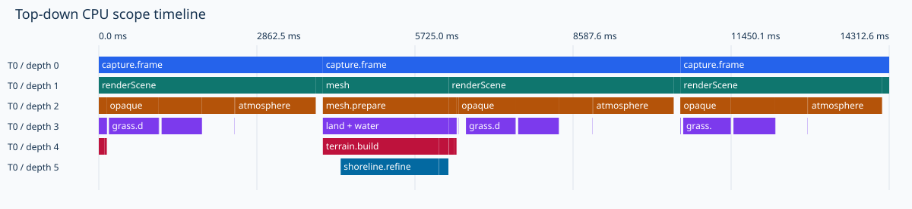
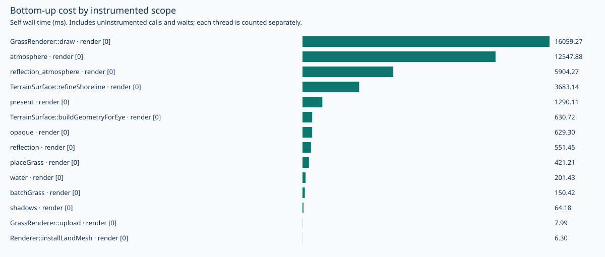

# CPU runtime profiling

This study separates elapsed frame time, CPU time on the calling thread, and
function-level instruction counts. They answer different questions and must
not be added or treated as interchangeable. The measured scene retains the
user's 60 m grass distance and the frozen camera from the
[LOD study](lod/input.json).

## Tools and environment

The runtime is GCC 12.2, `RelWithDebInfo` (`-O2 -g -DNDEBUG`), Xvfb and Mesa
llvmpipe, with `LIBGL_ALWAYS_SOFTWARE=1 LP_NUM_THREADS=2`. Native captures use
640×360 pixels, 14 frames, frozen simulation/wind time and 2 m walking steps.
Frames 0–2 are warmup; the final frame is excluded because its final GPU wait
occurs after the frame timer. Frames 3–12 supply the ten-frame tables. The
stationary control reuses a paused rendered image. The bare control disables
grass, and a separate walking run disables CPU tracing. Workloads run in order,
without concurrent builds/tests; this is a diagnostic run, not a statistically
powered performance comparison.

Kernel profiling is restricted (`perf_event_paranoid=4`), and there is no
physical GPU in this container. GNU gprofng 2.40 produced call stacks but
reported a changed interval timer and unreliable data. Its sampled CPU total
was inconsistent with process accounting, so those function-time estimates
were rejected. The [probe diagnostics](cpu/environment/gprofng-rejected.txt)
are retained. The sampler should be retried on a suitable host before drawing
function-level CPU-time conclusions on hardware.

Valgrind 3.19 Callgrind provides independent function and caller/callee
instruction accounting here. Its workload is the existing CPU-only
`foliage_benchmark`: one terrain build followed by twelve identical grass
placement/batching iterations, including its checksum and old/new work-count
comparison. This is a focused construction workload, not a full rendering
profile. Callgrind slows execution substantially; its elapsed times are not
native timings, and instruction proportions are not time proportions.
The [Callgrind manual](https://valgrind.org/docs/manual/cl-manual.html) explains
self/inclusive instruction attribution and caller/callee reports; the
[gprofng manual](https://sourceware.org/binutils/docs/gprofng.html) describes
sampling and its statistical limitations.

## New tracing and reports

`--cpu-trace FILE.json` records nested complete events, with wall-clock
timestamps and per-thread CPU durations where supported. The render thread
and terrain workers have separate lanes. Existing CPU/GPU CSV fields remain
available via `--performance-trace`; no GPU synchronization is introduced.
The trace begins in `Renderer::run`, after constructor startup, and finishes
when its owner is destroyed. Close the application normally to finish JSON.
The recorder writes events incrementally instead of accumulating an unbounded
in-memory history. It does not read clocks, allocate or lock for disabled scopes.

Scopes include simulation and camera updates; terrain/shoreline construction;
mesh installation; grass placement, LOD batching and upload; each rendering
pass, grass draw submission and body-lighting uniforms; presentation; and
capture completion, readback and PNG writing. Per-triangle/per-blade functions
are left to Callgrind so tracing does not flood the hot loops.

The report subtracts immediate children to compute self time. That self time
includes uninstrumented callees, driver work, scheduling/wait time and tracing
overhead. Summing inclusive values double-counts descendants. Thread CPU time
counts only the calling thread, excluding software-driver workers. Separate
worker wall times may overlap, and their totals are not frame latency.
Capture terrain construction is synchronous; interactive walking dispatches
the same construction to a worker. A capture mesh stall is therefore not a
measurement of an interactive render-thread terrain stall.

The standalone [walking report](cpu/walking/report/report.html) contains
expandable top-down caller trees, a chronological timeline, self-time rankings,
per-thread CPU columns and reversed callee-to-caller paths. Raw event files can
also be opened in a Chrome trace viewer or Perfetto. Complete worker jobs are
shown in unsliced reports; jobs crossing a selected frame interval are excluded
instead of assigning an invented fraction of their CPU cost.





## Native results

These are measured frame times from this environment, not a comparison with
the earlier LOD or camera-movement runs. Host load and clock behavior differ.
All ten retained frames in each case have valid GPU timestamp results.

| Case | Mean frame (ms) | Median frame (ms) | Grass rebuilds | Land mesh installs |
|---|---:|---:|---:|---:|
| Stationary, paused reuse | 131.36 | 124.88 | 0 | 0 |
| Walking, traced | 4216.18 | 3812.25 | 4 | 2 |
| Walking, grass disabled | 2021.34 | 1591.61 | 0 | 2 |
| Walking, CPU trace disabled | 4179.30 | 3786.42 | 4 | 2 |

The traced/untraced final walking PNGs are byte-identical. Traced mean frame
time is 0.88% higher in this one pair. That includes host/run variation and is
not an isolated measurement or bound on tracing overhead. Both runs retain the
existing GPU/CSV profiler. The paused reuse case measures presentation of an
existing image, not the cost of rendering grass without camera motion.

The following totals cover ten walking frames. The complete `capture.frame`
scope is 42,163.43 ms wall and 22,266.27 ms render-thread CPU. Tiny timing
differences from the CSV arise because the outer scope also covers frame setup
and CSV/GPU-profiler bookkeeping.

| Scope | Calls | Inclusive wall (ms) | Calling-thread CPU (ms) |
|---|---:|---:|---:|
| Grass draw, main plus reflection | 20 | 16059.27 | 16050.88 |
| Main atmosphere | 10 | 12547.88 | 26.05 |
| Reflected atmosphere | 10 | 5904.27 | 10.77 |
| Terrain build, land plus water | 4 | 4313.86 | 4312.70 |
| Shoreline refinement (inside terrain build) | 4 | 3683.14 | 3682.22 |
| Grass placement | 4 | 421.21 | 421.17 |
| Grass LOD batching | 4 | 150.42 | 150.37 |
| Grass instance upload | 4 | 7.99 | 7.99 |
| Presentation | 10 | 1290.11 | 3.59 |

Grass draw scopes account for about 38.1% of scoped frame wall time and 72.1%
of render-thread CPU time. These include the software OpenGL implementation's
work inside draw calls; they do not show that issuing a hardware instanced draw
would take the same time. Main and reflected atmosphere total about 43.8% of
frame wall time, while the calling thread uses only 36.81 ms. This indicates
blocking/scheduling rather than sustained work on that thread; the software
driver's other workers are not instrumented by the scope recorder.

Terrain construction is about 10.2% of frame wall time, with shoreline
refinement consuming 85.4% of its own inclusive time. The land/water pair is
built on two measured frames. Grass placement, batching and upload together
take about 580 ms across four rebuilds, roughly 145 ms per rebuild and 1.4% of
total frame time. Isolated native placement has a 97.63 ms process-CPU median
over iterations 2–11; isolated LOD batching has a 35.55 ms wall median. Its
fixed initial terrain differs from the later walking positions, so those
values are not interchangeable with walking averages.

These measurements prioritize reducing rendered grass/reflection work and
atmosphere cost for this software workload. Terrain refinement deserves a
separate allocation/call-graph investigation. Partial grass updates alone
would remove only a small part of the observed wall time, although the
preparation spikes can still matter on a fast GPU. Neither this profile nor
the grass-disabled control proves a specific benefit from the upcoming
terrain LOD, horizon foliage, culling or compute-shader tasks.

## Independent function instruction profile

The complete [Callgrind data](cpu/callgrind/callgrind.out),
[self report](cpu/callgrind/self.txt), [inclusive report](cpu/callgrind/inclusive.txt)
and [caller/callee tree](cpu/callgrind/callers.txt) retain 7,473,993,658
instructions. These are construction-workload counts, not rendering timings.
Selected **self source/function entries** are:

| Source/function entry | Instructions | Share of all instructions |
|---|---:|---:|
| GrassPlacement.cpp: placeGrass | 1,375,707,244 | 18.41% |
| Terrain.cpp: valueNoise | 949,288,560 | 12.70% |
| benchmark_grass.cpp: main | 736,636,553 | 9.86% |
| GLM type_vec3.inl: placeGrass | 428,407,404 | 5.73% |
| libm: lround | 408,664,176 | 5.47% |
| C++ compare header: refineShoreline | 402,074,893 | 5.38% |

Optimized debug attribution splits functions across source/header entries;
these rows are not complete function totals. Inclusive rows overlap and must
not be summed. The benchmark itself performs checksums and before/after
work-count comparisons, so its own cost is intentionally visible. The
caller/callee tree connects shoreline refinement to ordered-map comparisons
and terrain sampling, and placement to vector arithmetic and terrain color
sampling. These are candidates for a later construction optimization, not
proof that their instruction proportions equal native CPU-time proportions.

All 42 original artifacts, including the raw Callgrind file, were checked
against the saved SHA-256 manifest when resuming on 2026-10-01. Source, shaders
and the input replay also match their collection hashes. The original
[collection manifest](cpu/manifest.json) retains the old container paths and
executable hashes; [publication hashes](cpu/publication.json) cover the
published files and regenerated reports. The fresh validation build uses GCC 13.3 on the
current host; its results must not be mixed into the earlier timing tables.
This host lacks `xdotool` and ImageMagick, so CMake registers 40 tests and
omits five live-input/adaptive-render tests. The collection container's
45-test run passed; its log is retained separately from current validation.
Install the test tools listed in `todo.md` and reconfigure to restore those
five tests on this host.

## Validation

The fresh RelWithDebInfo build passes all 40 registered CTest entries in
197.24 s, including nested/thread-bound scope recording, five independent
report-attribution cases, command-line validation, and traced capture/image
identity. The [current test log](cpu/environment/validation-tests.txt) and
[collection-container log](cpu/environment/collection-tests.txt) distinguish
40 available tests here from the earlier 45-test run. The five omitted tests
are overlay input, orbit input, camera transition, camera clipping, and live
adaptive rendering; restoring the documented X11 tools enables them.

Both journal charts were visually inspected and the Typst PDF compiled.
All 17 existing gallery image hashes still match. Rendering behavior and
shader source are unchanged by this instrumentation task.

## Reproduction

The optional profiler dependency is recorded in `todo.md`:

```sh
apt-get update
apt-get install --no-install-recommends -y valgrind
cmake --build build-codex --target PlanetSimulation foliage_benchmark -j 2
LIBGL_ALWAYS_SOFTWARE=1 LP_NUM_THREADS=2 xvfb-run -a python3 scripts/benchmarks/cpu_profile.py --binary build-codex/PlanetSimulation --foliage-benchmark build-codex/tests/foliage_benchmark --replay docs/journal/benchmarks/lod/input.json --output-dir build-codex/cpu-study
python3 scripts/benchmarks/cpu_report.py build-codex/cpu-study/walking/trace.json --skip-frames 3 --frames 10 --output-dir build-codex/cpu-walking-report
```

For the actual interactive workload, run with `--cpu-trace` and
`--performance-trace` while walking, then close the window normally. Repeat on
the target GPU without software-renderer environment variables before choosing
a hardware optimization. The new traces show scoped thread costs, while an
external sampling profiler on that host can resolve uninstrumented callees.
