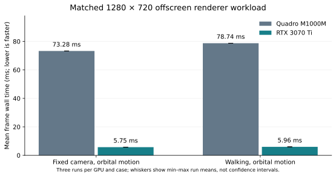
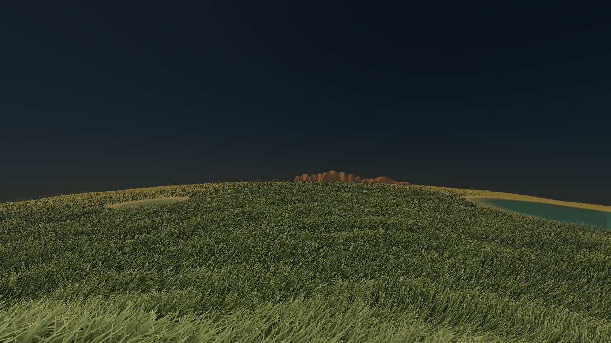

# Quadro M1000M versus RTX 3070 Ti — 2026-10-05

The RTX 3070 Ti renders this matched production-scene workload **12.75× faster**
than the Quadro M1000M with a fixed surface camera and **13.21× faster** with
controlled walking. These are measured uncapped offscreen frame times on both
physical GPUs in the same host, using the same executable and inputs.

| Case | GPU | Mean frame (ms) | Median (ms) | P95 (ms) | Range of three run means (ms) |
| --- | --- | ---: | ---: | ---: | ---: |
| Fixed camera, orbital motion | Quadro M1000M | 73.279 | 73.267 | 73.606 | 73.267–73.290 |
| Fixed camera, orbital motion | RTX 3070 Ti | 5.745 | 5.689 | 6.078 | 5.712–5.768 |
| Walking, orbital motion | Quadro M1000M | 78.741 | 79.254 | 80.169 | 78.733–78.757 |
| Walking, orbital motion | RTX 3070 Ti | 5.959 | 5.936 | 6.190 | 5.952–5.967 |



Each row pools 237 measured frames across three runs. Run means have equal
weight because every run retains 79 frames. P95 uses the nearest-rank statistic
over the pooled frames. Whiskers show the observed minimum and maximum run
means, not confidence intervals. Reciprocals of the means are 13.65 versus
174.05 frames/s for the fixed camera, and 12.70 versus 167.81 frames/s for
walking; desktop presentation and interactive frame rates were not measured.

## Matched method and actual hardware

- Same host, Debian GCC 12.2.0, `RelWithDebInfo` (`-O2 -g -DNDEBUG`), driver
  580.178.04, OpenGL 4.3 core on both cards. Quadro has 2,048 MiB and RTX has
  8,192 MiB reported total memory. GPU UUIDs and PCI addresses are retained in
  [devices.csv](validation/devices.csv).
- Same unchanged application binary from revision
  `b1a549cffc97470fc809eefe60ad07f720845110`. Binary SHA-256:
  `7ee0fca27d7b083c23acaa61469c9979f4a7279e1c5b65f86e40ff075bd4c1f5`.
  Frozen source/config/harness and compiled adapter hashes are recorded in
  [results.json](validation/results.json). Every run checks those inputs again.
- Exact production [scenario](validation/scenario.json), 1280×720, initial
  simulation time 20 s, surface latitude −17.23072754436555°, longitude
  79.39197457588234°, 2 m clearance and 80° FOV. Both advance simulation by
  1/60 s per frame; walking additionally advances the surface camera by 0.1 m
  per frame (nominal 6 m/s in simulation time). This is a deterministic capture
  path, not a native keyboard-input measurement.
- CPU terrain and CPU grass planning remain the production default; GPU
  compute foliage placement is enabled. Earth has 100,000 land triangles,
  150 m grass cutoff, a two-million-candidate budget and quarter-resolution
  atmospheric fields. Reflections and 2048-pixel shadows retain production
  settings. EGL configuration queries verify RGBA8, depth24, stencil8 and
  four samples. The late sidecar `render.samples=0` queries the diagnostics
  framebuffer, so the actual context configuration is taken from each log.
- Three serial pairs per case alternate card order: Quadro/RTX, RTX/Quadro,
  Quadro/RTX. Each run submits 90 frames. Frames 0–9 and final frame 89 are
  excluded, leaving frames 10–88. All retained GPU query samples are valid and
  no completed scene is reused. Startup, final PNG readback and file encoding
  are outside the reported steady-state measurements.

Xvfb/GLX exposed the Quadro but did not select the RTX. The private
[capture adapter](../../../../scripts/benchmarks/gpu_compare/EglCapture.cpp)
uses an EGL device/pbuffer and verifies its actual UUID against NVML and its
renderer string. NVIDIA describes this
[EGL multi-GPU selection route](https://developer.nvidia.com/blog/egl-eye-opengl-visualization-without-x-server/).
The adapter interposes only capture-window/context calls; production shaders,
draws, resource creation and profiler paths are unchanged. It rejects
interactive windows. Debian's GLX GLEW initializes GL entry points before
returning its missing-GLX-display error under EGL; the adapter accepts only
that specific error after checking the live EGL context, GL 4.3 and required
compute/timestamp functions. Each log records the check. This is an offscreen
comparison, without a desktop swap or frame limiter.

## Workload and image agreement

Both cards plan exactly **1,999,246 grass candidates/blades in 27,496 patches**.
The budgeted placement density is 47.1492 blades/m² on both, below the configured
120.72 blades/m² request. This experiment does not establish the future adaptive
near-density guarantee. GPU working draw resources are 255,903,520 bytes on
both cards. Fixed-view main culling submits 182,860 blades on Quadro versus
182,858 on RTX; walking submits 175,943 versus 175,941. The two-blade difference
is approximately 0.0011%; primitive differences are four triangles and eight
vertices. Camera metadata, planned counts and frame/rebuild/shadow receipts
match in every pair.

An initial preflight rejected exact GPU cull-count equality. The final, freshly
rerun dataset records the differences and requires GPU counts within 0.01%
and paired PNG mean absolute channel error below one 8-bit level. All six pairs
pass: fixed-camera error is 0.024736–0.024775 levels; walking error is
0.028767–0.028778 levels. Images are visually equivalent, not byte-identical
across the two architectures. All twelve final PNGs, sidecars, frame CSVs and
logs are retained below [validation/](validation/), with per-artifact SHA-256
hashes in `results.json`.

| Quadro fixed-camera final view | RTX fixed-camera final view |
| --- | --- |
|  |  |

## GPU stage costs and interpretation

Mean asynchronous GPU stage times, in milliseconds:

| Stage | Quadro fixed | RTX fixed | Quadro walking | RTX walking |
| --- | ---: | ---: | ---: | ---: |
| Main atmosphere | 33.630 | 2.159 | 36.725 | 2.264 |
| Opaque geometry | 19.554 | 1.247 | 21.228 | 1.307 |
| Reflected geometry | 11.741 | 1.066 | 12.266 | 1.093 |
| Reflected atmosphere | 7.215 | 0.545 | 7.392 | 0.560 |
| Shadows | 0.638 | 0.078 | 0.638 | 0.078 |
| Water | 0.258 | 0.032 | 0.243 | 0.031 |
| All scoped GPU stages | 73.038 | 5.132 | 78.494 | 5.339 |

Atmosphere and geometry remain the largest measured GPU stages. CPU stage wall
times include driver waits and overlap GPU work; they must not be added to GPU
times. `gpu_ms` sums existing render queries and is not the complete GPU span.
Neither case rebuilds terrain or grass in the retained interval: the short
walking path moves less than the current cache threshold. Startup preparation,
longer walking rebuilds, asynchronous terrain publication, body switching and
resident compute generation need separate measurements. This comparison
therefore **does not complete the T3c5 CPU-versus-compute acceptance gate**.

[Telemetry](validation/telemetry.csv) samples both cards every second without
locking clocks or power limits. Samples with at least 50% utilization show
Quadro SM clocks 1097–1124 MHz and temperature 57–92°C, and RTX SM clock
1965 MHz and temperature 63–66°C. Only two RTX samples meet that utilization
filter because its measured render intervals are short. These sparse samples
provide context, not sustained thermal, power, or peak physical-memory proof.

The earlier README Quadro 208/138/26 ms optimization comparison and 28.5 ms
verification used a different historical scene/build. The current denser scene
and camera are not a matched continuation of that experiment; its numbers
remain separately labeled in the paper.

## Reproduce and validate

Build the normal application with its documented dependencies, plus EGL
development headers/library for the adapter. Run from the repository root:

```sh
python3 scripts/benchmarks/gpu_compare/run.py \
  --binary build-resume/PlanetSimulation \
  --output-dir build-resume/gpu-comparison/reproduction
```

The runner creates its own NVIDIA EGL vendor JSON, compiles the private adapter,
and validates device identity, actual context format, complete query/frame
receipts, frozen inputs and paired camera/count/image agreement. EGL device
indices default to 0 and 1; `--devices` overrides their enumeration order.
The run requires two actual NVIDIA EGL devices, `c++`, EGL/GL/GLEW libraries,
`nvidia-smi` and ImageMagick `compare`. Assertions must remain enabled.

With Matplotlib installed, regenerate the standalone plot:

```sh
python3 scripts/benchmarks/gpu_compare/plot.py \
  docs/journal/benchmarks/gpu-comparison/validation/results.json \
  docs/journal/benchmarks/gpu-comparison/figures/frame-times.svg
```

The twelve matched runs provide scoped hardware validation of the capture
adapter and unchanged production renderer. Runtime source and shaders remain
unchanged from the preceding 63/63 regression checkpoint; that suite was not
rerun for these benchmark/documentation additions. Aggregate statistics,
artifact verification, repository checks and journal PDF review are retained
in `validation/aggregate.json` and `validation/evidence.json`.
