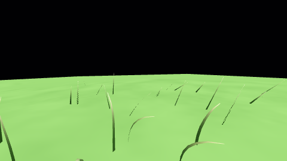
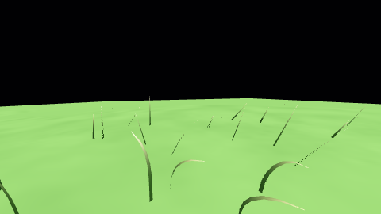

# Live grass wind while planetary time is paused

Live rendering advances foliage time by elapsed wall time independently of the
simulation clock. `T` freezes orbits and spin; `Y`/`U` affect only orbital speed.
Main and reflected grass receive the same local wind phase. Whole-frame reuse
is suppressed while wind is active. Reload preserves pause, resets the configured
orbital epoch, and clears the old grass plan. A zero `wind_noise.speed_multiplier`
freezes the field; zero `wind_strength` retains the seeded static lean.
Deterministic captures deliberately retain their explicit simulation-time phase.

`GrassWindInputIntegration` runs the actual GLFW application under Xvfb. It
presses T and 2, waits for two surface-camera reports after the completed
transition, releases the pointer, and compares two 480×270 frames one second
apart. The controlled scene disables water, atmosphere, stars, shadows and the
performance overlay. A green-pixel check prevents sampling the startup orbit
view. The saved performance CSV must record repeated, identical orbital times.
The test processes both orbital speed keys while paused, reloads wind speed zero
and requires identical RGB images, then removes foliage and requires a changed
image to prove grass was visible. Normal window shutdown flushes the CSV.




The clean full suite passes **50/50 CTest entries in 333.81 s** (GCC 13,
RelWithDebInfo, Mesa llvmpipe, two driver threads). In this run, 11,178 RGB
channels change between the animated frames while 89 completed frames share
orbital time 20.2094061 s. Frozen frames differ in zero channels, and 31
post-reload frames stay at the configured 20 s epoch. Wind amplitude and
camera direction are controlled inputs; these numbers are fixture evidence.

Artifacts are in [wind/](wind/): three resolved scene configurations, native
images, trace, evidence JSON, application log and full-suite log. The automated
pixel checks validate these controls on Mesa llvmpipe; they are not hardware
performance measurements or a comparison across different orbital epochs.

Reproduce from the repository root with an existing build:

```sh
LIBGL_ALWAYS_SOFTWARE=1 LP_NUM_THREADS=2 xvfb-run -a \
  ctest --test-dir build-resume --output-on-failure -R '^GrassWindInputIntegration$'
```
