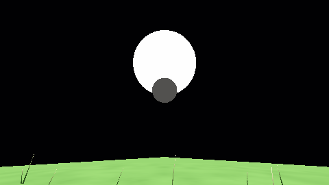
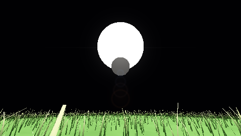

# Offline rendering profile

The later [dense production-start showcase](offline-showcase.md) replaces the
README image and strengthens visible aperture ghosts. The controlled fixtures
and test results below retain this earlier checkpoint's source provenance.

`--offline-render image.png` captures the surface camera at native requested
resolution. `--offline-quality` applies the same profile to existing capture
commands. Terrain construction and GPU completion are synchronous; no adaptive
frame-rate reduction is used. Atmosphere uses full-resolution integration.
The source JSON is validated and stored unchanged in the sidecar; the derived
profile is applied once in memory and restored separately during replay.

The Sun uses a 256×256 latitude/longitude grid (131,072 submitted triangles,
including pole degenerates), versus 32×32 (2,048) normally. Other bodies use
32 maximum edge segments with a 100,000-triangle ceiling. The surface-camera
planet retains its coarse base to keep budget available close to the camera;
other bodies, including the Moon, use a minimum ten-segment base with 86,400
triangles before local refinement. Offline terrain sinking is zero. These are
bounded detail rules, not unlimited geometry or a claim of more triangles in
an interactive scene already at the same ceiling.

Grass remains one GPU-generated layer with a 1–20× radius multiplier (20 by
default). Automatic candidate growth follows the factor squared and caps at
two million; larger explicit scene budgets are retained. Two compute queues
reserve 128 bytes per candidate plus 32 bytes of indirect commands. Biome,
Gaussian density, slope, water and frustum rules remain active. Budget saturation
reduces effective density. The radius is a cutoff in body-local metres, not a
promise of uniform density or coverage beyond the body's physical extent.
Normal JSON draw-distance validation remains 5–400 m; derived offline radii
can reach 8 km without widening that interactive setting.

Lens flare is a capture-only OpenGL 3.3 postprocess: a halo and horizontal streak
around the projected Sun, plus colored ring/filled aperture ghosts along the
Sun–image-center axis. Depth-tested Sun stencil IDs measure visibility; mean
visible Sun brightness attenuates the effect through atmospheric extinction.
Fully occluded or offscreen Suns contribute no flare. Color is added in display
space after tone mapping. This is a visual approximation, not spectral lens
ray tracing, diffraction or physically calibrated HDR bloom. Offline mode
intentionally accepts synchronous visibility readback. CPU/GPU traces expose
its own `lens_flare` stage; depth/stencil and prior GL state are preserved.

`OfflineCaptureIntegration` checks expanded radius, bounded candidate counts,
actual Moon/Sun mesh counts, a visible-Sun on/off comparison, a terrain-hidden
Sun on/off identity check, explicit option overrides, and byte-identical replay
without the source config file. `OfflineQuality` unit tests check unchanged
normal settings, candidate budget limits and real distant-mesh tessellation.
A production transform-feedback regression on both compute and vertex paths
requires roots beyond the normal cutoff only in the offline profile.

Run the focused checks under Xvfb with Mesa or an existing display:

```sh
LIBGL_ALWAYS_SOFTWARE=1 LP_NUM_THREADS=2 xvfb-run -a \
  ctest --test-dir build-resume --output-on-failure \
  -R 'OfflineCaptureIntegration|RendererLifecycleTests|TerrainShadowRenderIntegration'
```

The clean full suite passes **51/51 CTest entries in 308.44 s** on GCC 12.2,
RelWithDebInfo, Mesa llvmpipe/Xvfb with two driver threads. The focused GPU
and final flare/replay checks also pass (43.08 s). Compiler provenance was
audited from the build cache and executable; earlier continuation prose
incorrectly named GCC 13 and is corrected.

Controlled airless fixture, 480×270, manual exposure:

| Submitted work / cutoff | Normal | Offline |
| --- | ---: | ---: |
| Grass radius | 30 m | 600 m |
| Candidate budget | 1,024 | 409,600 |
| Reserved candidates | 972 | 409,600 |
| Camera-planet triangles | 9,964 | 99,732 |
| Moon triangles | 960 | 86,400 |
| Sun triangles | 2,048 | 131,072 |

The visible Sun supplies 6,199 stencil pixels and estimated flare strength
0.9799. Flare-on and flare-off images differ; the terrain-occluded pair is
identical. Replay is byte-identical and restores 600 m rather than multiplying
that derived radius again. An explicit replay override restores 60 m and turns
flare off. This is a behavior/quality comparison; it does not measure hardware
performance or preserve identical grass density/terrain tessellation.




Images, sidecars, raw capture logs, test logs and evidence are retained under
[offline/](offline/). The compiler/build identity is recorded in the validation
folder. Invalid profile types and out-of-range replay factors are rejected
before a display is initialized.

All **21 README images** were regenerated, visually inspected and matched to
the manifest and complete source fingerprint. The original 20 PNG hashes are
unchanged; the offline profile adds one image. The journal PDF compiles with
the new quality section and controlled comparison.
