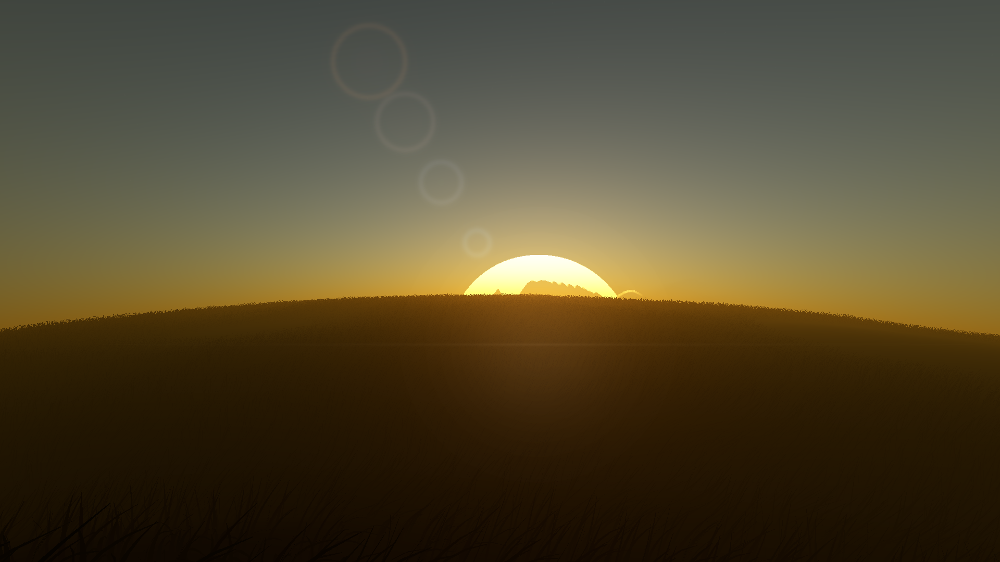

# Dense offline production view — 2026-10-03

The README's offline image now uses the initial production camera, replacing
the earlier 480×270 airless regression fixture. Its latitude, longitude,
2 m configured clearance, NED direction, 80° FOV and simulation timestamp 0
match `configs/scenarios/solar_system.json`. Terrain, atmosphere, water,
lighting, foliage colors and wind remain from that scene. The initial view is
a backlit dusk landscape; the foreground is naturally dark.



The native 1920×1080 PNG is a direct renderer capture. A separate showcase
scene changes three foliage parameters: `max_blades=12000000`,
`gaussian_sigma_fraction=0.05` and `max_candidates_per_triangle=65536`.
The normal 150 m cutoff derives into 3 km under the 20× offline profile;
the Gaussian sigma is 150 m instead of the default profile's 1 km.
Configured peak density remains 120.72 blades/m², but hard candidate budgets,
power-of-two slots, biomes, water, slopes and frustum rejection can thin it.
This is an explicit finite study profile, not automatic VRAM budgeting.

| Measured work | Production settings, offline | Dense showcase | Central narrow view |
| --- | ---: | ---: | ---: |
| Resolution | 1920×1080 | 1920×1080 | 192×1080 |
| Allocated candidates | 1,999,999 | 11,999,989 | 11,999,989 |
| Main-view submitted blades | 102,918 | 213,454 | 43,690 |
| Compute queue bytes | 255,999,904 | 1,535,998,624 | 1,535,998,624 |
| Earth / Moon land triangles | 100,000 / 86,400 | 100,000 / 86,400 | 100,000 / 86,400 |
| Sun triangles | 131,072 | 131,072 | 131,072 |

The dense scene submits 2.07× as many main-view blades at the same camera and
about 6.94× the old README fixture's 30,744 blades. Submitted blades are GPU
queues after placement/frustum rejection, not a count of unoccluded pixels.
Earlier water captures read the last indirect queue after reflections; the
capture path now snapshots main-view counts before reflection draws overwrite
them. An optional output keeps this diagnostic readback out of interactive
rendering. `foliage_gpu_count_view` identifies the main count;
`foliage_gpu_last_pass_drawn_blades` retains the final pass for diagnosis.

## Visible flare and replay

The halo and horizontal streak have stronger display-space energy. Four
aperture ghosts are spread farther along the Sun–image-centre axis so they
extend beyond the bright solar haze. The same depth-tested Sun stencil and
visible brightness gate the effect. Its production strength is approximately
0.13436, with partial terrain/foliage occlusion. Disabling flare changes 49,648
pixels by at least eight channel levels; the dense capture and its replay have
identical SHA-256 hashes. This scene has no white-clipped pixels.

[Flare-off view](offline/showcase/images/no-flare.png) uses the same scene,
camera, density, wind and exposure. The automated airless fixture additionally
requires 80+ lower-half pixels with a channel difference of at least 24, away
from its upper-half Sun; 1,083 pixels pass with a peak difference of 112.
Fully terrain-hidden Sun captures remain identical with flare on and off.
The effect remains an artistic postprocess, not spectral lens ray tracing.

## Column rendering decision

A central 192×1080 view uses the same vertical FOV and eye as the full frame.
It reduces main-view draws to 43,690, but candidate allocations and terrain
triangles remain identical. CPU terrain LOD depends on the eye's radial
position; foliage planning reserves an eye-centred disk before GPU frustum
rejection. Narrower raster targets therefore do not free those allocations
and cannot themselves load more triangles or foliage. This measured probe is
not an assembled multi-column render.

Implement column assembly after the allocation policy can exploit each
column's view. It needs:

- Off-axis sub-frusta derived from the full projection, conservative overlap,
  and exact crop/assembly at the original pixel coordinates.
- Shared terrain boundaries and stable root ranks/seeds. Stream relevant
  patches into bounded queues while retaining shadow and reflection coverage.
- One full-frame exposure/highlight solution. Per-column highlight metering
  can otherwise produce visible brightness seams.
- Full-frame reflection coordinates and visibility, plus one flare pass after
  assembly using the whole image's Sun visibility. The narrow probe's flare
  strength differs because its viewport cuts the solar disk.

Those ownership and streaming choices belong with the upcoming CPU–GPU
terrain/foliage architecture plan. The current task improves the full-frame
example and records why naive columns would not meet the requested goal.

## Reproduction and evidence

```sh
LIBGL_ALWAYS_SOFTWARE=1 LP_NUM_THREADS=2 xvfb-run -a -s '-screen 0 1920x1080x24' \
  python3 scripts/benchmarks/offline_showcase.py --binary build-resume/PlanetSimulation \
  --output-dir build-resume/offline-showcase/final
```

Use `--capture baseline|dense|no-flare|replay|narrow` for individual batches.
Run again with `--resume` for a complete cached-capture audit. Resume verifies
scene, camera, dimensions and quality controls before checking the images.
The script requires only Python's standard library and the renderer. The
measured draw-count comparison uses the OpenGL 4.3 compute-placement path.

The retained [showcase](offline/showcase/) includes the resolved study scene,
five images, replay sidecars, command logs and validation results. Results
record source/config hashes, commands, queue/triangle counts and flare signal.
The README replay preserves the source scene and applies the derived profile
once. Historical [offline quality evidence](offline-rendering.md) remains
separate; validation below records the new build and regression runs.


## Validation

All 56 CTest entries pass across six grouped Xvfb runs, totalling 609.22 s.
This is grouped coverage, rather than a single uninterrupted full-suite run.
The final RelWithDebInfo/Ninja rebuild passes with GCC 12.2.0. The first
32 entries preceded a final explicit-standard-header cleanup; the remaining
24 ran with the rebuilt binary, with no runtime implementation changes
between groups. Captures use Mesa 22.3.6 llvmpipe, OpenGL compute placement
and `LP_NUM_THREADS=2`; their timings are not hardware GPU benchmarks.

| CTest entries | Passed | Real time | Retained log |
| --- | ---: | ---: | --- |
| 1–32 | 32/32 | 40.42 s | [tests-01-32.log](offline/showcase/validation/tests/tests-01-32.log) |
| 33–34 | 2/2 | 173.67 s | [tests-33-34.log](offline/showcase/validation/tests/tests-33-34.log) |
| 35–39 | 5/5 | 109.31 s | [tests-35-39.log](offline/showcase/validation/tests/tests-35-39.log) |
| 40–44 | 5/5 | 177.70 s | [tests-40-44.log](offline/showcase/validation/tests/tests-40-44.log) |
| 45–47 | 3/3 | 24.56 s | [tests-45-47.log](offline/showcase/validation/tests/tests-45-47.log) |
| 48–56 | 9/9 | 83.56 s | [tests-48-56.log](offline/showcase/validation/tests/tests-48-56.log) |

The native five-view audit passes for the exact production camera, increased
main-view foliage, visible flare, byte-identical replay and measured column
allocation limits. All 22 gallery hashes match their provenance; the other
21 images and their per-image records are unchanged. The previous astronaut
candidate asset audit still passes. The 24-page journal PDF compiles, and
pages 11–15 and 23–24 were visually reviewed, including the new comparison.
Repository layout and whitespace checks pass. The source fingerprint,
binary hash, grouped results and retained artifact hashes are recorded in
[evidence.json](offline/showcase/validation/evidence.json).
