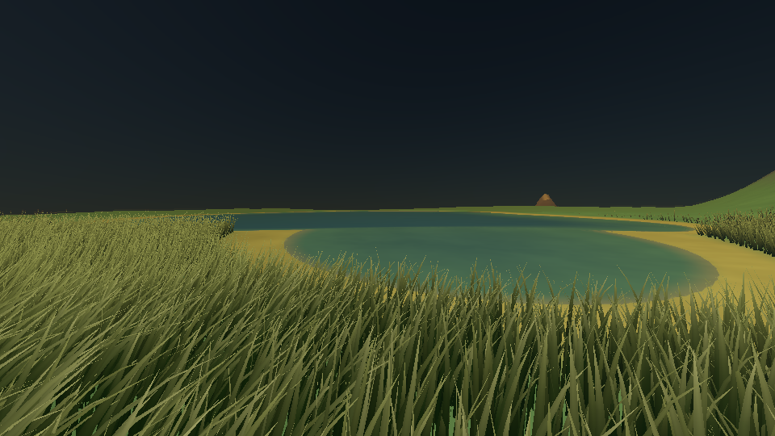
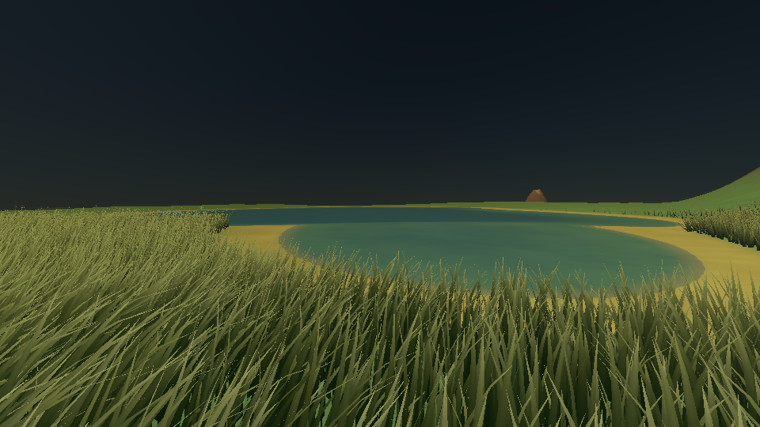
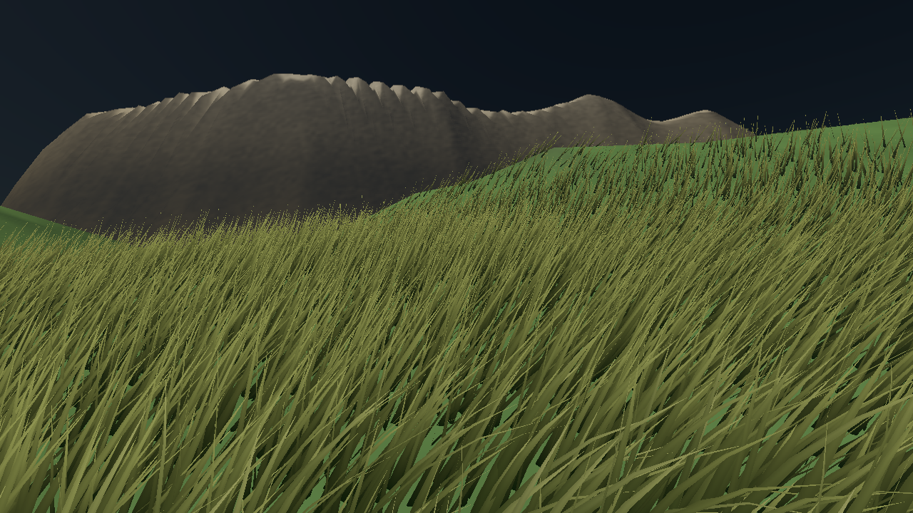

# Eight terrain levels and inward sinking

The renderer now selects eight surface-distance levels in a single closed
terrain mesh. A base face contributes only its selected tessellation; no
coarse shell remains underneath a finer copy. Completed background builds
replace the installed vertex/index buffers, and all render passes use the
same mesh. The grass draw distance remains 60 m in the working scenario.

## Selection and boundaries

Levels run from 0 (coarse) to 7 (fine). The existing segment settings anchor
levels 0, 3 and 7; integer interpolation fills the other levels. The working
scene uses:

| Level | Edge segments | Outer surface distance (m) |
| --- | ---: | ---: |
| 7 | 16 | 300 |
| 6 | 14 | 416.67 |
| 5 | 12 | 533.33 |
| 4 | 10 | 650 |
| 3 | 8 | 766.67 |
| 2 | 6 | 883.33 |
| 1 | 5 | 1000 |
| 0 | 3 | remainder of sphere |

Distances use a conservative nearest extent of each of the 320 base faces.
The existing 20 m retreat hysteresis, 10 m rebuild threshold and extra steep
refinement remain. A small configured segment range can share a density
between levels. The triangle budget removes optional steep refinement first,
then downgrades less detailed bands before more detailed ones. Equal-priority
choices retain stable base-face order. Shoreline subdivision still reserves
part of the same budget; it does not add an overlapping mesh.

## Sinking and surface ownership

For selected segment count `n`, the inward offset is
`maximum_sink * clamp((max_segments - n) / (max_segments - base_segments), 0, 1)^2`.
Equal base/maximum counts produce zero offset. `terrain_lod.sink_depth_m`
defaults to 1 m, accepts 0–100 m, and can disable sinking with zero. The actual
maximum is additionally capped to 0.1% of the radius remaining after maximum
terrain relief. Finest and extra-steep samples remain at the original height.

Shared corners take the minimum offset of every incident face; edge interiors
take the minimum of their two faces. Smooth interpolation joins corner, edge
and face-center offsets. This lets the finer region own the shared height
without cracks or duplicate surfaces. Shoreline midpoint subdivision carries
the same scalar field; displacement occurs only after tessellation finishes.
Procedural normals retain the original height-field lighting approximation.

The scalar is CPU-only metadata (four bytes per emitted vertex); it is discarded
when geometry moves into the mesh. GPU format remains nine floats per vertex
and three 32-bit indices per triangle: **120 bytes per terrain triangle**.
Sinking adds neither GPU attributes nor draw calls. The sea also uses eight
levels but explicitly sets sinking to zero, preserving its physical level.
Grass roots are placed on the final terrain triangles, while shadows and
reflections draw the same installed geometry.

This is spatial sinking, not temporal morphing. Identical selected levels
preserve geometry between rebuilds, but crossing a level can still produce a
small step. Nor does a bounded inward offset prove that every triangle lies
below the procedural function between its samples. Removing overlapping
shells avoids inter-LOD intersection rather than relying on such a bound.

## Controlled captures

The two fixed replays were rendered with the retained pre-change executable
and the new renderer under Xvfb/Mesa llvmpipe. The camera, scene and time are
matched; all capture logs, PNGs and replay sidecars are retained in
[`terrain-lod/`](terrain-lod/), with executable and artifact hashes in
[`evidence.json`](terrain-lod/evidence.json).

| Capture | Before land / water triangles | After land / water triangles | After level 0 → 7 face counts |
| --- | ---: | ---: | --- |
| Shoreline | 100,000 / 60,000 | 100,000 / 60,000 | 223 / 14 / 17 / 14 / 14 / 12 / 7 / 19 |
| Grass | 100,000 / 60,000 | 100,000 / 60,000 | 220 / 18 / 16 / 15 / 13 / 9 / 11 / 18 |

Both scenes already spend the complete terrain budget. Eight levels redistribute
that budget; they do not reduce these captures' land triangles or their
12,000,000-byte land uploads. Steep-refined faces change from 16 to 14 at the
shore and 15 to 14 in the grass view. Different selected triangles also change
seeded foliage candidates: 99,474 → 100,042 and 30,897 → 31,080 blades. Each
capture still submits six grass batches per pass.

Timings in these logs were collected alongside compilation and are **not a
performance comparison**. No hardware FPS result is claimed.

| Before | Eight levels |
| --- | --- |
|  |  |
|  |  |

## Validation

The new `TerrainLod` tests cover all eight thresholds, config parsing and
validation, displacement against an unsunk control, unchanged finest samples,
closed geometry at the equator and both poles, shoreline offset interpolation,
budget limits and invalid prior levels. They check edge incidence, duplicate
triangles, outward winding and Euler characteristic to reject cracks and
stacked shells. Existing tests cover walking hysteresis, fixed vertices within
unchanged levels, steep refinement, foliage placement and render replay.

All 45 CTest entries passed in 350.77 s in `build-terrain` (GCC 12,
RelWithDebInfo, Xvfb, Mesa llvmpipe, two llvmpipe threads). This includes the
five live X11 tests omitted on the previous profiling host. The three focused
terrain/config/foliage entries also passed in 11.76 s. Raw configure, build and
test logs are retained under [`validation/`](terrain-lod/validation/).

The refreshed shoreline and grass gallery captures match the saved after
images byte for byte. The overview was visually inspected: 14,779
non-background pixels, bounding box (1, 1)–(794, 598).

All 17 gallery PNG hashes and the generation source fingerprint were verified.
The journal PDF was recompiled with Typst 0.15.1; terrain pages, overview,
shoreline and grass captures were visually reviewed. No runtime dependencies
were added.
