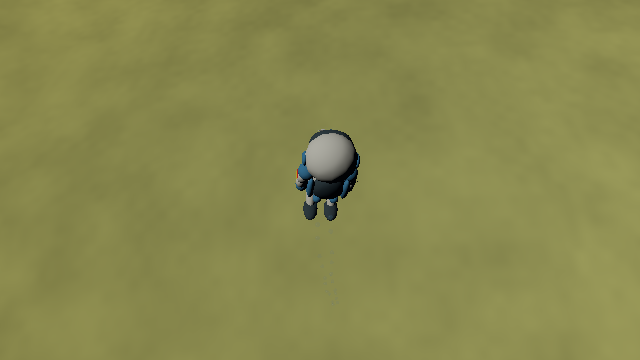
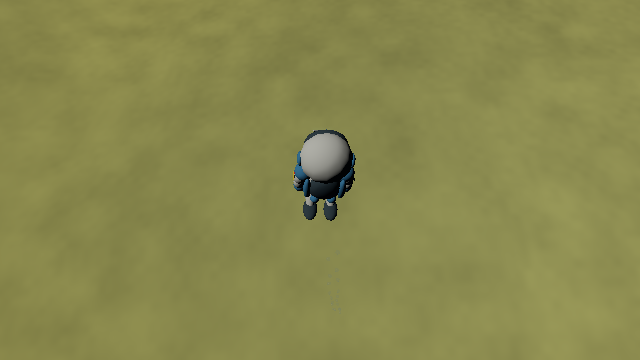

# Jetpack exhaust lifetime and shared wind

The two backpack nozzles now emit individual exhaust markers over time. A
40-particle/s stream alternates nozzles into a pool capped at 64 particles;
each particle lives 1.4 s. Stopping thrust stops births immediately while
existing particles drift, expand and fade. Fade-in takes 60 ms; the final 40%
of a particle's life fades smoothly to zero. There is no instantaneous full
plume and no repeated phase that teleports an old bubble back to a nozzle.

## Motion and wind

Particle positions and velocities are inertial world-space metres and m/s.
Each birth inherits the astronaut's world velocity, plus a 6 m/s downward
entrained-plume speed and small deterministic lateral spread. These are
visible markers after initial exhaust mixing, not a simulation of the engine's
1,000 m/s hot exhaust, gas expansion thermodynamics or fuel consumption.
Gravity uses the existing nearest-three-body field. A bounded 25 ms particle
step applies gravity and exponential relaxation toward local moving air;
the relaxation rate is 6/s at 1.225 kg/m³, scaling with gas density. In vacuum
the particles remain ballistic. A camera/body-frame change never relocates
already emitted particles.

The wind sampler uses the production grass shaders' integer hash, 12 gradient
directions, quintic Perlin interpolation, gust/direction/flutter frequencies,
seed, advection rates and wrapped 8,192 s clock. Both grass GPU paths use these
same fields. CPU float arithmetic is checked against the production GLSL
noise. Grass strength originally specified an angle rather than air speed;
the aerodynamic interpretation is 6 m/s at full strength and gust, in the
blade's tangent bending direction, with a small shared flutter contribution.
The configured strength, seed, frequencies and time multiplier affect all
three consumers. Setting strength to zero removes wind; setting time
multiplier to zero freezes its spatial field.

Astronaut aerodynamic drag now uses air velocity that includes that wind,
in addition to planetary translation and spin. The 100 kg mass and the
existing pressure-dependent quadratic drag remain. Near-body engine commands
still target velocity relative to the body, so the controller counters wind
when possible; releasing controls allows wind drift. Grounded boots retain
their fixed contacts: terrain traction counters wind rather than sliding the
walking root. Wind does not exert drag where the atmosphere is disabled.
The wind clock advances with local time independently of paused or sped-up
orbits, matching grass animation.

## Transparent rendering and bounds

Each visible bubble uses a four-vertex billboard with a reconstructed spherical
normal. Smooth edges, lifetime alpha, a Fresnel rim and Sun specular highlights
produce a see-through shell. A blue emission tint keeps the small markers
visible under daylight exposure. Indirect light approximates environment reflection;
there is no extra scene reflection or refraction pass per bubble. The shell
receives configured atmospheric attenuation and terrain Sun visibility.

Bubbles sort back to front for each view, blend with the scene and keep depth
writes and stencil writes disabled. The main plume draws after translucent
water; water reflections draw the same saved particle pool with their own
sorting and clipping. Drawing never advances particles. A single instanced
draw per view replaces repeated sphere meshes: at the cap, 256 submitted
vertices, 128 triangles and at most 2,048 instance bytes. The buffer allocates
once at the cap. This bounds work; it is not a hardware FPS measurement.

## Replay and validation

Sidecars retain the wind clock and exhaust schema 1: every particle's world
position, velocity, age, lifetime and ID, plus the emission clock and next ID.
Restore rejects oversized pools, duplicate IDs, invalid ages/lifetimes and
nonfinite motion. Old sidecars without exhaust history retain their saved
character pose but cannot reconstruct particles that were never recorded.

CPU checks cover staggered birth, release tails, fading, bounded long burns,
world-space motion, wind drift, exact continued replay and malformed input.
OpenGL checks exercise actual shell transparency, specular reflection, depth
and blend-state preservation, and production GLSL/CPU wind parity. Native
captures exercise burn, release and retirement through the real HDR/water
renderer, and require exact image and complete pose/particle replay.

## Retained captures and final checks

| Powered plume, looking down | Released jetpack, same view |
| --- | --- |
|  |  |

The downward camera exposes the trail beneath the backpack; it changes only
the view of the tested burn snapshot. Particles retain their original world
positions. These reduced-budget fixtures omit foliage; the wind field still
uses the scene's configured parameters. [Burn, release and retirement snapshots](exhaust/images/)
and [complete replay inputs](exhaust/replay/) retain the lifetime sequence.

The final clean full run passed **56/56 CTest entries in 675.37 s** on GCC 12.2,
RelWithDebInfo and Mesa llvmpipe/Xvfb with two rendering workers. It includes
41 existing character CPU cases, 10 exhaust/wind CPU cases, shell rendering
checks and 120 CPU/production-GLSL Perlin comparisons. Burn, release and
retirement require exact PNG and complete pose/particle replay. Existing
standing, gait, flight, grass trails and Moon handoff/settling also replay
exactly; native walking/jetpack, paused wind, switching and reload checks pass.
Invalid exhaust sidecars are rejected. The additional downward views replay
byte-identically. Logs and hashes are retained in [validation/](exhaust/validation/).

The jetpack gallery image was freshly rendered and visually reviewed; the
other 21 images retain their original provenance. All 22 PNG hashes match
[generation.json](../../captures/generation.json). The main Typst journal
PDF was rebuilt after publication and its updated character/evaluation pages
reviewed.
