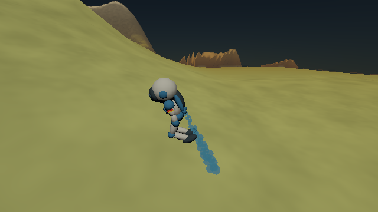

# Directed astronaut flight and power estimate

This records the directed-flight checkpoint before world-space navigation.
Its force/engine sizing calculation remains the shared hardware reference.
For current controls, three-body gravity and Moon travel, see
[space-flight behavior and validation](space-flight.md).

The 100 kg astronaut now flies under forces in the selected planet's rotating
frame. WASD commands horizontal acceleration while the jetpack boosts, with a
100 m/s target rather than a velocity clamp. The suit leans into its requested
force over a 0.12 s response time. Actual thrust acts only along the suit's
up axis; exhaust and both bubble streams point down from the backpack.
Arms remain still while the jetpack is armed, including unpowered coasting.

Space on the ground still launches at 10 m/s. A second press in flight arms a
0.18 s thrust pulse; holding Space sustains thrust, and release allows coasting
once the pulse ends. Horizontal momentum is retained on takeoff. Holding Shift
still changes grounded walking from 6 to 12 m/s. Landing clears flight velocity
and the armed state. Airborne WASD no longer moves the ground camera directly;
it follows the integrated actor and carries the view across the sphere.

## Forces and pressure

All positions and velocities are double-precision planet-local SI values.
With angular velocity `ω = (0,0,2π/spin_period)`:

```
a_frame = −GM p / |p|³ − 2 ω × v − ω × (ω × p)
P(h) = P_sea exp(−g_sea M_mol h / (R T))
rho = P M_mol / (R T)
F_drag = −½ rho (Cd A) |v| v
```

`h = max(0, |p| − r_sea)`, `R = 8.314462618 J/(mol K)`, and `g_sea` is the
nonnegative inward acceleration of a stationary actor at local sea level.
The isothermal hydrostatic approximation holds that gravity fixed in the
pressure exponent; force gravity still varies with altitude. The mixture uses
configured nitrogen, oxygen, water vapour, carbon dioxide and argon percentages,
with unspecified balance treated as argon. Dust and condensed droplets do not
contribute to aerodynamic mass. Disabled atmosphere or zero pressure gives
zero drag. The ideal-gas relation and quadratic drag follow
[NASA's equation of state](https://www1.grc.nasa.gov/beginners-guide-to-aeronautics/equation-of-state/)
and [drag equation](https://www1.grc.nasa.gov/beginners-guide-to-aeronautics/drag-equation/).

The effective `Cd A = 0.7 m²` is a stated constant, not a measured suit coefficient.
Air co-rotates with the planet; atmospheric wind is zero for this task. Physical
pressure uses its hydrostatic scale height rather than the renderer's artistic
optical scale height, and is not truncated at the visual atmosphere shell.
High-altitude accuracy, varying temperature, condensation, compressibility,
pose-dependent drag and grass-wind coupling remain outside this approximation.

Time steps are at most 10 ms for an established actor. Each step applies
gravity and thrust, then the exact drag-only update
`v_next = v_kicked / (1 + ½ rho Cd A |v_kicked| dt / mass)`.
Trapezoidal velocity updates position. This force/drag splitting is dissipative
and removes the previous −50/+35 m/s caps. In locally constant air and gravity,
falling approaches `sqrt(2 mass g / (rho Cd A))`; vacuum has no aerodynamic
terminal speed. Terrain/water contact remains a radial floor, not swept mesh
collision or a rigid-body contact solver.

## Controller and shared engine

With a nonzero WASD direction, the controller requests
`a_horizontal = clamp_length(0.3 (100 direction − v_horizontal), 30 m/s²)` and
adds drag compensation. No input supplies no horizontal thrust. Space also
requests a 20 m/s² climb acceleration plus inward support, accounting for
`v_horizontal² / |p|` curvature. The total requested vector is capped by the
engine limit, then applied along the smoothly tilted suit axis. Turning needs
time; there is no instantaneous independent side thrust.

The engine is sized once from the resolved scene's **first planet**:

```
D100 = ½ rho_sea Cd A (100 m/s)²
F_max = max(3000 N, 1.1 hypot(mass (GM/r_sea² + 20), D100))
```

The full gravitational support load avoids sizing from equatorial rotational
relief alone. Every selected planet uses this same hardware capacity. Scene
reload recalibrates from the new main-planet configuration. Atmospheric density,
gravity, climb rate and heading can change the attainable speed; momentum or
passive forces can briefly exceed the 100 m/s command. This is a flight control
model with a shared engine, not a hard 100 m/s bound on every planet.

## Production-scene calculation

Run `python3 docs/journal/character/flight/power.py` to reproduce
[the numerical report](flight/power.json). The report records the production
configuration SHA-256. An identical [frozen configuration](flight/replay/production.json)
is retained; pass it with `--config` to reproduce these numbers after future
scene edits. Its kilometre scene has sea-level radius 1,000 m,
60 s spin, gravity 42.308 m/s² and equatorial stationary inward acceleration
31.342 m/s². At 101,325 Pa and 293.15 K, its configured mixture gives density
1.213 kg/m³. At 100 m/s, drag is **4.244 kN** and useful horizontal power
`D v` is **424.4 kW**. The installed limit is **8.29 kN**.

Power cannot be inferred uniquely from mass and speed: it also depends on the
propulsion system. For this study only, assume pressure-matched rocket exhaust
at `v_e = 1,000 m/s` and conversion efficiency `eta = 0.60`. Then
`F = mdot v_e` and kinetic exhaust power give
`P_input = (½ mdot v_e²) / eta = F v_e / (2 eta)`.
This idealised derivation uses the momentum-thrust relation in
[NASA's propulsion description](https://www1.grc.nasa.gov/beginners-guide-to-aeronautics/specific-impulse/);
pressure thrust, air intake and engine losses beyond the chosen efficiency are
excluded. Maximum installed thrust corresponds to **6.91 MW** under these
assumptions, with about **8.29 kg/s** exhaust mass flow. Fuel depletion is not
simulated; actor mass stays 100 kg.

Rapid spin and small radius matter even at sea level. Instantaneous equatorial
level flight at 100 m/s has these approximate support and power requirements;
these are analytic level-flight comparisons, not recorded sustained gameplay:

| Heading | Inward support | Total thrust | Tilt from radial up | Estimated input |
| --- | ---: | ---: | ---: | ---: |
| East | 39.8 N | 4.244 kN | 89.5° | 3.54 MW |
| North | 2.134 kN | 4.751 kN | 63.3° | 3.96 MW |
| West | 4.229 kN | 5.991 kN | 44.9° | 4.99 MW |

Support is `mass (g − omega² r − 2 omega v_east − v_horizontal²/r)`.
The runtime additionally requests climb acceleration and must steer the suit;
these level-flight numbers therefore differ from its instantaneous thrust.
The fixed-local-air terminal-speed estimate is about 85.9 m/s. A real fall
samples changing density, gravity and rotational forces rather than maintaining
those local conditions.

## Reproducibility and validation

New replay sidecars retain 3D velocity, suit axis and thrust in addition to
contacts, gait and bubble phase. Diagnostics include pressure, density, shared
maximum thrust and the conditional exhaust-power estimate. Legacy sidecars
without the new fields restore radial velocity from their scalar vertical speed
and an upright suit; their old horizontal velocity cannot be reconstructed.

CPU checks exercise pressure/composition/temperature/vacuum, inverse-square and
rotating-frame forces, shared thrust bounds, speed-governor force, drag terminal
speed, tilted acceleration, quiet arms, coasting, continued-state replay and
time-step equivalence. Native GL captures require byte-identical upright and
tilted flight replays. Native GLFW exercises walking, Space presses, switching
and reload. The [side-view capture](flight/images/steering.png) shows the tilted nozzles and
quiet arms. Its [complete sidecar](flight/replay/steering.png.json) can be rendered
with the following command:

```sh
./build-resume/PlanetSimulation \
  --replay docs/journal/character/flight/replay/steering.png.json \
  --astronaut-capture build-resume/steering-replay.png --render-size 640 360
```



Raw motion, capture and native-input logs are retained in [validation/](flight/validation/).
The full 52-entry run passed 51 in 814.46 s; the nine-scene atmosphere check
hit its 180 s timeout after eight scenes. Its allowance is now bounded at
300 s and a standalone rerun passed in 152.20 s, with the same application
binary and assertions. Thus all 52 entries have passing results via full run
plus targeted recheck, not a second clean full run. The flight target contains
19 passing CPU cases. Native input and upright/tilted capture replays pass in
the full run. All 22 gallery images were regenerated, visually inspected and verified against
their SHA-256 manifest and renderer source fingerprint. Only the jetpack PNG
changed; its side view is byte-identical to the retained study image. The main
Typst journal PDF compiled successfully after gallery publication.
