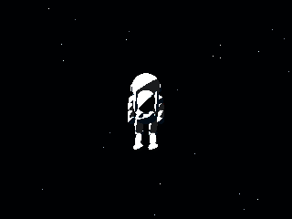
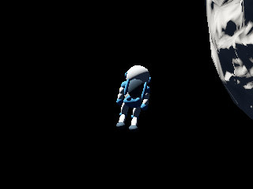
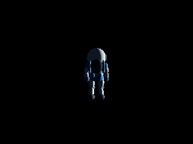

# Directional jetpack flight between bodies

Camera 4 keeps grounded walking at 6 m/s and Shift sprinting at 12 m/s.
Tapping Space launches the jump. Once airborne, WASD fires the engine without
Space: W/S follows the full view direction and A/D follows camera right.
Looking down and holding W therefore commands descent. Space commands up;
combined axes are normalized. Releasing movement controls removes thrust
after any 0.18 s Space-tap pulse ends, leaving gravity and atmospheric drag. Arms remain quiet during powered flight.

## Frames and orientation

Flight position and velocity are double-precision inertial world values in
metres and metres per second. The exhaust axis also persists in world space,
so coasting does not inherit the departure planet's spin. Near a body,
unpowered suit orientation settles toward its radial up; in space the exhaust
axis remains inertial. Ground contacts, joints and rendered geometry
remain in the selected body's coordinates. Launch includes that body's
translation and spin velocity. Changing the reference body transforms every
joint/contact and the relative velocity while preserving world position and
velocity. Flight uses full elapsed wall time and bounded 10 ms substeps; body centres
and orientations are sampled backward from the current ephemeris pose using
its velocity and spin across the frame. This is a linear approximation to body
translation during each presentation frame, not a second orbital solver.
Grounded movement still follows the surface and records grass trails;
airborne motion breaks trail continuity.

A planet or moon supplies the local up direction while centre distance is at
most 1.2 diameters, or 2.4 radii. Outside every eligible body's boundary, up
remains fixed in the inertial frame. Mouse look can pitch through the vertical
in space; the camera follows the astronaut instead of the departure planet.
The Sun contributes gravity but does not supply a walking/orientation frame.

When regions overlap, keep the current body until another body's distance
from the centre is at least 10% smaller. Exiting a body's region still
uses the exact 2.4-radius boundary. Entering another region selects its frame;
up approaches its radial direction with a 0.35 s response. Position and velocity
are not blended or reset. Destination terrain/water governs collision, landing
and later walking. The surface-camera selection follows that destination.

## Forces

Every flight substep sums vector gravity from the three closest celestial
centres, including the Sun, or all bodies if fewer than three exist:

`a = sum(G * M_i * (c_i - p) / length(c_i - p)^3)`.

Selection updates with position. Inside a solid reference sphere a uniform
sphere field bounds the singularity; terrain/water collision stops descent.
The engine remains the same main-planet-sized hardware on every destination.
Its force acts along the suit's single axis, which turns with a 0.12 s response.

Near a body, a proportional controller requests up to 30 m/s² toward a
100 m/s velocity vector along the commanded 3D direction, relative to that
body's moving air. Steering controls the complete relative velocity. It also
compensates gravity and predicted drag, subject to the shared thrust bound.
Releasing controls preserves inertia. Space flight requests 30 m/s² along the commanded
axis without a speed governor, allowing travel between moving bodies. No
velocity is clipped. Gravity acts even when no engine input is present.

Aerodynamics uses the existing gas pressure/composition/temperature model for
the nearest bodies, their translation and spin, and dissipative quadratic-drag
substeps. Orientation mode does not turn gas resistance off. Orbital pause and
speed controls change the bodies' prescribed motion; local character animation
continues. This remains a prescribed-orbit simulation with idealized unlimited
propellant, not a self-consistent coupled N-body system.

## Replay and validation

New airborne sidecars store world position/velocity, inertial up, reference body,
orientation mode and the selected gravity sources, in addition to the full
suit/contact pose. Exact world view vectors, every body's terrain-generation
position and its LOD history avoid precision loss and history-dependent
background changes during replay. Capture clipping is calculated from the current
chase eye each frame, matching interactive flight and destination replay. Old sidecars without world navigation retain their saved
body-relative pose and camera. The automated renderer check seeds reproducible
world positions to exercise space mode and the actual Moon frame handoff;
it also requires exact PNG and pose replay in both modes. CPU cases cover
a powered departure-to-Moon journey, nearest-source gravity, boundaries,
overlap hysteresis, continuous reorientation,
W-only descent, released coasting, unbounded space acceleration, moving-body
landing, free camera look, slow-frame moving-body sampling, inertial suit
orientation and deterministic continuation/reframing. Native X11
input exercises WASD ignition after a jump, camera switching and reload.


## Rendered checkpoints

These frozen, reduced-budget fixtures isolate the character; they do not show
production foliage density. The free-space and Moon-approach images retain the
initial view, while the settled view follows the Moon's radial up. The renderer
check also compares the complete saved pose and PNG bytes with their replays.

| Free-space coast | Entering the Moon frame | Settled Moon up |
| --- | --- | --- |
|  |  |  |

Resolved [replay snapshots and seed inputs](space-flight/replay/) retain the
scene, body ephemeris time, exact camera basis and terrain planning history.
For a single checkpoint, use:

```sh
LIBGL_ALWAYS_SOFTWARE=1 LP_NUM_THREADS=2 xvfb-run -a \
  build-resume/PlanetSimulation \
  --replay docs/journal/character/space-flight/replay/moon.png.json \
  --astronaut-capture build-resume/moon-replay.png --render-size 320 240
```

Run `SpaceFlightCaptureIntegration` to reproduce the seed, handoff and settling
sequence, and `AstronautMotionTests` for the numerical journey and force checks.
Validation logs and artifact hashes are retained in [validation/](space-flight/validation/).


The final clean full run passed **53/53 CTest entries in 764.20 s** on GCC 12.2,
RelWithDebInfo and Mesa llvmpipe/Xvfb with two rendering workers. The character
CPU target contains **41 passing cases**, including 19 new navigation cases.
The full run includes exact standing, walking, tilted flight and grass-trail
replays, the three new space/Moon replays, and native WASD-only ignition,
camera switching and reload. The README jetpack view was freshly rendered;
all 22 gallery PNG hashes match their manifest, with the other 21 captures'
original provenance retained. The main Typst journal PDF was rebuilt after
publication and its flight pages reviewed.
