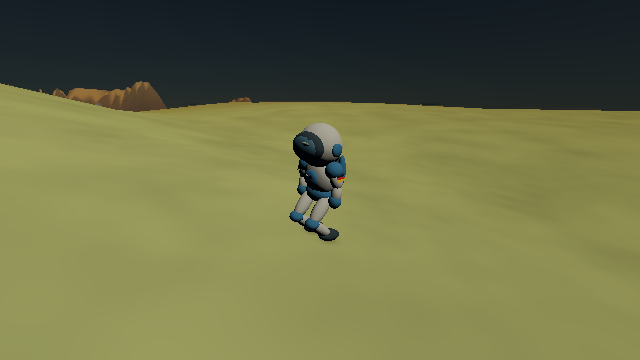
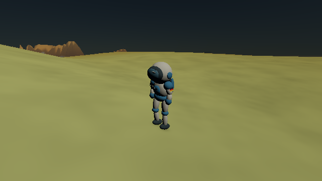

# Standing astronaut: straight knees and fixed soles

The astronaut now stands with extended knees on level ground. The original
hips sat 0.75 m above the ground, while the two leg segments each measure
approximately 0.481 m. Keeping the soles planted therefore needs about 0.30 m
of additional hip height. The new suit-local body offset raises the pelvis,
torso, arms and backpack together; the chase eye and target follow the offset.
The ground anchor remains the same position used for collision and grass trails.

Once movement stops and the final foot swing finishes, the pelvis settles over
the mean ankle target with a 0.10 s response time. Its height is bounded by
both legs' available reach. Walking lowers it as needed for a new step, and
flight retains the existing tucked legs. Boots stay at their stance contacts.
The implementation keeps the original segment lengths; it does not change
walking/sprinting speeds or jetpack forces.

On uneven ground, the lower ankle limits extension and the other knee bends
as needed to maintain contact. A stride retained on the curved sphere may
leave a small residual bend; the stop test allows at most two degrees. An
exactly extended leg has no unique bend plane, so that case places the knee
at the collinear midpoint in double precision. Other poses continue using
ozz two-bone IK near the actor origin. Offset limits (−0.25 to +0.50 m
vertically and 0.50 m horizontally) keep a cliff contact from pulling the
whole suit beneath the ground; an unreachable foot remains flagged by IK.

The complete offset is stored as `body_offset_m` in replay metadata, including
partly settled states. Legacy sidecars default to zero and retain their previous
poses; the README's two standing examples are newly posed snapshots. The
other gallery examples retain their existing captures and provenance.

## Visual comparison

The retained before/after pictures use the same fixture, surface location and view direction; the chase eye follows the
changed body height.

| Previous crouched stance | Extended standing stance |
| --- | --- |
|  |  |

Replay inputs and resolved snapshots live in [standing/replay/](standing/replay/).
The production scenario is unchanged. The newly queued jetpack control and
interplanetary-orientation task remains unimplemented.

## Validation

CPU tests measure extension, bone lengths, fixed soles, walking/sprint reach,
uneven ground, continuous settling and replay during settling. Native GL checks
standing extension and byte-identical standing, walking, tilted flight and trail
replays through HDR and reflection passes. Native GLFW checks movement, jump,
jetpack, view switching and reload. The final eight-entry focused run passes in 133.62 s with the current binary;
the motion target contains 22 passing CPU cases. This is scoped character,
camera and renderer validation, not a fresh full 52-entry run. An earlier
capture sequence exceeded 180 s before finishing its trail cases; its bounded
allowance is now 300 s, and the final capture run passes in 115.28 s.

Both standing README views were regenerated and visually reviewed. All 22
gallery PNG hashes and the new views' per-image source fingerprints match.
The other 20 captures retain their previous source fingerprints and dates;
this mixed provenance is explicit in the generation records. The original
front-view sidecar replays byte-identically with zero body offset. Logs and
artifact hashes are retained in [validation/](standing/validation/).

The main Typst journal PDF was rebuilt after gallery publication and its
updated astronaut pages were visually reviewed.
