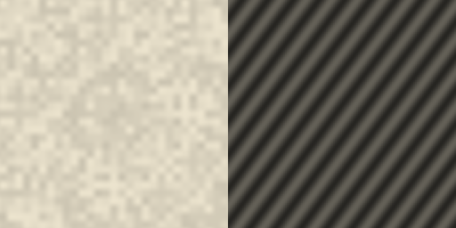
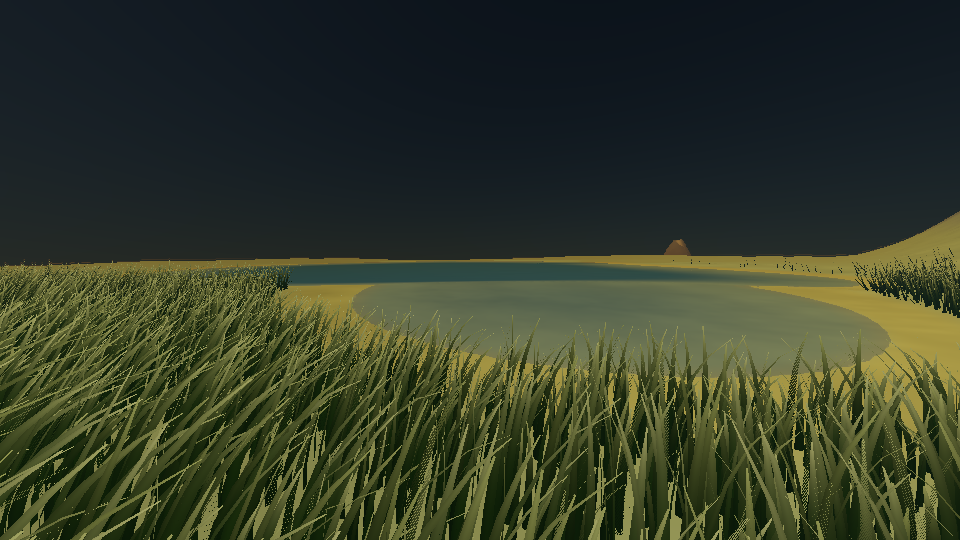
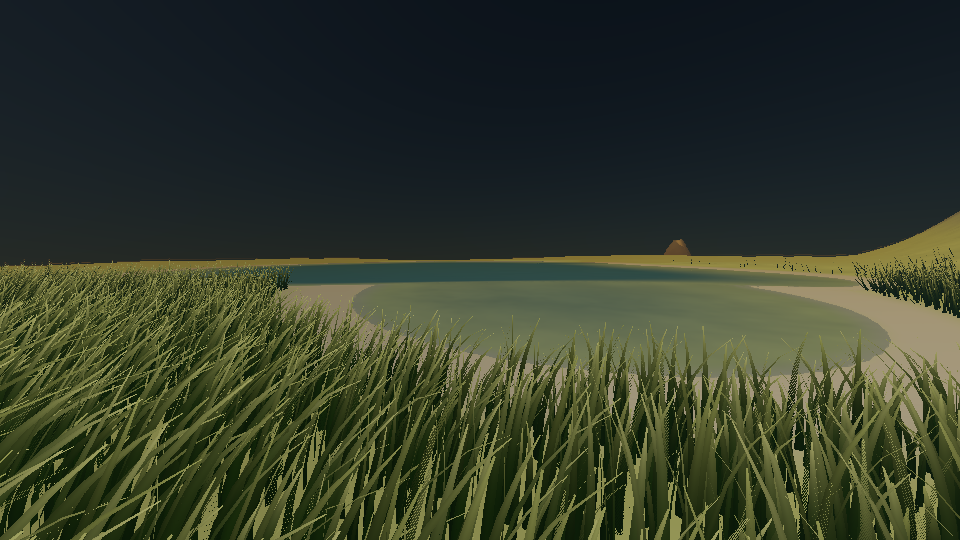

# Pale granular sand and wind ripples

The user reference, `USER_IO/user_artifacts/image copy 2.png`, shows pale sand
with small wind ripples and fine granular texture. Beaches now use linear RGB
(0.86, 0.83, 0.75), independent of the planet's green tint. Their existing
fragment-height boundary, seabed, snow and slope-to-rock rules remain intact;
grass keeps its shared midpoint foliage-tip palette and original placement
boundaries. Illumination, atmosphere, exposure and water reflections still
determine the displayed colour.

## Detail and cost

Body-local metre coordinates feed a triplanar wave field with 18 cm spacing.
A smooth 3-D noise field warps the phase. Fourth-power normal weights blend
the three projections without a longitude seam or singular pole frame. Its
bounded amplitude is 7 mm, giving at most 14 mm crest-to-trough relief before
filtering. A second value-noise field at 180 cells per metre supplies fine
grain, a maximum 0.7 mm additional height range, small neutral albedo variation
and matte roughness near 0.88. These are visual material choices rather than
wind transport or a calibrated sand scattering model.

Screen derivatives convert the combined height field into surface-normal
relief. Each projected wave is filtered by its own screen-space phase
footprint; the grain uses a metre-space pixel footprint. Unresolved ripples
and grains tend to neutral sand instead of aliasing. The shared height-based
beach weight also blends the detail across biome boundaries. Derivatives are
evaluated in a uniform landscape branch, including non-beach fragments.

The material adds two eight-corner value-noise samples and three projected
waves per landscape fragment, with no textures, CPU-generated noise arrays,
extra triangles or buffer uploads. It works in the existing OpenGL 3.3
terrain fragment shader in main and reflected rendering. Geometry, depth,
shadow silhouettes and camera/astronaut collision height do not move: these
centimetre dunes are normal relief. Geometric dune silhouettes would require
additional mesh detail. Body coordinates retain the renderer's existing float
precision limit; centimetre detail is validated on the kilometre-scale scene,
not a claim of arbitrary Earth-radius precision.

## Validation

The real OpenGL terrain-material test renders a coarse two-triangle patch
under controlled lighting. It checks bright near-neutral beach colour despite
a green body tint, the narrow shoreline band and unchanged foliage-tip ground
ratios. Separate close and medium-distance patches check visible grains,
grazing-light ripple contrast, absence of painted ripple stripes in indirect
light, unresolved-detail filtering, byte-identical depth, unchanged triangles,
attachment during body rotation and detail at all three projection axes,
including both poles. Ripple contrast varies with ridge/light alignment.



This diagnostic uses the production shader in a fixed offscreen framebuffer;
it is not a perspective landscape or an atmospheric capture. The two panels
use different scales and lighting to distinguish grain from normal relief.





The before image is the historical gallery capture retained with its original
source fingerprint and timestamp in [before.json](sand/validation/before.json).
The after image is regenerated with the current renderer at the same saved
camera and scene. Both resolved [replay sidecars](sand/replay/) are retained.
The narrow shore contains distant ripples which are intentionally filtered;
the controlled material patch above resolves their shape up close.

Reproduce the material regression and landscape view after building:

```sh
LIBGL_ALWAYS_SOFTWARE=1 LP_NUM_THREADS=2 xvfb-run -a \
  build-resume/tests/terrain_shadow_render_tests --gtest_filter='TerrainMaterialRender.*'
LIBGL_ALWAYS_SOFTWARE=1 LP_NUM_THREADS=2 xvfb-run -a \
  build-resume/PlanetSimulation \
  --replay docs/captures/replay/terrain/shoreline-detail.png.json \
  --surface-capture build-resume/sand-shoreline.png
```

The clean full suite passes all 52 CTest entries in 530.86 seconds on GCC 12.2,
RelWithDebInfo, Xvfb and Mesa llvmpipe with two workers. The initial focused
run retained in the validation directory passed colour, depth and filtering
checks but required a less direction-specific pole contrast assertion: ridge
alignment with sunlight changes contrast. The final full run passes all four
terrain-material tests, including that corrected check. Raw build, full-suite
and per-entry [logs](sand/validation/) are retained. Hardware GPU frame rates
were not measured. All 22 gallery images were regenerated, visually reviewed
and verified against their SHA-256 manifest and source fingerprint. The journal
PDF compiles. [Evidence and image hashes](sand/validation/evidence.json) also
confirm unchanged shoreline terrain/foliage triangle counts and grass payloads;
replay normalization changes camera numbers by at most 2.23e-16.
